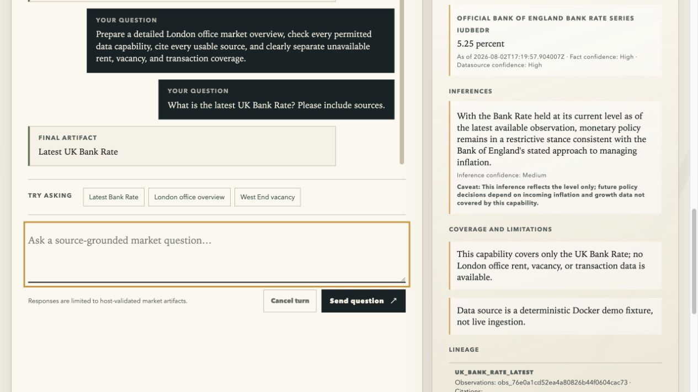

# London Market Desk

London Market Desk is an evidence-first London office research PoC. It combines
a Python canonical data plane (SQLite + immutable evidence), a controlled Pi
agent runtime, and one same-origin dashboard.

The agent currently supports **nine canonical market-data capabilities** backed
by UK official open-data sources (OGL v3.0 or Crown copyright). Each capability
is queryable through the dashboard UI; the host finalizer owns all numeric
values and enforces capability-specific claim guards to prevent proxy
relabelling (e.g. GDP figures cannot be presented as London office metrics).

**Supported capabilities:**

| Capability | Source | What it returns |
|---|---|---|
| UK Bank Rate | Bank of England IUDBEDR | Official interest rate |
| London planning activity | planning.data.gov.uk (Crown copyright) | Decided planning applications per London authority per month |
| UK GDP | ONS ECYX / IHYQ | GDP index and growth rate |
| UK inflation | ONS D7G7 / L55O / CZBH | CPIH, OOH, and GDP deflator |
| UK labour market | ONS LF24 / MGSX / AP2Y / KAI9 | Unemployment, employment, vacancies |
| London employment | Nomis NM_59_1 / NM_130_1 | London LFS and workforce jobs |
| UK hybrid working | ONS OPN survey | Great Britain hybrid-working share |
| London office stock | VOA NDR Stock of Properties | Annual office hereditaments count (stock, not vacancy) |
| London EPC certificates | MHCLG Table A | Non-domestic EPC lodgements |

**Visibly unavailable** (no compliant public source exists — see
[rent survey](wiki/research/datasource/office-rent-canonical-survey.md) and
[vacancy survey](wiki/research/datasource/office-vacancy-canonical-survey.md)):
London office rent, vacancy, leasing transactions, project-level supply, and
ranked market news. The system must never fill those gaps with model-generated
numbers.



The `5.25 percent` shown here is a deterministic demo fixture, not a live market
claim. See the recorded [browser test](wiki/questions/Test_result/TC-01-dashboard-ui-test-2026-08-02.md).

## Fast start (local development)

Requirements: macOS or Linux, Python 3.12 via `uv`, Node 22.19+, and a
GLM-compatible endpoint. On Linux install `bubblewrap` for parser isolation
(Debian/Ubuntu: `apt-get install bubblewrap`). Install both runtime layers:

```sh
uv sync
(cd agent-runtime && npm ci)
cp agent-runtime/.env.example agent-runtime/.env
chmod 600 agent-runtime/.env
```

Set these values in `agent-runtime/.env`:

```dotenv
PI_MODEL=glm/GLM-5.2
PI_BASE_URL=https://your-provider.example/v1
PI_API_KEY=replace-me
CRE_DATA_DIR=/absolute/path/to/canonical-data
```

Bootstrap the canonical store once from the repository root, then start the
single dashboard service:

```sh
uv run cre --data-dir /absolute/path/to/canonical-data db migrate
cd agent-runtime
npm run start
```

Open <http://127.0.0.1:8787>. The page creates an in-memory bearer session,
gets the fixed dashboard overview from the typed Facade, and streams only
host-finalized market briefs.

For a safe local demonstration (not production data), seed the supplied Bank
Rate fixture before starting the service:

```sh
uv run python agent-runtime/test/helpers/seed_bank_rate.py /absolute/path/to/canonical-data 5.25
```

## One-command Docker demo

Create the untracked credentials file once, set `PI_BASE_URL` and `PI_API_KEY`,
then start the complete demo:

```sh
cp agent-runtime/.env.example agent-runtime/.env
chmod 600 agent-runtime/.env
docker compose up --build --wait
```

Open <http://127.0.0.1:8787>. Compose first runs the one-shot
`demo-data-init` service, migrates the dedicated `market-desk-demo-data` volume,
verifies the packaged Bank Rate fixture checksum, and writes a versioned marker.
The UI, HTTP/SSE transport, typed Facade, and Pi `createAgentSession` runtime
then start behind a healthcheck suitable for `--wait`.

This mode is explicitly a reproducible fixture demo. It does not run live
ingestion or grant a refresh profile. To run live ingestion inside Docker on a
Linux host, enable the opt-in `ingestion` profile (bubblewrap sandbox; the
service needs `CAP_SYS_ADMIN` to create user namespaces):

```sh
MARKET_DESK_MODE=production docker compose --profile ingestion up ingestion
```

```sh
docker compose down      # stop containers; preserve the seeded demo volume
docker compose up --wait # restart and verify the existing marker/data

docker compose down -v   # remove only this Compose project's demo volume
docker compose up --build --wait # migrate and seed it again
```

The initializer fails closed outside `MARKET_DESK_MODE=demo`, including when a
demo marker is found in a non-demo startup.

## Data pipeline

The operational data pipeline runs on macOS or Linux. Linux hosts use
`bubblewrap` (`bwrap`) instead of macOS `sandbox-exec` for parser isolation;
install it from your distro (Debian/Ubuntu: `apt-get install bubblewrap`).

```sh
cre --config /secure/cre.toml db migrate
cre --config /secure/cre.toml health
cre --config /secure/cre.toml ingest enqueue boe.bank_rate.iudbedr --request '{"series":"IUDBEDR"}'
cre --config /secure/cre.toml daemon once --allow-network
```

Only enable the daemon after `health` confirms parser isolation and operational
ingestion are ready. The fuller setup, scheduling, source-policy, backfill,
and review rules are in [the first-use and pipeline guide](docs/first-use-and-data-pipeline.md)
and [the datasource operations runbook](docs/datasource-operations.md).

## Verify

```sh
uv run pytest
cd agent-runtime
npm test
npm run typecheck
npm run test:browser
npm audit --omit=dev
```

With a configured private `.env`, `npm run test:glm` performs the opt-in real
GLM-5.2/Pi acceptance without a fake session factory or model override. The
dated deterministic, browser, Docker, and live-model results are recorded in
[`tests/Test case.md`](tests/Test%20case.md).

## Local state and secrets

`.env`, local data, virtual environments, node modules, evidence scratch space,
generated browser reports, and editor state are ignored. Never commit the
credentials file, API keys, canonical data, raw evidence, or backups.
