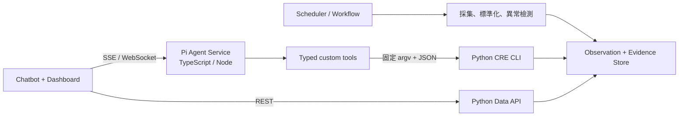

# Agent Runtime Architecture: Pi + Python Data Plane

## Decision

產品採用 **chatbot + market dashboard** 形式，並以 Pi Agent Harness 作為互動式 Agent runtime：

- **Pi / TypeScript Agent Service** 負責對話、推理、session、Skill 載入、runtime hooks、工具協調及串流事件。
- **Python data plane** 負責資料採集、標準化、計算、證據保存、排程及 CLI 工具。
- Dashboard 的固定指標直接讀取 Data API；只有自然語言研究、解釋及臨時分析經過 Agent。
- MVP 使用單一 Market Analyst Agent，不啟用自由遞迴的 multi-agent delegation。

這是一個「**互動層 harness-first、資料層 workflow-first**」的混合架構。Pi 不取代資料 workflow，也不是正式市場數據的 source of truth。

## Compliance Assumption

[[wiki/User Requirement|User Requirement]] 要求「以 Python 開發的 AI Agent」。Pi runtime 本身是 TypeScript／Node，因此本決策成立的前提是：

> 可接受由 Pi／TypeScript 提供 Agent runtime，而核心市場資料能力、分析工具及 workflow 由 Python 實作。

如果評審要求 Agent runtime 本身必須是 Python，則這個方案不符合要求，應改用 Python agent framework。僅在 Pi 下方使用 Python CLI，不能把整個 runtime 稱為純 Python Agent。

## System Context



### Component Boundaries

| Component | Responsibility | Must not own |
|---|---|---|
| Chatbot UI | 對話、串流狀態、來源及 artifact 顯示 | 市場數據計算、權限判斷 |
| Dashboard | 固定 KPI、圖表、時間序列、警示列表 | 每次載入時要求 LLM 重算數據 |
| Pi Agent Service | 推理、工具選擇、session、Skill 與 hook lifecycle | 正式市場數據、排程、任意系統存取 |
| Python Data API | 為 dashboard 提供穩定的 typed read API | 自由形式 Agent reasoning |
| Python CRE CLI | 可重播、可測試的 Agent capability boundary | 通用 Shell 或任意命令執行 |
| Scheduler / Workflow | 採集、重試、idempotency、daily/weekly run、alert rule | 對話 session lifecycle |
| Evidence Store | observation、source artifact、claim lineage | 只保存 Agent 自由文字而沒有來源 |

## Pi Embedding Surface

使用 `@earendil-works/pi-coding-agent` 的 programmatic SDK 和 `createAgentSession()`，而不是只使用低階 `pi-agent-core`：

- `AgentSession` 管理對話 lifecycle、message history、compaction 和 event streaming。
- `ResourceLoader` 載入受信任的 Skills、extensions、prompt templates 和 context。
- Agent Service 透過 SSE 或 WebSocket 把 Pi events 投影成產品自己的 UI event schema。
- 應 pin 明確的 Pi package version；不可混用舊 `badlogic/pi-mono`／`@mariozechner/*` 和目前 `earendil-works/pi`／`@earendil-works/*` 文件。

若主要 backend 不是 Node，可以用 Pi RPC 作為 PoC bridge；production 仍優先使用獨立 Node Agent Service 直接嵌入 SDK，避免把 JSONL subprocess protocol 變成主要產品邊界。

## Runtime Guidance Model

### Skills: how to reason

Skill 是領域 runbook 和分析 guidance，例如：

- `market_metrics`：指標定義、可比較條件及查詢步驟。
- `news_monitor`：市場新聞搜尋、去重及來源優先級。
- `supply_pipeline`：新建、翻新、預租和完工日期的處理規則。
- `macro_monitor`：利率、GDP、通脹、就業等指標的時間口徑。
- `submarket_analysis`：City、West End、Canary Wharf 等子市場比較。
- `source_conflict_resolution`：不同 broker 報告口徑衝突時的處理方式。
- `report_generator`：daily／weekly brief 的 claim、citation 和輸出要求。

Skills 只提供 prompt-level guidance，不是權限或安全邊界。正式 run 應由 host 明確綁定所需 Skill；ad-hoc chat 才可以讓模型按描述選擇 Skill。

Pi 的標準 Skill 機制會讓模型按需要讀取完整 `SKILL.md`。關閉通用 filesystem tools 後，應提供只能讀取受信任 Skill／reference 目錄的 restricted `read`，或由 host 在 `before_agent_start` 明確注入所需內容。

### Hooks / Extensions: runtime policy

Hook 負責 lifecycle policy 和 enforcement：

- `session_start`：建立 user、tenant、session 和 trace context。
- `before_agent_start`：注入 `as_of_date`、允許的資料範圍、來源 allowlist、成本及時間 budget。
- 工具呼叫前：驗證 tool allowlist、參數、CLI subcommand、query 數、timeout 和風險等級；不合規時直接阻擋。
- 工具結果後：正規化、截斷、敏感資料清理，並記錄 evidence、latency、cost 和錯誤。
- 完成階段：驗證每個數字 claim 都有 evidence ID，並區分 fact 和 inference。

不應只依賴自然語言 system prompt 或 Skill frontmatter 執行權限控制。

### Tools and CLI: actual capabilities

Agent 只看到 typed custom tools；每個 tool 內部才調用 Python CLI：

| Agent tool | Example CLI responsibility |
|---|---|
| `query_market_metrics` | 查詢指定指標、子市場和 as-of date |
| `search_evidence` | 搜尋已保存的來源 artifact 和原文定位 |
| `search_market_news` | 在允許的來源和日期範圍內搜尋新聞 |
| `compare_submarkets` | 執行可重現的子市場比較 |
| `get_supply_pipeline` | 查詢 development／refurbishment／pre-let 項目 |
| `submit_artifact` | 驗證並提交 chart、table、brief 或 alert artifact |

CLI invocation 必須使用固定 binary 和 argv array，並設定 `shell: false`。模型不可拼接任意 Shell command，也不應獲得通用 `bash`、`edit` 或 `write` 工具。

## CLI Contract

所有 Agent 可用 CLI 必須符合以下契約：

- stdout 只輸出符合版本化 schema 的 JSON；logs 寫入 stderr。
- 使用穩定 exit codes，並支援 timeout 和 cancellation。
- 輸出包含 `schema_version`、`as_of`、`source_date`、`retrieved_at`、`evidence_ids` 和 `confidence`。
- read-only 是預設；有 side effect 的操作使用獨立命令和權限。
- 同一輸入應可重播，並盡可能 deterministic 和 idempotent。
- 大型文件或 binary 不放入 stdout/context，只回傳 artifact ID 和必要 metadata。
- Agent 產生的摘要不是 evidence；正式 claim 必須引用 immutable source artifact。

Example logical interface：

```text
cre metrics query --metric vacancy --submarket city --as-of 2026-07-31 --json
cre evidence search --query "City vacancy" --from 2026-07-01 --json
cre news search --query "London office leasing" --from 2026-07-24 --json
cre submarkets compare --metric prime-rent --as-of 2026-07-31 --json
```

CLI 是穩定、可審計的 capability boundary；如果後續 process startup latency 過高，可以在不改變 tool schema 的前提下，把內部實作換成 long-running Python service。

## Dashboard and Artifact Contract

固定 dashboard 內容直接從 Python Data API 取得，包括：

- 最新市場 KPI 和時間序列。
- 子市場比較。
- 最新警示及 daily／weekly snapshot。
- source freshness 和 degraded status。

Pi 處理需要自然語言推理的問題，例如解釋變化、比較口徑、整理證據或回應 ad-hoc research request。

Agent 最終結果不能只有 Markdown。`submit_artifact` 應產生可驗證的 typed artifact：

```json
{
  "type": "chart",
  "title": "City vacancy trend",
  "chart_spec": {},
  "evidence_ids": ["ev_123", "ev_456"],
  "as_of": "2026-07-31",
  "confidence": "medium"
}
```

首批 artifact types：

- `chart`
- `table`
- `evidence_list`
- `market_brief`
- `alert_explanation`

Frontend 只渲染通過 schema validation 的 artifact。Pi session 是對話及 trace 狀態，不是 dashboard 的 source of truth。

## Search and Delegation Policy

### MVP: single agent

MVP 使用一個 Market Analyst Agent 配合 deterministic tools，不採用長期角色 agents 或 recursive delegation。只有實測證明 coverage、latency 或 review precision 明顯改善，才考慮 multi-agent。

### Runtime search

Agent 可以自行選擇 bounded search tool，但搜尋分為三個 lane：

1. `production_ingestion`：只使用 approved sources，由 workflow 執行。
2. `source_discovery`：尋找新來源，結果進入 quarantine，不能直接改寫 canonical metrics。
3. `ad_hoc_research`：支援 chatbot 臨時問題；輸出標記為 research evidence。

每次 search 必須限制 domains、date range、max queries、timeout 和最大結果數。網頁內容一律視為不可信資料，不能改變 runtime instructions 或 tool permissions。

## Security Boundaries

Pi 沒有內建 filesystem、process、network 或 credential permission system，因此 production 必須另外建立安全邊界：

- Agent Service 在 container／sandbox 內執行。
- 關閉 Pi 內建 `bash`、`edit`、`write` 和不受限制的 `read`。
- Python CLI 使用最小權限 service account。
- credentials 不進入 prompt、Skill 或 tool result。
- Network egress 和資料來源使用 allowlist。
- Hooks 提供 policy enforcement 和 audit，但不能取代 OS／container／database 權限。
- Tool call、evidence access、artifact submission 和 policy rejection 都保留 audit trace。

## Scheduling Boundary

Pi 不負責 durable scheduling。以下工作由獨立 workflow runner 執行：

- Approved-source ingestion。
- Parse、normalize、deduplicate 和 metric-definition validation。
- Daily／weekly snapshot。
- Deterministic anomaly／alert rules。
- Retry、timeout、idempotency 和 degraded-state reporting。

Scheduled workflow 可以把已準備好的 typed task 交給 Pi 做 bounded synthesis，但 workflow 必須擁有 run lifecycle 和完成狀態。

## Acceptance Criteria

- Agent 只可調用明確 allowlist 的 typed tools，無法執行任意 Shell 或寫入檔案。
- 每個數字 claim 可追溯至 evidence ID、來源、發布日期和 as-of date。
- Dashboard 在 Agent 不可用時仍能顯示已採集的指標、圖表和警示。
- 相同 CLI request 可被獨立重播及測試。
- Source failure 顯示 degraded status，不由 Agent 補造數據。
- Skill guidance 不能提升 tool、filesystem、network 或 credential 權限。
- Prompt-injection 測試不能改變 allowlist 或觸發未授權 action。
- MVP 在沒有 multi-agent delegation 的情況下完成 chatbot、dashboard、daily/weekly brief 和 ad-hoc research。

## References

- [[wiki/User Requirement|User Requirement]]
- [[wiki/rearch/UI/chatbot-dashboard-decision|UI Decision: Chatbot Dashboard]]
- [Pi Agent Harness](https://github.com/earendil-works/pi)
- [Pi SDK](https://github.com/earendil-works/pi/blob/main/packages/coding-agent/docs/sdk.md)
- [Pi Skills](https://github.com/earendil-works/pi/blob/main/packages/coding-agent/docs/skills.md)
- [Pi Extensions](https://github.com/earendil-works/pi/blob/main/packages/coding-agent/docs/extensions.md)
- [Pi RPC mode](https://github.com/earendil-works/pi/blob/main/packages/coding-agent/docs/rpc.md)

