# Agent Runtime Architecture: Pi + Python Data Plane

## Decision

產品採用 **chatbot + market dashboard** 形式，並以 Pi Agent Harness 作為互動式 Agent runtime：

- **Pi / TypeScript Agent Service** 負責對話、推理、session、host-verified Skill
  preloading、工具協調及串流事件。
- **Python data plane** 負責資料採集、標準化、計算、證據保存、排程及 CLI 工具。
- Dashboard 的固定指標直接讀取 Data API；只有自然語言研究、解釋及臨時分析經過 Agent。
- Competition MVP 不註冊任何 filesystem tools。Host 只驗證並把兩份 allowlisted
  Skill 的完整內容預載到 system prompt；`read`／`grep`／`find`／`ls`／`bash`／`edit`／
  `write`、extensions 及 context discovery 均不可用，亦不使用 vector database 或
  專用 RAG framework。
- 在產品支援路徑中，Pi 透過typed tool申請bounded on-demand refresh及查看durable job狀態；只有這條路徑的結果可進入正式資料流程，Pi 不負責執行collector、選promotion lane或寫DB。
- MVP 使用單一 top-level Market Analyst Agent；它可在同一個 AgentSession 內把複雜目標拆成 bounded sub-tasks，逐步調用 Skills 和 typed tools，但不要求 child agent，也不啟用自由遞迴的 multi-agent delegation。
- Competition MVP 沿用 Pi 標準 AgentSession lifecycle、Skills、tools 和 events；除 CRE typed tools 及產品 UI event adapter 外，不另建 `competition_profile`、通用 policy engine、task manager 或自訂 `before_agent_start` context injection。

這是一個「**互動層 harness-first、資料層 workflow-first**」的混合架構。Pi 不取代資料 workflow，也不是正式市場數據的 source of truth。

開發分成兩個可獨立驗收的階段：[[wiki/decisions/agent-tool-facade-foundation|Agent Tool Facade Foundation]] 已通過 exit gate；[[wiki/decisions/pi-agent-runtime-and-skills-vertical-slice|Pi Agent Runtime and Skills Vertical Slice]] 以三個 mandatory gates 進行，兩者不綁成一次性大改動。

## Compliance Assumption

[[wiki/User Requirement|User Requirement]] 要求「以 Python 開發的 AI Agent」。Pi runtime 本身是 TypeScript／Node，因此本決策成立的前提是：

> 可接受由 Pi／TypeScript 提供 Agent runtime，而核心市場資料能力、分析工具及 workflow 由 Python 實作。

如果評審要求 Agent runtime 本身必須是 Python，則這個方案不符合要求，應改用 Python agent framework。僅在 Pi 下方使用 Python CLI，不能把整個 runtime 稱為純 Python Agent。

## System Context

```mermaid
flowchart LR
    UI["Chatbot + Dashboard"] -->|"SSE"| PI["Pi Agent Service\nTypeScript / Node"]
    UI -->|"Product transport"| APP["Dashboard backend / adapter"]
    APP -->|"in-process typed call"| API["nan_fung.read_api"]

    SKILLS["Host-verified Skills\nfull content preloaded"] --> PI
    PI --> TOOLS["Registered typed tools"]
    TOOLS -->|"fixed argv + JSON"| FACADE["Agent Tool Facade\nnan-fung-agent-tools"]
    FACADE -->|"query / citation"| API
    FACADE -->|"request / status"| BROKER["Trusted refresh broker"]
    BROKER -->|"versioned bounded request"| SCH["Scheduler daemon / durable jobs"]

    SCH --> PIPE["採集、標準化、異常檢測"]
    PIPE --> STORE["Observation + Evidence Store"]
    STORE --> API
    STORE --> RENDER["Canonical-view Wiki renderer"]
    RENDER --> WIKI["Generated read-only Market Wiki"]
```

`nan_fung.read_api`在目前datasource decision中是in-process Python service，不是獨立HTTP server。UI只依賴product backend／adapter transport；若未來把它變成remote multi-user API，需另作transport、authentication及tenancy決策。

### Component Boundaries

| Component | Responsibility | Must not own |
|---|---|---|
| Chatbot UI | 對話、串流狀態、來源及 artifact 顯示 | 市場數據計算、權限判斷 |
| Dashboard | 固定 KPI、圖表、時間序列、警示列表；經backend adapter使用in-process read service | 每次載入時要求 LLM 重算數據 |
| Pi Agent Service | 推理、工具選擇、session、host-preloaded Skill content、SSE event projection | 正式市場數據、canonical write／promotion、durable scheduling、filesystem/extension loading |
| Python Data API | 為dashboard／Agent facade提供穩定的in-process typed read API | 自由形式Agent reasoning、直接network transport |
| Python Agent Tool Facade | 將五個Agent data tools映射至read API／refresh broker，執行product manifest、scoped handles、schema、timeout和response bounds | 暴露operator command、任意Shell、raw result_ref、lane／promotion選擇或canonical write |
| Python CRE CLI | 本地operator surface，用於人工操作與診斷 | 作為Agent bridge或形成第二套Agent contract |
| Trusted refresh broker | 驗證host context、fixed request profile、scope、budget、lane及licence後enqueue／讀job status | 直接執行collector、讓Agent選lane／promotion、直接寫observation |
| Scheduler / Workflow | 採集、重試、idempotency、daily/weekly run、alert rule | 對話 session lifecycle |
| Evidence Store | observation、source artifact、observation／evidence lineage | 只保存 Agent 自由文字而沒有來源；Agent claim persistence 需另作 Decision |
| Generated Market Wiki | 按日期／分類投影canonical facts，供人類和非-model discovery | 成為第二個可手工修改的source of truth，或在render pending時冒充最新canonical state，或成為 Phase 2 model resource |

## Pi Embedding Surface

使用 Node `>=22.19.0` 及固定版本 `@earendil-works/pi-coding-agent@0.83.0` 的 programmatic SDK 和 `createAgentSession()`，而不是只使用低階 `pi-agent-core`：

- `AgentSession` 管理對話 lifecycle、message history、compaction 和 event streaming。
- Session明確傳入`customTools`及strict `DefaultResourceLoader`。in-memory settings、
  private empty agentDir／cwd及startup assertions關閉 extensions、Skill discovery、
  packages、context files、prompt templates 和 themes；兩份已驗證 Skill 內容由 host
  寫入 version-controlled system prompt，不交給 Pi 從資源載入。
- Competition MVP 使用 in-memory session，並透過 SSE 把 Pi events 投影成產品自己的 UI event schema。
- 模型由 `PI_MODEL` 明確指定；啟動時不可用便 fail fast，不做隱式 fallback 或 provider cycling。
- 不可混用舊 `badlogic/pi-mono`／`@mariozechner/*` 和目前 `earendil-works/pi`／`@earendil-works/*` 文件。

本產品的 Agent Service 本身是 Node，因此直接嵌入 SDK；Pi RPC 不作主要 transport，也不是此 vertical slice 的 fallback。

## Runtime Guidance Model

### Skills: how to reason

Skill 只保存領域 runbook、分析口徑和輸出 guidance；deterministic、可重播、需要schema enforcement的行為屬於 Tool。現有七個 Skill 名稱與舊九工具契約已不再是可直接開工的interface；研究推導見 [[wiki/research/agent-skill-and-tool/skill-and-tool-design|Agent Runtime, Skill and Tool Research]]，正式allowlist及rollout以 [[wiki/decisions/pi-agent-runtime-and-skills-vertical-slice|Pi Agent Runtime and Skills Vertical Slice]] 為準。

第一個 vertical slice 只allowlist兩個 Skills：

- 重寫 `track-uk-macro`：使用新 facade 查詢既有 macro observations，處理canonical latest、freshness、degraded與citation規則。
- 新增 `generate-grounded-market-brief`：把已取得的 facts／inferences 組裝成帶
  `supporting_citation_refs`的`market_brief_draft.v1`；runtime再產生
  host-enriched `market_brief.v1`。

其餘 Skills 只有在對應 datasource coverage 和 typed contract 存在後才加入。Competition
MVP 不使用 progressive disclosure：host 在 boot 驗證 `track-uk-macro` 和
`generate-grounded-market-brief` 的 regular-file、symlink、64-KiB、hash 和 exact
allowlist 規則，再把兩者完整內容預載。模型無法讀取、列出或替換 Skill 檔案。

### Runtime lifecycle and extensions

Competition MVP 直接使用 Pi 的 AgentSession、對話澄清、tool loop 和 lifecycle events，不以 custom hooks 重建 runtime：

- 使用者明確指定日期時，Agent 把日期傳給 typed tool；使用者明確要求「最新」時，tool 查詢 canonical latest，並回傳實際 `as_of`、`source_date` 和 `retrieved_at`。
- 時間會影響答案而使用者未指定日期或期間時，由 Pi 在正常對話中追問想查的時間，不另行注入 host clock、預設 `as_of_date` 或假設「未指定」等於「最新」。
- London office domain 由固定 system prompt 和 Skills 定義，不在每個 turn 重複注入 scope。
- Session boot只註冊五個 CRE typed tools 和 runtime-only finalizer；tool arguments、
  product capability、session scope、timeout、query bounds和refresh policy由各
  tool adapter／broker驗證。
- Tool result 只做 typed-schema validation、必要的 context-size bounding，並保留 evidence IDs 和錯誤。MVP 假設只處理公開 approved sources，不接收 PII、機密輸入或 production credentials，因此不建立通用敏感資料清理、tenant-aware compliance 或自訂 audit pipeline。
- Fact／inference 區分和 evidence requirements 由 Skills、tool response schema 及runtime-only `finalize_market_brief` schema 表達，不新增 completion hook。

如需 production auth、tenant policy、敏感資料處理或完整 audit，再以 Pi extensions／hooks 加入；這些不是 Competition MVP 前置工作。

### Tools, discovery and Agent facade

Competition MVP 不另建 `wiki_search` tool，也不提供任何 filesystem/Wiki discovery
tool。Agent 的產品 coverage 只由 `describe_market_data` 和 Phase 1 capability manifest
得知；正式數值只可由 typed canonical query/citation 取得和驗證。

Agent只註冊五個data tools；每一個都由專用 `nan-fung-agent-tools` facade提供：

| Agent tool | Responsibility |
|---|---|
| `describe_market_data` | 列出目前實際可查的datasource、series、dimensions、coverage與refresh profile |
| `query_market_data` | 查詢canonical observations及兩軸freshness；支援canonical latest或明確as-of |
| `get_citation_metadata` | 以query回傳的scope-bound citation refs取得原anchor的metadata，不回傳raw evidence或整份文件 |
| `request_data_refresh` | 以allowlisted profile和bounded scope申請durable refresh job |
| `get_refresh_status` | 查詢job、attempt、promotion及canonical change；health另由`query_market_data`查詢 |

Facade是Agent-only Python executable，不是operator `cre` CLI。Node host以
authoritative tool-name argv、`shell: false`、bounded JSON stdin/stdout和10秒
timeout呼叫；logs只寫stderr。Model-visible arguments與trusted `host_context`
分離；principal、session capability scope、product allowlist、budget、licence、
lane及promotion policy均由host持有。

Query／citation response預設最多20筆，Facade單次JSON最多256 KiB；Runtime另有
全turn 128 KiB／40 records／40 citations累積上限。Cursor、citation、job和approval
handles綁定session scope。Refresh先回ack，production terminal後必須重新query
canonical。ONSPD第21次refresh只可由UI向真人取得明確批准；token留在trusted
data plane，由host-only approval operation重送，模型及Node event永遠看不到token。

完整wire schemas、exit codes、error taxonomy、bounds及Phase 1 exit gate由 [[wiki/decisions/agent-tool-facade-foundation|Agent Tool Facade Foundation]] 定義。Runtime另外註冊 `finalize_market_brief`；它以host-only turn ledger驗證`market_brief_draft.v1`的exact citation refs，再產生`market_brief.v1`，不穿過facade，也不寫datasource store。

## Dashboard and Artifact Contract

固定 dashboard 內容直接從 Python Data API 取得，包括：

- 最新市場 KPI 和時間序列。
- 子市場比較。
- 最新警示及 daily／weekly snapshot。
- retrieval／observation freshness、degraded status和canonical availability。

Pi處理需要自然語言推理的問題，例如解釋變化、比較口徑、整理證據或以已批准
canonical data回應臨時問題；讀取non-canonical ad-hoc result不屬於v1。

第一個vertical slice只產生一種結構化輸出：`market_brief.v1`。Pi把
`market_brief_draft.v1`交給runtime-only `finalize_market_brief`；runtime依正式
Decision核對citation ref對應的anchor／run／observation／evidence，並由ledger填入
source metadata，通過後才由SSE交給frontend渲染。

`market_brief.v1` 只保存在當次in-memory AgentSession，不寫入canonical DB，也不把既有data-plane `output_artifact` projection table當成Agent claim store。其他chart、table、alert等artifact types延後到有明確consumer和Agent persistence decision時再設計。schema與驗收規則由 [[wiki/decisions/pi-agent-runtime-and-skills-vertical-slice|Pi Agent Runtime and Skills Vertical Slice]] 定義。

## Search and Delegation Policy

### MVP: single agent with bounded sub-tasks

MVP 使用一個 Market Analyst Agent 配合 deterministic tools。複雜問題由同一個 AgentSession 拆成有明確目標和依賴關係的 bounded sub-tasks，再按 tool result 繼續、受控重試、降級或完成：

- 分析、比較和下一步選擇由目前 Agent context 完成。
- 資料查詢、citation metadata lookup和 deterministic 計算由 typed Python tools 完成。
- 長時間、需重試或需 durable state 的工作由 workflow job 完成，Agent 只 request 和 observe status。

Sub-task 是邏輯執行單位，不等於另一個 Agent。主 Agent 擁有最終整合、evidence validation 和 brief validation；UI 如需顯示進度，可把 tool／job lifecycle events 投影成 sub-task status，而不建立通用 task manager。MVP 不採用長期角色 agents 或 recursive delegation；只有實測證明 context isolation 或並行分析能改善 coverage、latency 或 review precision，才考慮 child AgentSession。

### Runtime search

Agent 可以自行選擇bounded search／refresh tool，但不能選lane。Trusted host policy按datasource definition、request profile、source approval和trigger把工作分為三個trust lane：

1. `production_ingestion`：只使用 approved sources，由 workflow 執行。
2. `source_discovery`：尋找新來源，結果進入 quarantine，不能直接改寫 canonical metrics。
3. `ad_hoc_research`：支援 chatbot 臨時問題；輸出標記為 research evidence。

產品支援的query／refresh tools必須以versioned product capability manifest限制
datasource、series、dimensions、date range、timeout和最大結果數，且不接受
arbitrary URL、headers、lane或promotion mode。Competition MVP不註冊`bash`或
其他network-capable built-in；live data只能經Agent facade向trusted refresh
broker申請，網頁內容不能改變runtime instructions或tool permissions。

v1 Agent surface只讀production canonical data。`source_discovery`和
`ad_hoc_research` lanes仍屬data plane能力，但其`result_ref`不進model，留待
session-scoped non-canonical result另作Decision。

Scheduled、release-aware、on-demand和manual是另一個正交的trigger維度；approved on-demand fixed request可以是production，novel live search仍是ad-hoc／discovery。詳細規則由 [[wiki/architecture/data-access-freshness|Data Access and Freshness Architecture]] 定義。

## Security Scope

### Competition MVP

本次比賽不把 production security／compliance hardening 納入交付範圍。Demo 只使用公開 approved sources，不主動輸入機密資料或 PII；模型 provider authentication 沿用 Pi 標準設定，不另建 credential system。不實作 auth／tenancy、通用 PII redaction、custom permission engine、network egress policy、container sandbox 或完整 prompt-injection security test suite，因此不宣稱 demo process 已具備 production isolation。

Competition MVP 仍保留資料正確性邊界：Pi 沒有 canonical DB writer credential，正式 observation／evidence／promotion 只能經 Python workflow 和既有 typed boundary 完成。這是避免破壞 canonical data 的 application boundary，不代表系統已達 production security readiness。

### Deferred production gates

Pi 沒有內建 filesystem、process、network 或 credential permission system。正式處理真實 credentials、機密資料、PII 或多租戶流量前，必須另行決定並驗證：

- Agent Service 的 container／sandbox 和 filesystem isolation。
- Host-preloaded Skill assets、network egress allowlist和credential isolation。
- 最小權限 service identity、authentication、authorization 和 tenancy。
- 敏感資料處理、audit retention 和 compliance requirements。
- Tool／broker policy enforcement，以及 prompt-injection、unauthorized action 和 data-leakage tests。

## Scheduling Boundary

Pi 不負責 durable scheduling。以下工作由獨立 workflow runner 執行：

- Approved-source ingestion。
- Parse、normalize、deduplicate 和 metric-definition validation。
- Daily／weekly snapshot。
- Deterministic anomaly／alert rules。
- Retry、timeout、idempotency 和 degraded-state reporting。

Scheduled workflow 可以把已準備好的 typed task 交給 Pi 做 bounded synthesis，但 workflow 必須擁有 run lifecycle 和完成狀態。

可預期來源使用scheduled／release-aware ingestion；「今天／最新」或超過freshness policy的資料可以由受控on-demand refresh更新。Pi只request和observe durable job，不同步執行collector；request先回ack，之後以bounded status polling或UI stream觀察。Production terminal後必須重新query canonical；pending／failure返回last-good health。Live result必須先保存及驗證，才可進入Agent context；詳細規則見 [[wiki/architecture/data-access-freshness|Data Access and Freshness Architecture]]。

## Acceptance Criteria

### Competition MVP

- Agent Service 直接使用 Pi 標準 AgentSession、Skills、tools 和 events；沒有 `competition_profile`、通用 policy engine、task manager 或自訂 `before_agent_start` context injection。
- 日期由使用者要求決定；明確要求「最新」時 typed query 使用 canonical latest並回傳實際 `as_of`／source date，未指定而時間會影響答案時由 Agent 在對話中追問。
- Demo 只使用公開 approved sources，不主動輸入機密資料或 PII，亦不配置 canonical DB writer credential；模型 provider authentication 沿用 Pi 標準設定，production security／compliance hardening 不阻塞本次比賽驗收。
- Pi 的 active tools 精確為五個 typed Facade tools 和 runtime-only finalizer；
  filesystem、shell、extension、package 和 context-discovery tools 不註冊，正式數值
  仍以 typed canonical query 驗證。
- 產品支援的 Agent refresh 只能經Agent facade建立policy-selected durable job；Agent不能直接執行collector、寫evidence／observation／canonical DB或選lane／promotion。
- Trigger mode和trust lane分開；approved on-demand production可以promotion，ad-hoc／discovery永不自動promotion或render canonical Wiki。
- Refresh ack／status不冒充data result；pending返回last-good health，production terminal後重新query canonical。
- 每個數字 claim 可追溯至 evidence ID、來源、發布日期和 as-of date。
- Pi Service停止時，persisted Python Data API仍可讀canonical Bank Rate；完整dashboard實作不屬於此vertical slice。
- 相同 Agent Tool request 可被獨立重播及測試。
- Cursor／citation／job／approval capabilities不能跨session重播；SSE final artifact
  可用`Last-Event-ID`或turn endpoint恢復。
- Source failure 顯示兩軸freshness、degraded和canonical availability，不由 Agent 補造數據。
- 單一 AgentSession 能以bounded sub-tasks、typed tools和durable jobs完成Bank Rate grounded brief vertical slice；daily／weekly brief、廣泛ad-hoc research和完整dashboard待相應product coverage及後續驗收。

### Deferred production acceptance

- Pi process、filesystem、network、credentials 和 tenant boundaries 有可執行的 enforcement，不只依賴 prompt 或 Skill guidance。
- Prompt-injection tests 不能改變 allowlist、取得 restricted data 或觸發未授權 action。
- 敏感資料處理、audit、retention 和 compliance controls 按正式部署要求完成。

## References

- [[wiki/User Requirement|User Requirement]]
- [[wiki/rearch/UI/chatbot-dashboard-decision|UI Decision: Chatbot Dashboard]]
- [[wiki/architecture/datasource|Datasource Persistence Architecture]]
- [[wiki/architecture/data-access-freshness|Data Access and Freshness Architecture]]
- [[wiki/research/agent-skill-and-tool/skill-and-tool-design|Agent Runtime, Skill and Tool Research]]
- [[wiki/decisions/agent-tool-facade-foundation|Agent Tool Facade Foundation]]
- [[wiki/decisions/pi-agent-runtime-and-skills-vertical-slice|Pi Agent Runtime and Skills Vertical Slice]]
- [Pi Agent Harness](https://github.com/earendil-works/pi)
- [Pi SDK](https://github.com/earendil-works/pi/blob/main/packages/coding-agent/docs/sdk.md)
- [Pi Skills](https://github.com/earendil-works/pi/blob/main/packages/coding-agent/docs/skills.md)
- [Pi Extensions](https://github.com/earendil-works/pi/blob/main/packages/coding-agent/docs/extensions.md)
- [Pi RPC mode](https://github.com/earendil-works/pi/blob/main/packages/coding-agent/docs/rpc.md)
