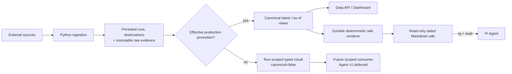
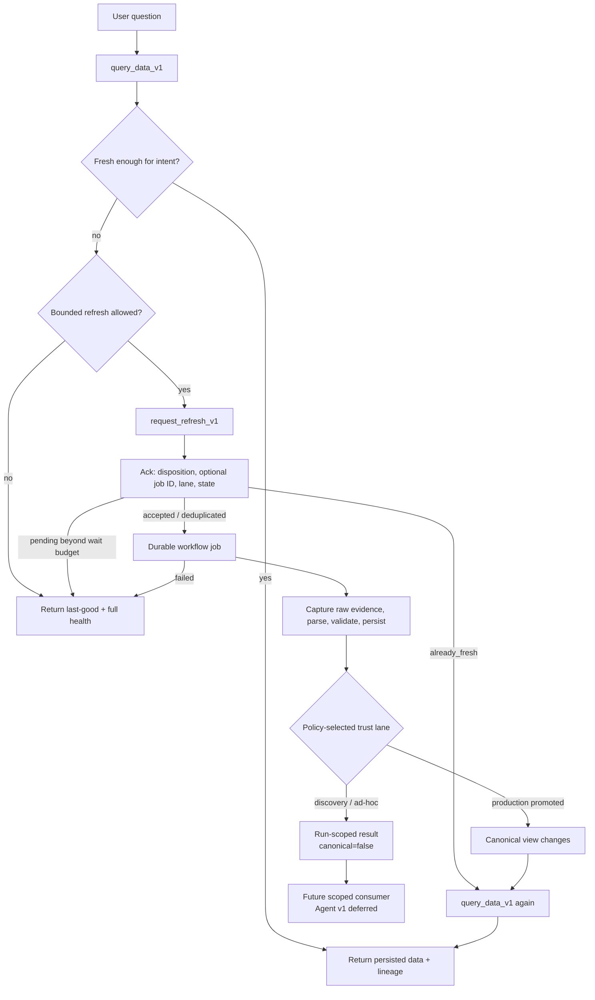

# Data Access and Freshness Architecture

## Decision

市場資料採用 **scheduled snapshot 為主、freshness-aware on-demand refresh 為輔**：

- Python workflow 定時或由人手執行 ingestion，保存正式 observation 和 raw evidence。
- Dashboard 透過 Data API 讀取 canonical observation view，不經 LLM 重算。
- 為 Pi 生成按日期及分類整理的 read-only Markdown projection，copy到專用rooted resource workspace；Agent只經rooted `read`／`grep`／`find`／`ls` adapter找資料，不引入 vector database 或 RAG framework。
- 使用者問「今天／最新／剛公布」或本地資料超過 freshness policy 時，才觸發受控 live refresh。
- Agent 的query tool只讀persisted data；live refresh經獨立授權的request tool建立durable job，Agent不直接調用raw collector或寫DB。
- Live result 必須先完成 capture、validation 和 persistence；Agent facade v1只消費canonical結果，run-scoped noncanonical consumption待另一個Decision。一次性 web context 不能成為正式數據。

實體 persistence 和證據規則由 [[wiki/architecture/datasource|Datasource Persistence Architecture]] 定義。本頁只定義資料何時更新，以及 Dashboard 和 Agent 讀取哪一個 representation。

## Canonical Store and LLM Wiki Are Not Two Sources of Truth

SQLite／raw evidence store 是 operational source of truth；`wiki/market/` 是由 canonical observations 和 evidence metadata **確定性生成的 materialized projection**：



避免 divergence 的規則：

- 只有 Python ingestion workflow 可以保存 evidence、run 和 observation；只有 effective `production_ingestion` promotion／revocation 可以改變 canonical visibility。
- 只有 durable deterministic renderer 可以寫入 `wiki/market/` 的生成頁面；LLM 和使用者不手改其中的 numeric facts。
- 每個生成頁保存 canonical anchor、effective promotion ID／sequence、`observation_ids`、`evidence_ids`、`as_of`、`generated_at`、兩軸 freshness、`degraded`、projection schema version 和 source hash。
- Wiki 可以從 canonical store 完整重建；刪除 projection 不會丟失正式資料。
- Dashboard 和 Wiki 由相同 canonical view 生成，不各自維護數值。
- `source_discovery`、`ad_hoc_research`、failed 或 succeeded-but-unpromoted run 不生成 canonical Wiki；只可返回 persisted run-scoped typed result並明示`canonical=false`。
- Data plane保留上述run-scoped能力，但
  [[wiki/decisions/agent-tool-facade-foundation|Agent Tool Facade v1]]不把
  `result_ref`暴露給model；Agent consumption待另一個session-scoped Decision。
- Markdown 中的分析文字不是 observation；fact 和 inference 必須分開。

如果比賽版本尚未完成 SQLite persistence，可以用 validated JSON／JSONL 作同一 logical canonical store；但仍須維持「一個 canonical writer、Wiki 是衍生 projection」的規則。

## Freshness Classes

不同 datasource 不能共用一個固定 TTL。每個 datasource definition 必須分開聲明 trigger mode、retrieval target、observation／release policy、on-demand capability和promotion policy。

| Data class | Typical change pattern | Refresh policy |
|---|---|---|
| Prime／Grade A rent、vacancy、availability | 月度／季度報告或不定期 broker update | 定時檢查；保存至下一個預期 release，不在每次 chat 重抓 |
| Leasing volume 和市場 aggregate | 月度／季度 | Scheduled ingestion |
| Broker market reports | 月度／季度或不固定 | 每日／每週 discovery check；新文件出現才 ingest |
| GDP、CPI、就業 | 官方 release calendar | `release_aware`：公布時間後 refresh |
| Bank Rate／MPC | 已知會議日期後公布 | `release_aware`：公告後 refresh |
| Planning applications／development status | 可以每日變動 | 每日 scheduled；latest 問題可 on-demand |
| Leasing transactions／重大交易 | 不定時發生 | 定時 news discovery；latest 問題可 on-demand |
| 市場新聞、政策或突發事件 | 持續更新 | 短 TTL 或 on-demand live search |

Policy example：

```yaml
market_reports:
  trigger_mode: scheduled_discovery
  retrieval_target: weekly
  observation_policy: until_next_expected_release
  on_demand_profile: discovery_check

macro:
  trigger_mode: release_aware
  retrieval_target: after_expected_release
  observation_policy: until_next_official_release
  on_demand_profile: approved_production_catchup

planning:
  trigger_mode: scheduled_or_on_demand
  retrieval_target: 24h
  observation_policy: source_defined

market_news:
  trigger_mode: on_demand
  retrieval_target: 1h
  observation_policy: not_applicable
  default_lane: ad_hoc_research
```

Freshness response保留兩個獨立軸：

- `retrieval_freshness`：`fresh`、`aging`、`stale`、`never_ingested`，表示最近是否按poll／release policy成功檢查來源。
- `observation_freshness`：相同狀態，另可為`unknown`／`not_applicable`，表示最新合法observation是否符合預期period／release。

`degraded`和`canonical_available`是另外兩個獨立欄位，不是freshness enum。例如source今天已成功檢查、最新合法CPI仍是上月，可能同時是retrieval fresh、observation fresh、canonical available；若上一個attempt失敗但last-good仍在，則可以是observation aging、`degraded=true`、canonical available。

TTL／target 是初始產品 policy，不代表來源本身的更新承諾；每個回答仍須顯示來源實際 `as_of`、`source_date` 和 `retrieved_at`。

## Query-time Decision

Freshness 由 host-controlled code 根據 datasource policy 判斷，不由 LLM 自己猜測：



Runtime sequence：

1. 解析問題需要的 datasource、submarket、metric 和 time range。
2. Agent facade v1以`query_data_v1`讀取canonical data，以及兩軸freshness、`degraded`、`canonical_available`和last attempt／success／promotion；authorized run-scoped consumption尚未暴露給Agent。
3. Host policy按使用者intent、release calendar和datasource definition判斷是否需要及允許refresh；LLM不能自行把TTL改成0或選lane。
4. 需要refresh時，`request_refresh_v1`只提交allowlisted profile和bounded scope；trusted broker決定definition、request template、budget、lane、licence及promotion policy，再enqueue／dedupe durable job。
5. Request立即回傳disposition、optional job ID、policy-selected lane、state和poll-after；`already_fresh`直接回canonical anchor。快速單一官方API可在host固定budget內poll；PDF、pagination、fanout或manual review一律async。
6. Job按capture-before-parse規則保存、解析、驗證及terminal commit；結果未保存及驗證前不可進Agent context。
7. `get_refresh_status_v1`分開回傳job、attempt、promotion和`canonical_changed`；`succeeded`不等於已promotion或數值有改變。
8. Production terminal後重新呼叫`query_data_v1`。Data plane仍保存ad-hoc／discovery的capability-scoped result並明示`canonical=false`，但Agent v1不消費；待另一個session-scoped Decision才接入。只有effective production promotion／revocation enqueue targeted Wiki render。
9. Pending、未獲批准或失敗時保留last-good，回答顯示完整stale／degraded、舊`as_of`及job status；不得以0或空結果覆寫。

## Trigger Modes and Trust Lanes

### Scheduled／release-aware triggers

用於可預期、可批量處理的資料：

- Approved-source ingestion。
- Broker report discovery。
- Macro release checks。
- Planning daily update。
- Daily／weekly market snapshot。
- Deterministic anomaly 和 alert rules。

比賽版本不需要先部署 24/7 scheduler；可以在應用啟動或 demo 前執行同一批 refresh commands。部署 scheduler 不應改變 ingestion contract。

### On-demand trigger

只在以下情況執行：

- 使用者明確要求「最新／今天／剛公布」。
- 所需 datasource 已超過 freshness policy。
- 使用者問題超出現有 snapshot 的時間或主題範圍。
- 使用者主動按下 Refresh。

On-demand不決定lane。已批准的fixed official collector，例如release後的宏觀數據catch-up，可以由policy選`production_ingestion`；新query、任意live news search或未qualification來源預設`ad_hoc_research`／`source_discovery`，不能直接更新Dashboard。Agent不能在tool arguments指定或提升lane。

### Trust lanes

| Lane | Permitted result | Canonical／Wiki impact |
|---|---|---|
| `production_ingestion` | Approved fixed request經完整validation的observations | Promotion通過後可改canonical，並enqueue targeted Wiki render |
| `source_discovery` | Candidate source／edition／revision及quarantined evidence | 不canonical、不render；approval後另建production reacquisition job |
| `ad_hoc_research` | 當次問題的persisted run-scoped typed result | `canonical=false`，不render、不自動promotion |

## Competition Profile

MVP 保留少量清楚的 refresh entrypoints：

```text
refresh-all         # host/operator：demo 前批量enqueue一般來源
refresh-macro       # enqueue官方宏觀資料profile
refresh-planning    # enqueue規劃／供應profile
refresh-news        # enqueue最新新聞／交易research profile
refresh-status JOB  # 讀取job／attempt／promotion狀態
wiki-rebuild        # admin-only：只由canonical view完整重建
```

所有`refresh-*` alias只可enqueue並回傳job ID，不同步直接執行raw collector。Pi 不需要自訂 `wiki_search` tool；在 sandbox 內使用 `rg` 找生成頁，再用 restricted `read` 讀取。需要current claim時仍以typed query核對canonical anchor，避免targeted render尚在pending時讀到舊projection。資料獲取和 refresh 由host-controlled broker／commands執行，不能讓模型自行拼接任意網絡或寫入命令。

## LLM Correctness Contract

本地保存資料並不能單獨保證 LLM 正確；必須限制數字 claim 的形成方式：

- `rg` 只負責 discovery，不負責判斷哪個數值最新或定義是否相容。
- Agent 從生成頁發現資料後，必須取得明確 `observation_id`、value、unit、definition 和 `as_of`；current／latest claim需以typed query確認canonical anchor，不能假設Wiki render已完成。
- 每個 material numeric fact 必須使用structured `numeric_observation`並引用exact
  citation ref；Facade依capability manifest投影typed numeric value，不能猜generic
  payload key。
- Final validator 對照同一canonical-query ledger；value、unit、date、definition或
  anchor不符時拒絕輸出並要求重答，numeric顯示文字由host產生。
- Qualitative／inference text不得另帶數量 claim；runtime只承諾mechanical token
  guard，number words及quantitative comparison由Skill和固定acceptance evaluator
  檢查，不宣稱通用semantic detection。
- Trend、percentage change 和 comparison 優先由 deterministic Python code 計算，不由 LLM 心算。
- 來源不足或定義衝突時輸出 `unknown`／`not comparable`，不能補造或自動合併。
- 所有回答明示retrieval／observation freshness及`degraded`；`published_at`、`source_date`、`as_of` 和 `retrieved_at` 不可互相替代。

## Acceptance Criteria

- Slow-moving datasource 不會因每次聊天而重複 live fetch。
- 「今天／最新」問題在 stale 時會觸發允許的 refresh，而不是直接使用舊資料冒充 current。
- Query、refresh request和status是分開的versioned contract；Agent不能直接調用collector、任意URL、lane、promotion或DB writer。
- 每個refresh先建立durable、可dedupe的job；pending可返回job ID和last-good，不需把長工作綁在chat request。
- Live result 在進入 LLM context 前已有terminal run、evidence、retrieval timestamp和validation結果；job `succeeded`不被當成已promotion。
- Refresh failure 不覆寫上一個有效值，UI 和回答顯示兩軸freshness、`degraded`及canonical availability。
- Trigger mode和trust lane分開；approved on-demand production可以promotion，ad-hoc／discovery不能自動提升。
- LLM Wiki 可由 canonical store 完整重建，只有effective production promotion／revocation觸發render，且不存在手工維護的第二份數值。
- Dashboard 和 Agent 引用相同 observation IDs。
- Agent 無法把 `ad_hoc_research` result 自動提升成 canonical metric。
- 無 vector database 或專用 RAG infrastructure，仍可用 `rg`／`read` 完成 evidence discovery。

## References

- [[wiki/architecture/agent-runtime|Agent Runtime Architecture: Pi + Python Data Plane]]
- [[wiki/architecture/datasource|Datasource Persistence Architecture]]
- [[wiki/User Requirement|User Requirement]]
- [ONS Release Calendar](https://www.ons.gov.uk/releasecalendar)
- [Bank of England MPC dates](https://www.bankofengland.co.uk/monetary-policy/upcoming-mpc-dates)
- [Planning London Datahub](https://www.london.gov.uk/programmes-strategies/planning/digital-planning/planning-london-datahub)
