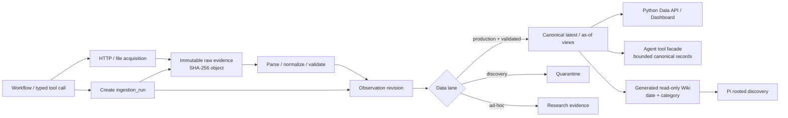

# Datasource Persistence Architecture: Observation + Evidence Store

> **Implementation update (2026-08-01):** This architecture is now implemented
> as the bounded datasource operational system. Actual live persistence results,
> remaining policy gates, ONSPD competition tool budget and retention procedure are recorded
> in [[wiki/decisions/datasource-operational-implementation-2026-08-01|Datasource Operational Implementation Status]].

## Decision

Datasource 取得的正式市場數據由 **Python data plane** 保存，不由 Pi session、chat history 或 Agent memory 保存。MVP 採用：

- **SQLite** 保存ingestion run、標準化observation revision、audit metadata及
  deterministic projection delivery metadata；目前不保存Agent claim lineage。
- **本地 content-addressed artifact directory** 保存不可變的原始 response body，例如 JSON、HTML、PDF、CSV、ZIP、XLSX、ODS 和 ArcGIS payload。
- Python workflow 是唯一正式寫入者；Python Data API、Dashboard 和 Agent tools 透過穩定 read interface 查詢。
- `wiki/market/` 可以由canonical observations和evidence metadata確定性生成，
  再copy到Pi的rooted read-only resource workspace；它不是第二個正式數據來源。
- `production_ingestion`、`source_discovery` 和 `ad_hoc_research` 分 lane 保存，只有通過驗證的 production observation 可以進入 canonical view。

SQLite 和本地 artifact directory 是 MVP 的實體實作；邏輯上的 `Observation + Evidence Store` 不依賴 SQLite。需要多主機、多 writer、集中權限或大量 spatial query 時，metadata／observation 可遷移至 PostgreSQL／PostGIS，raw artifact 可遷移至 S3-compatible object storage，而不改變 Agent tool schema。

## Core Rule: Capture Before Parse

不能等 datasource function 回傳 `SourceResult` 後，才聲稱已保存 raw evidence。

目前 HTTP helper 只回傳 body bytes，PDF、ZIP、XLSX、ODS 和 API response 會在 datasource function 內被解析；call 完成後只剩標準化 records，無法重建原始 response、HTTP headers 或取得當時的內容。因此 production collector 必須在 **HTTP／file acquisition boundary**：

1. 取得 response body 和必要 HTTP metadata。
2. 對原始 bytes 計算 SHA-256。
3. 先將 raw artifact 不可變地保存。
4. 再從已保存的 artifact 進行 parse、normalize 和 validate。
5. 將 observation revision 連回 evidence ID 和原文 locator。

`SourceResult` 是 normalized output，不是 immutable source evidence。Agent 摘要、Markdown 或模型抽取結果也不能取代原始 artifact。

## Persistence Boundary

Datasource parser 不應自行隱式寫入資料庫。正式保存由 workflow／CLI 的 persistence wrapper 擁有：

```text
collect request
  -> create ingestion run
  -> fetch and persist raw evidence
  -> parse from persisted artifact
  -> normalize and validate
  -> deduplicate and persist observation revisions
  -> finish run and report freshness/degraded state
```

這個邊界保留 datasource parser 的可重播及可測試性，也讓 scheduled ingestion、Agent ad-hoc research 和 offline reparse 共用同一套保存規則。

Agent read tools預設查詢已保存的production canonical數據。Data plane可把future
live research保存到`ad_hoc_research` lane，但目前Agent Runtime v1不暴露
`result_ref`；待另作session-scoped non-canonical result Decision後才可進入回答，
且永不得直接更新canonical metrics。

## Data Flow



## MVP Physical Layout

```text
data/
  store.sqlite3
  evidence/
    sha256/
      ab/
        <full-sha256>.<extension>
```

- `data/` 是 runtime state，不提交 Git。
- 原始 artifact 以 content hash 去重；extension 只協助人工檢查，不參與 identity。
- SQLite 只保存 metadata、可查詢的 normalized payload 和 artifact URI，不保存大型 binary。
- SQLite database 和 evidence directory 必須一起備份及還原；restore 後要執行 hash／missing-object integrity check。
- MVP 使用本機 disk，不將 SQLite database 或 WAL 放在 network filesystem。

## Logical Data Model

不為 13 類 datasource 預先建立 13 套資料表，也不把所有欄位強塞成單一 EAV metric table。MVP 使用共同 provenance envelope 加 source-specific JSON payload；Dashboard 需要穩定 KPI 時，再建立小型 typed projection／view。

### `ingestion_run`

每一次嘗試都有新的 `run_id`，包括成功、空結果、部分成功和失敗。

| Field | Meaning |
|---|---|
| `run_id` | execution identity；UUID／ULID |
| `datasource_id` | 穩定 machine ID，不使用人類可讀 `source` 代替 |
| `lane` | `production_ingestion`、`source_discovery` 或 `ad_hoc_research` |
| `request_json` | canonical、已移除 secret 的 function args／HTTP request metadata |
| `request_hash` | canonical request 的 SHA-256 |
| `as_of` | caller 要求的分析截點 |
| `collector_version` | collector code／package version |
| `parser_version` | parser／normalizer version |
| `schema_version` | persisted result schema version |
| `started_at`, `completed_at` | run lifecycle |
| `status` | `running`、`succeeded`、`empty`、`partial` 或 `failed` |
| `error_json`, `warnings_json` | 結構化錯誤和資料質素警告 |
| `latency_ms` | acquisition 加 processing latency |
| `trace_id`, `session_id` | nullable；只在 Agent 觸發時連接 runtime audit |

### `evidence_artifact`

`evidence_id` 代表一次不可變的來源證據；物理內容由 `content_sha256` 去重。相同 bytes 在不同 run 出現時不重複保存 object，但每次 retrieval 仍可由 run linkage 審計。

| Field | Meaning |
|---|---|
| `evidence_id` | immutable evidence identity |
| `content_sha256` | raw bytes hash／physical object identity |
| `artifact_uri` | local content-addressed path，未來可改為 object-store URI |
| `media_type`, `byte_size` | artifact metadata |
| `source_id`, `source_url` | 穩定來源和實際 request URL |
| `http_method`, `http_status` | acquisition metadata |
| `etag`, `last_modified` | 來源有提供時保存 |
| `retrieved_at` | 我們實際取得 response 的 UTC 時間 |
| `published_at` | 來源首次發布時間；未知保留 `null` |
| `source_updated_at` | 來源更新／修訂時間；未知保留 `null` |
| `licence`, `access_class` | retention、內部使用及可再發布限制 |

`run_evidence` 保存 run 與一個或多個 evidence artifacts 的關係。這對 ONS 多 series、Nomis 多 endpoint 以及由 Content API 發現附件的 datasource 是必要的。

### `observation_revision`

每筆 normalized record 保留共同查詢欄位及完整 source-specific JSON：

| Field | Meaning |
|---|---|
| `observation_id` | immutable revision identity |
| `record_key` | datasource 定義的穩定 natural key |
| `record_hash` | canonical normalized payload hash；排除 `retrieved_at` 等 volatile field |
| `category`, `record_type` | 市場資料分類和 record schema |
| `payload_json` | 完整 normalized record，不丟失 source-specific fields |
| `source_date` | point observation／event 的有效日期；無可靠日期可為 `null` |
| `period_start`, `period_end`, `period_label` | time-series／季度資料的原始期間 |
| `geography_code`, `geography_name` | 可比較的地理 identity；不適用時為 `null` |
| `unit` | 原始單位，不由 Agent 猜測 |
| `data_kind` | `direct`、`proxy` 或 `report-derived` |
| `confidence` | `high`、`medium` 或 `low` |
| `definition`, `limitations_json` | 原始定義、地理／用途覆蓋和已知限制 |
| `evidence_id`, `locator_json` | 原始 artifact 和精確原文位置 |
| `parser_version`, `schema_version` | 可離線重播的 transformation identity |
| `created_at`, `supersedes_id` | revision lineage |

`run_observation` 保存本次 run 看見了哪些 observation。即使 observation 因內容相同而沒有新增 revision，本次 retrieval 仍可審計。

### `output_artifact`

目前`output_artifact`只記錄`projection_daily`、`projection_weekly`、
`projection_alerts`和`projection_audit`等deterministic delivery metadata；它不是
Agent artifact／claim store。現行schema沒有`claim_evidence` table，也沒有
Agent-facing writer contract。

第一個Agent vertical slice的`market_brief.v1`只保存在in-memory Runtime turn，
不寫入這張表。未來若要持久化chart、brief或material claim，必須另作Decision及
migration，明確定義fact／inference、observation／evidence lineage、consumer、
retention和access policy；不可把projection row當成Agent claim。

## Time Semantics

以下時間不可互相冒充：

| Field | Definition |
|---|---|
| `source_date` | 數據點或事件實際代表的日期 |
| `period_start`／`period_end`／`period_label` | 月、季、rolling period 或報告期 |
| `published_at` | 來源首次發布時間 |
| `source_updated_at` | 來源後續更新或 observation revision 時間 |
| `retrieved_at` | 系統取得資料時間 |
| `as_of` | 查詢／分析只能使用的 knowledge cutoff |

當來源只有 `2026 Q1` 等 period label 而沒有可靠日子時，保留 `period_label`，不可虛構 `source_date`。CLI contract 中的 `source_date` 可以是 `null`，但 period 和日期限制必須保留。

`as_of=T` 查詢只能選擇 `retrieved_at <= T`、當時已通過 validation 的 revision，才能重現「在 T 時系統知道甚麼」。

## Evidence Locators

每筆 observation 必須能定位至原始 evidence：

| Source type | Minimum locator |
|---|---|
| JSON API | JSON Pointer／record ID，加實際 request URL |
| CSV／ZIP | archive member、row key、column names |
| PDF report | page number；可用時加 table／section／text span |
| XLSX／ODS | workbook attachment、sheet、row／cell range |
| HTML | canonical URL 加穩定 section／element locator |
| ArcGIS | layer、feature ID、geometry spatial reference |

Report-derived observation 必須連回 raw report artifact 和 page locator，並保存 extractor／parser version。模型抽取可以產生 derived record，但模型摘要本身不是 evidence。

## Deduplication and Revision Rules

1. **Every call creates a run**：重跑也是可審計事件。
2. **Raw object deduplication**：相同 `content_sha256` 不重複保存 bytes。
3. **Same key, same content**：相同 `record_key + record_hash` 不新增 revision，只增加 run linkage。
4. **Same key, changed content**：建立新的 immutable revision，透過 `supersedes_id` 連回舊值。
5. **Never overwrite history**：canonical latest 是 view，不是 update 舊 observation。
6. **Offline reparse**：以 `evidence_id + parser_version` 重播，不重新上網。
7. **URL is not identity**：URL 可以變化或返回新內容，不能單獨作 evidence／record identity。

每個 datasource 必須明確定義 `record_key`。例如：

- Bank Rate：`series + date`。
- ONS：`series + period`。
- Nomis：`dataset + geography_code + period_code + metric`。
- VOA office stock：`area_code + year`。
- Planning application：PLD application ID。
- GOV.UK content：`base_path + public_updated_at`。
- Postcode：`PCDS`。

若來源沒有穩定 key，例如部分 boundary records，collector 必須先保存來源 feature ID；不能用 list position 作 identity。

## Write and Failure Protocol

每次 ingestion 依以下順序執行：

1. 建立 `running` run，保存 canonical／redacted request。
2. 取得 raw response；記錄 timeout、status 和 response metadata。
3. 以 temporary file 寫入 artifact，完成後 atomic rename 至 content-addressed path。
4. 從已保存 artifact 解析；原始下載 buffer 不作唯一輸入。
5. 執行 runtime schema、metric definition、unit、period、geography 和 proxy label validation。
6. 在單一 SQLite transaction 內寫入 evidence metadata、observation revision 和 run links。
7. 最後將 run 更新為成功、空、部分成功或失敗，並計算 freshness／degraded state。

File 必須先安全落盤，database 才可引用它。若 database transaction 失敗，最多留下可安全清理的 orphan content object；不可留下指向不存在 artifact 的 committed database row。

若 raw acquisition 成功但 parse／validation 失敗，raw evidence 仍保留，run 標記為 `partial` 或 `failed`，不產生 canonical observation。Datasource failure 不得刪除上一成功 revision；Dashboard 繼續顯示上一值並清楚標示 stale／degraded。

## Data Lanes and Promotion

| Lane | Persistence | Canonical impact |
|---|---|---|
| `production_ingestion` | 保存 run、raw evidence、validated observations | 通過驗證後可進 canonical view |
| `source_discovery` | 保存至 quarantine | 不可直接更新 canonical metrics |
| `ad_hoc_research` | 保存為 research evidence | Data plane可簽發run-scoped result；Agent v1未啟用，不可自動更新dashboard |

Discovery 或 ad-hoc evidence 若要成為正式資料，必須建立 approved datasource definition，並由新的 production run 重新取得及驗證；不要原地改變舊 run 的 lane。

## Persisted Result Contract

Persistence／CLI wrapper 在現有 `SourceResult` 外提供版本化 run envelope。大型 records 可只回傳 bounded subset；完整內容由 IDs 查詢：

```json
{
  "schema_version": "source-run/v1",
  "run_id": "run_...",
  "datasource_id": "ons.uk_inflation",
  "lane": "production_ingestion",
  "status": "succeeded",
  "as_of": "2026-07-31",
  "source_date": "2026-06-30",
  "retrieved_at": "2026-07-31T14:00:00Z",
  "published_at": "2026-07-22T06:00:00Z",
  "source_updated_at": "2026-07-22T06:00:00Z",
  "evidence_ids": ["ev_..."],
  "observation_ids": ["obs_..."],
  "confidence": "high",
  "warnings": [],
  "records": []
}
```

Unknown date 保留 `null`。`proxy`／`report-derived`、原始定義、地理範圍及限制必須持久化，不可只寫在 research Markdown 或 Agent response。

## SQLite Operating Rules

- MVP 由單一 workflow writer 執行短 transaction；Data API 和 Agent tools 主要讀取。
- MVP 預設使用 SQLite rollback journal。WAL 只有在 runtime SQLite 已核對官方修復版本、資料庫位於同一 host local disk，並通過 concurrent read／write tests 後才可啟用。
- 2026-07-31 的 `uv run` runtime 使用 SQLite `3.50.4`；SQLite 官方 WAL advisory 指出相關 WAL-reset bug 的修復版本包括 `3.50.7` 和 `3.51.3`，因此目前不得直接啟用 WAL。
- 設定 foreign keys、busy timeout 和 integrity checks；migration 必須版本化。
- 不把 DuckDB 當 operational source of truth。它可日後讀取 export／Parquet 做分析，但不負責 Node Agent Service、Data API 和 workflow 的跨 process 寫入協調。

## Upgrade Triggers

出現任一情況時，將 operational store 遷移至 PostgreSQL；需要大量 geometry operation 時加 PostGIS：

- workflow、API 或其他 service 在多個 host／container 需要 concurrent writes。
- single-writer queue 已造成可觀察 ingestion latency 或 lock contention。
- 需要高可用、集中備份、tenant isolation 或細粒度 database permissions。
- 需要大量 point-in-polygon、spatial join 或 spatial index query。
- raw artifact 需要跨主機共享、lifecycle policy 或遠端備份時，遷移至 S3-compatible object storage。

遷移不可改變 `run_id`、`evidence_id`、`observation_id`、tool output schema 或 as-of semantics。

## Security, Licensing and Retention

- Credentials、API tokens、cookies 和敏感 headers 在寫入 request metadata 前必須移除。
- URL query 若包含 secret，保存 redacted URL；重播所需 secret 只由 runtime credential store 注入。
- Raw artifact 依來源 licence／terms 設定 retention 和 access class。
- 公開可下載不代表可以公開重新發布；broker PDF 等報告可以作內部 evidence，但產品不可提供整份鏡像下載，除非 licence 明確允許。
- Evidence access、artifact submission、policy rejection 和 canonical promotion 均保留 audit trace。

## Historical Implementation Gap (2026-07-31 baseline)

現有 `SourceResult` 只有：

- `category`
- `source`
- `source_url`
- `retrieved_at`
- `published_at`
- `source_updated_at`
- `records`

它尚缺 `schema_version`、`datasource_id`、`run_id`、`as_of`、`source_date`、`evidence_ids`、`confidence`、record key、raw content hash、locator、parser version、lane、status 和 error metadata。

另外：

- `get_bytes()` 沒有保留 response status、headers、final URL 或 raw artifact reference。
- PLD search 使用 POST body，但 `source_url` 只有 endpoint，無法獨立重播 request。
- Planning search 可以丟失來源 `_id`；town-centre query 尚未要求穩定 feature ID。
- PDF／ZIP／XLSX／ODS functions 在解析後不再持有可引用的 raw evidence。

## Implementation Order

1. 建立 SQLite migrations、artifact writer 和 ID／hash utilities。
2. 將 HTTP acquisition 改為可回傳 body、status、headers、final URL 和 retrieved time 的 typed response，並在解析前保存 artifact。
3. 建立 persistence workflow wrapper；不要把 DB writes 分散到 16 個 datasource functions。
4. 為各 datasource 定義 `datasource_id`、`record_key`、locator、`data_kind`、confidence 和限制。
5. 建立 canonical latest／as-of views、freshness 和 degraded-state query。
6. 擴充 CLI contract，回傳 run、evidence 和 observation IDs。
7. 最後加入 typed output artifact 和 claim-evidence validation。

## Acceptance Criteria

- 原始 response 在 parse 前已保存，並可用 SHA-256 驗證。
- 不連網時可由同一 evidence artifact 以指定 parser version 重播。
- 相同來源內容重抓不產生重複 raw object 或 observation revision，但保留 run audit。
- 來源修訂會新增 observation revision，舊值仍可用 as-of query 取得。
- Failed／partial run 不會覆寫上一個 canonical value，Dashboard 會顯示 degraded status。
- Discovery／ad-hoc data 不可直接進 canonical view。
- 每個數字 fact 可追至 evidence ID、source、locator、source period、published time 和 retrieval time。
- Proxy／report-derived data 永遠保留其類型、原始定義、地理範圍及限制。
- Request／artifact metadata 不包含 credentials。
- Agent 不可透過任意 filesystem write 或 SQL 修改 store。

## Non-goals for MVP

- Kafka、event streaming 或分散式 queue。
- Cloud data lake、vector database 或專用 time-series database。
- 13 類 datasource 各自完整 data warehouse schema。
- PostGIS／SpatiaLite；MVP geometry 以 GeoJSON、SRID、source vintage、geometry hash 和 bounding box 保存。
- 將 Agent session transcript 或 chain-of-thought 當正式 evidence。

## References

- [[wiki/architecture/agent-runtime|Agent Runtime Architecture: Pi + Python Data Plane]]
- [[wiki/architecture/data-access-freshness|Data Access and Freshness Architecture]]
- [[wiki/User Requirement|User Requirement]]
- [[wiki/research/_index|Datasource Research Index]]
- [SQLite: Appropriate Uses](https://www.sqlite.org/whentouse.html)
- [SQLite: Write-Ahead Logging](https://www.sqlite.org/wal.html)
- [DuckDB: Concurrency](https://duckdb.org/docs/current/connect/concurrency)
- [PostgreSQL: JSON Types](https://www.postgresql.org/docs/current/datatype-json.html)
