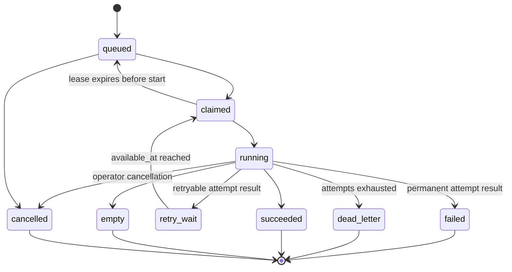
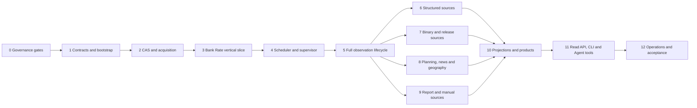

# Datasource Database and Scheduled Ingestion Pipeline

## Decision

本項目完整實作一個由 **Python data plane** 擁有的 datasource operational system，而不是只在現有函數外加一層 cache。最終交付包括：

1. versioned datasource registry；
2. SQLite operational database；
3. content-addressed immutable evidence store；
4. durable scheduler、job queue、retry、backfill 及 offline reparse；
5. 13 類資料的 automatic、assisted 或 manual ingestion workflow；
6. revision、tombstone、promotion、canonical latest／as-of semantics；
7. typed projections、freshness、degraded status、daily／weekly snapshot 及 deterministic alert input；
8. migration、integrity、backup／restore、安全、監控及 deployment runbook；
9. Python CLI、Data API 和 Agent tools 共用的 stable read contract，以及受控、可審計的 refresh request／status contract。

這是一份完整交付決策，不把第一條 vertical slice 當作終點。實作可以按依賴分批落地；本文分開定義 engineering completion 和 product-coverage completion，避免把未獲授權的外部來源假裝成技術完成。

本文將 [[wiki/architecture/datasource|Observation + Evidence Store]] 的 logical architecture 收斂成 proposed implementation contract。它涵蓋完整終態，但要在 Phase 1 以可執行 migrations、constraints 和 lifecycle tests 驗證後才轉為 `accepted`；在此之前不得把 schema notation 當成已部署事實。若本文與該架構頁在 schema 或 operational semantics 上有差異，以本文較具體的決策為準。

## Scope and completion boundary

### In scope

- 目前 13 類 datasource coverage 對應的所有 upstream source。
- structured API／CSV／RSS、ZIP／XLSX／ODS／PDF、ArcGIS、release discovery、manual browser review。
- production ingestion、source discovery、ad-hoc research 三條 lane。
- source history、source revisions、parser revisions、deletion／reappearance。
- dashboard、CLI、Agent 所需的 read model、evidence locator 和 data health。
- initial backfill、正常排程、停機 catch-up、manual reprocessing、災難還原。

### Not equivalent to completion

- 只建立 SQLite tables。
- 只完成 Bank Rate 或單一 collector。
- 只把 16 個現有 Python function 依序定時執行。
- 只保存 normalized `SourceResult`，沒有 raw evidence 和 request audit。
- 13／13 有可用來源，但部分來源仍靠無記錄的人工步驟。
- Dashboard 顯示數值，但不能用 as-of query 重現當時已知資料。

### Non-goals

- MVP 不使用 Kafka、Celery、Redis、APScheduler、Airflow 或分散式 queue。
- MVP 不使用 SQLAlchemy／Alembic；stdlib `sqlite3` 和 numbered SQL migrations 已足夠。
- 不為每個 datasource 建立一套 warehouse schema；共同 provenance envelope 加少量 query-shaped projection。
- 不使用 LLM summary、chat transcript 或 chain-of-thought 代替 source evidence。
- 不因「免費公開」而假設可公開鏡像或永久保存完整內容。
- 不把 planning town centre、official geography 或 platform enquiry proxy 靜默改稱 broker submarket／office demand。

## Non-negotiable invariants

1. **Capture before parse**：所有production／discovery／ad-hoc network acquisition只可解析已atomic保存的artifact；未保存及terminal validation的live result不能進Agent context。
2. **Every attempt is auditable**：一次 logical job 可以 retry；每次 attempt 都有獨立 `workflow_attempt`，datasource attempt 再有一對一 ingestion run。
3. **File before database reference**：database 不可 commit 指向不存在檔案的 row。
4. **Immutable history**：evidence、observation revision、promotion decision 和 audit event 不覆寫。
5. **Lane isolation**：discovery／ad-hoc run 永遠不能直接進 canonical view。
6. **Failure preserves last good value**：failed、partial、unexpected empty 不清除上一個 canonical value。
7. **Knowledge-time correctness**：as-of 同時檢查 retrieval time 和 canonical promotion time。
8. **No inferred deletion**：只有 validated complete snapshot 或 explicit upstream delete 才可建立 tombstone。
9. **Definition preservation**：unit、period、geography、provider definition、proxy／report-derived label 和 limitations 不可丟失。
10. **Least privilege**：Agent 只能讀 typed interface，或透過獨立授權的 bounded refresh-request capability 建立 durable job；不能任意 SQL、filesystem write、network request，亦不能直接寫 evidence、observation、promotion 或 canonical state。
11. **Trigger and trust are orthogonal**：scheduled／release-aware／on-demand 是觸發方式；`production_ingestion`／`source_discovery`／`ad_hoc_research` 是信任及 promotion lane。Agent 或使用者觸發不會自動決定 lane。

## System context

```mermaid
flowchart LR
    REG["Versioned datasource registry"] --> SCH["Python scheduler daemon"]
    SCH --> JOB["Durable workflow_job queue"]
    JOB --> SUP["Single active supervisor"]
    SUP --> COL["Bounded collector subprocess"]
    COL --> ACQ["Allowlisted acquisition boundary"]
    ACQ --> CAS["Content-addressed object store"]
    CAS --> PARSE["Parse from persisted artifact"]
    PARSE --> VAL["Normalize and validate"]
    VAL --> OBS["Observation revisions and projections"]
    OBS --> PROMO["Automatic or reviewed promotion"]
    PROMO --> CANON["Latest and as-of read models"]
    CANON --> API["Python Data API and CLI"]
    PROMO -->|"effective decision"| WJOB["wiki_render outbox job"]
    WJOB --> RENDER["Canonical-view Wiki renderer"]
    CANON --> RENDER
    RENDER --> WIKI["Deterministic read-only Market Wiki"]
    CANON --> SNAP["Snapshots and deterministic alerts"]
    API --> DASH["Dashboard"]
    API --> AGENT["Typed Agent read tools"]
    WIKI --> AGENT
    AGENT -->|"bounded refresh request"| BROKER["Trusted refresh broker"]
    BROKER -->|"policy-selected durable job"| JOB

    DISC["Discovery or manual review"] --> REVIEW["Review task"]
    REVIEW -->|"approved new production job"| JOB
    REVIEW -->|"rejected"| QUAR["Quarantine"]
```



## Runtime and deployment model

- 一個 portable `cre daemon` 長期運行，由 systemd、launchd 或 container restart policy 管理。
- daemon 每 30 秒計算 due slots、enqueue、claim job、回收 expired lease 和更新 heartbeat。
- MVP 同一時間只執行一個 collector subprocess。這不是功能限制；它配合 SQLite single-writer、upstream rate limit 和 document parser isolation。
- 每個 collector 在固定 argv、無 shell 的 child process 執行，由 supervisor 強制 wall-clock timeout 及 graceful termination。
- persisted timestamp 一律是 UTC RFC 3339；UK calendar schedule 使用 `Europe/London` 計算，再將 occurrence 保存為 UTC。
- process 內 latency／timeout 使用 monotonic clock，不以 wall clock 計算 duration。
- dev 預設 state 在 repo `data/`；production 使用獨立 local filesystem data directory。database、temp 和 evidence 必須在同一 host，不放 network filesystem。
- SQLite 使用 rollback journal、`foreign_keys=ON`、`busy_timeout=5000`、`synchronous=FULL`。目前 runtime SQLite 3.50.4 不啟用 WAL。

### Parent／child protocol

- Parent daemon 是唯一 DB writer：claim job、建立 attempt／run、更新 heartbeat、執行 acquisition persistence，以及以 compare-and-set 收結 attempt／job。
- Child 只以 hidden fixed-argv worker entrypoint 啟動；一個inherited Unix-domain socketpair使用`uint32 length + UTF-8 JSON` framed duplex protocol和`SCM_RIGHTS`，stderr另作bounded logs，不用shell、pickle或任意import name。Parent以selector同時drain control socket／stderr和處理responses，bounded queue提供backpressure，禁止互等未drain channel。
- `ArtifactHandleV1`含`evidence_id`、`content_sha256`、byte size和media type，並由parent透過同一socket ancillary data傳一個已`O_RDONLY`開啟的artifact FD。Child只讀該FD，先`fstat`並核對size／hash；沒有任意absolute path、CAS directory capability或可寫handle。
- Child 的 `CollectionContext.acquire()` 向parent發typed request；parent驗證registry policy、取得及保存bytes，再回`ArtifactHandleV1`。Parser output不塞在單一final JSON：child按最多1,000 records／4 MiB一個`RecordBatchV1` streaming；definition可收窄，system hard ceiling為1,000,000 records／512 MiB normalized spool。Terminal frame保存batch count、record count和rolling SHA-256，parent逐batch schema validate／寫mode `0600` temp spool，核對terminal manifest後才進final DB transaction。Protocol error、truncation或limit breach令attempt failed，spool不promotion。
- Timeout／cancel 時 parent 先停止接受新 child request、發 SIGTERM、等待短 grace、必要時 SIGKILL；只有 `waitpid` 確認 child 已死後，parent 才用 `job_id + claim_token + attempt_id` compare-and-set 收結，防止 timeout result 和 late child result 競爭。
- Child 是 resource／fault isolation，不是 security sandbox；production 仍要靠 OS user、filesystem permissions、egress allowlist或container policy限制能力。

### Configuration and credential contract

- Non-secret config 由 explicit `--config` 或 `CRE_CONFIG` 指向一個 mode `0600` 的 TOML file；CLI flag只覆蓋明確 documented operational fields，優先序為 CLI → config → packaged safe default。
- Secret 只從 named environment reference或permission-checked secret file讀入，不進 registry JSON、DB、argv、logs或hash；startup輸出缺少的 secret name，不輸出其值。
- Pagination cursor HMAC key使用獨立mode `0600` secret file；rotation可明確令舊cursor過期，不影響stored data或as-of query。
- Production 必須明確設定 data directory、backup staging directory、instance ID和environment；相對 path只允許 development。
- Startup 驗證 `ZoneInfo("Europe/London")`；minimal image／缺系統 tzdb的平台加入 `tzdata` runtime dependency。
- Raw HTML 永不 render；只提供 escaped bounded plain text，因此 v1 不引入 sanitizer dependency。

### Single-writer command path

- Daemon持有 data-directory `writer.lock` 和 mode `0600` local Unix control socket；所有 enqueue、retry、cancel、review、evidence import、registry sync和retention approval等mutating CLI requests經versioned bounded JSON送給daemon，由它寫DB。
- Daemon未運行時，offline admin command才可取得exclusive writer lock；取得後必須確認沒有unexpired daemon heartbeat／job lease，完成一個bounded transaction再釋放。無法證明exclusive ownership即拒絕，不直接「試寫」。
- Read-only CLI／Dashboard／Agent query path只開 `mode=ro`＋`PRAGMA query_only=ON` connection，不取得writer lock。Agent refresh adapter不取得DB connection或admin callable；它只可把versioned bounded request送到trusted refresh broker，再由broker經daemon control socket enqueue。Migration／restore要求daemon stopped和exclusive lock；backup由daemon system job執行。
- `cre evidence import` 不把binary放JSON，也不讓daemon讀任意path。CLI以`O_NOFOLLOW`讀regular file，stream到service-owned mode `0700` import-staging內的random mode `0600` basename，計算hash／size、fsync並atomic rename為ready，再只把basename、hash、media type和operator attestation送control socket。Daemon用directory FD＋`O_NOFOLLOW`重開，核對owner／mode／regular-file／hash／size／media limits後才移入CAS和寫DB；成功／拒絕後清理staging。V1要求CLI與daemon同一least-privilege OS user。

## Source of truth and configuration ownership

Datasource definition 是 frozen、versioned、可序列化的 Python descriptor，不使用可任意載入的 YAML plugin system：

```python
DatasourceDefinitionDescriptor(
    datasource_id,
    definition_version,
    display_name,
    publisher,
    category,
    source_kind,
    automation_mode,
    collector_name,
    collector_version,
    source_bindings,
    parser_name,
    parser_version,
    schema_version,
    locator_version,
    default_request,
    schedules,
    catchup_policy,
    snapshot_mode,
    default_lane,
    record_key_builder_name,
    record_key_version,
    validator_bindings,
    retry_policy,
    timeout_policy,
    rate_limit_group,
    allowed_hosts,
    artifact_policy,
    review_policy,
    freshness_policy,
    promotion_policy,
    data_kind,
    default_confidence,
    licence,
    access_class,
    retention_policy,
    capabilities,
)

RUNTIME_BINDINGS = {
    ("collector", collector_name, collector_version): collector_callable,
    ("parser", parser_name, parser_version): parser_callable,
    ("record_key", record_key_builder_name, record_key_version): key_callable,
    ("validator", validator_name, validator_version): validator_callable,
}
```

`definition_json` 是唯一被 hash 的 immutable semantic truth；table 中的 searchable columns 是從它投影的 cache。Registry sync／daemon startup 必須逐欄重算和比對，任何不一致即拒絕啟動。Callable 不進 JSON；descriptor只保存每個binding的`kind + stable name + version`，validator list亦逐項versioned。Runtime registry拒絕duplicate keys；production／reparse target的missing binding拒絕啟動／enqueue，retired definition缺舊binding仍可read history但不可replay。部署不得讓同一binding key偷偷指向不同semantics。

Registry 負責 executable policy；SQLite 保存每個 definition 的 canonical JSON snapshot 和 hash。任何 request semantics、record identity、validation、access／retention policy 或 parser output 改變，都要增加 `definition_version`／`parser_version`，不得讓 code deployment 改寫舊 run 的含義。

Operational operator 可以 pause schedule、retry／cancel job、approve review 或 enqueue backfill，但不能在 DB 直接修改 source definition。

`datasource_id` 代表可版本化的 collector／product contract；`source_id` 代表 registry-approved upstream surface，例如 Content API、attachment、landing page 或 data API。兩者以 `datasource_source` 明確關聯。Human publisher 另存 `publisher`，每次實際 endpoint／attachment 保存 redacted URL 和 source identity；artifact 在某次 run 的用途則由 `run_evidence.role` 表達。若一項產品指標真正依賴不同 publisher 的獨立 records，建立不同 datasource definitions，而不是把它們合成一個模糊 source。

## Identity, time and canonical hashing

### IDs

- entity ID 使用帶 prefix 的 UUID4 hex，例如 `job_...`、`run_...`、`acq_...`、`ev_...`、`obs_...`。
- ID 不承擔排序語意；所有排序使用明確 timestamp 加 ID tie-breaker。
- `datasource_id` 是穩定 machine identity，不等於人類可讀的 source name。

### Timestamp and date rules

- timestamp：UTC RFC 3339、microsecond precision、`Z` suffix。
- calendar date：ISO `YYYY-MM-DD`。
- `period_label` 可獨立存在；只有 `2026 Q1` 時不可虛構季度最後一天作 `source_date`。
- API 若接受 date-only `as_of`，以 caller timezone 解讀該日結束；產品預設 `Europe/London`，轉成 UTC 後才查詢。
- `scheduled_for`、`started_at`、`retrieved_at`、`published_at`、`source_updated_at`、`source_date`、`promotion_at` 各自保存，不互相代替。
- Knowledge-critical `started_at`、`retrieved_at`、`completed_at`、decision／audit timestamps由parent service／DB transaction clock在事件發生時產生，不接受child、source或caller回填；upstream只可提供`published_at`／`source_updated_at`／`source_date`並保留其語意。
- Live scheduled ingestion 的 job `as_of_at` 可為 null；run 建立時以 `started_at` 作 requested cutoff。Backfill／reparse 若 source request 有明確 cutoff，保存該 cutoff。Canonical knowledge-time 永遠以 evidence retrieval、run completion 和 promotion decision計算，不以 run `as_of_at` 冒充。
- Persisted v1 contract 使用 `Z`。現有 `SourceResult.retrieved_at` 暫時保留 `+00:00` 作 legacy adapter compatibility；它不直接寫 production tables。所有現有 datasource functions 在完成 acquisition-boundary migration 前均標記 non-production adapter，直接呼叫不能繞過 capture-before-parse。
- 現有 `SourceResult` 為相容tests可繼續返回Python float；production `NormalizedRecord` 的hash-sensitive payload保留source numeric text／normalized decimal string，typed projection才轉`REAL`／`INTEGER`。兩個contract分開version和測試，不把legacy float直接餵入canonical JSON hasher。

### Canonical JSON v1

Request hash、record hash、definition hash 和 locator hash 使用同一 versioned algorithm：

1. strings 轉 Unicode NFC；
2. object keys 依 Unicode code point 排序；
3. compact separators，UTF-8，`ensure_ascii=False`；hash-sensitive JSON 只接受 null、boolean、UTF-8 string 和有界 integer；decimal／percentage／currency 用 normalized decimal string，拒絕 float、`-0` 和 exponent notation；
4. reject NaN、Infinity、duplicate JSON keys 和 unsupported values；
5. timestamps 先正規化成上述 UTC format；
6. secrets 先以固定 `"<redacted>"` placeholder 移除，再 hashing；
7. hash input 加入 canonicalization version 和 schema version；
8. SHA-256 輸出 lowercase 64 hex。

Python v1 等價基礎為 `json.dumps(..., sort_keys=True, separators=(",", ":"), ensure_ascii=False, allow_nan=False)`；Unicode、timestamp、numeric-domain 和 secret normalization 在 serialization 前完成。Decoder 必須在 object hook 階段拒絕 duplicate keys，不能等資料進 `dict` 後才檢查。Phase 1 要為 definition／request／key／record／locator 各保存至少兩組 cross-process golden vectors。

`record_hash` 排除 retrieval time、run／evidence IDs、log fields 等 volatile metadata；排除欄位由 versioned datasource definition 明確列出。Raw source numeric string 保留在 payload；typed projection 可以另存 `REAL`，避免浮點轉換改寫 evidence。

Hashes 使用 domain separation，避免不同用途的相同 bytes／JSON 被誤當同一 identity：

```text
content_sha256 = SHA256(raw_bytes)

source_hash = SHA256(
  "nan-fung/source/v1\0" + canonical_json(source_definition)
)

definition_hash = SHA256(
  "nan-fung/definition/v1\0" + canonical_json(definition)
)

request_hash = SHA256(
  "nan-fung/request/v1\0" + canonical_json(redacted_request)
)

record_key_hash = SHA256(
  "nan-fung/record-key/v1\0" + datasource_id + "\0" +
  record_key_version + "\0" +
  canonical_json(record_key)
)

record_hash = SHA256(
  "nan-fung/observation/v1\0" + canonical_json({
    datasource_id, record_type, schema_version, revision_action,
    record_key, payload, source_date, period_start, period_end, period_label,
    geography_code, geography_name, unit, data_kind, confidence,
    snapshot_scope_hash,
    definition, limitations
  })
)

locator_hash = SHA256(
  "nan-fung/locator/v1\0" + canonical_json(locator)
)

schedule_rule_hash = SHA256(
  "nan-fung/schedule-rule/v1\0" + canonical_json(schedule_rule)
)

watermark_hash = SHA256(
  "nan-fung/watermark/v1\0" + canonical_json(watermark)
)
```

Collector／parser version、URL 和 locator 不在 `record_hash`；它們由 run／evidence lineage 保存。Parser upgrade 若產生完全相同 semantics 不應製造新 revision。

### Natural record key

- key 是 canonical JSON array，例如 Bank Rate `["IUDBEDR", "2026-07-31"]`，不是使用未 escape 的 delimiter string。
- DB 同時保存 `record_key_json` 和 `record_key_hash`。
- key algorithm 改變必須增加 `record_key_version`，不能靜默重新命名歷史。V1 canonical views按key version分區，因此同一 datasource已有canonical records後，registry禁止啟用新key version；必須先另開decision加入stable `record_entity_id`／key-alias migration並驗證無duplicate entities。

## Database physical rules

- 所有ordinary application tables使用SQLite `STRICT`；FTS5 virtual table是SQLite語法上的唯一例外，其content來自STRICT `evidence_text` table，可丟棄重建且不可直接作authoritative read model。
- JSON 欄位是 `TEXT NOT NULL CHECK(json_valid(column))`；optional JSON 為 nullable 並加 `column IS NULL OR json_valid(column)`。
- boolean 使用 `INTEGER NOT NULL CHECK(value IN (0,1))`。
- foreign keys 不使用 cascade delete；audit／lineage rows 不因 parent 操作消失。
- raw binary 不放 SQLite；content-addressed object path 為 `evidence/sha256/<first-two>/<sha256>`，不依 extension 決定 identity。
- migration 是 forward-only numbered SQL；applied migration 保存 checksum。daemon 不自動 migrate，schema 不相容時拒絕啟動。
- 大型 JSON／text search 只保存 bounded normalized text；raw artifact 仍由 access policy 控制。

## Complete logical schema

以下是完整目標 schema。可分多個 migration 落地，但 final system 不得省略 control、lineage 或 review tables。

### 1. Registry and scheduling control plane

```text
schema_migration(
  version INTEGER PRIMARY KEY,
  name TEXT NOT NULL UNIQUE,
  checksum_sha256 TEXT NOT NULL CHECK(length(checksum_sha256)=64),
  applied_at TEXT NOT NULL,
  app_version TEXT NOT NULL
)

datasource_definition(
  datasource_id TEXT NOT NULL,
  definition_version INTEGER NOT NULL CHECK(definition_version > 0),
  definition_hash TEXT NOT NULL CHECK(length(definition_hash)=64),
  display_name TEXT NOT NULL,
  publisher TEXT NOT NULL,
  category TEXT NOT NULL,
  source_kind TEXT NOT NULL CHECK(source_kind IN
    ('structured_api','feed','file_release','report','manual_web','reference')),
  automation_mode TEXT NOT NULL CHECK(automation_mode IN
    ('automatic','assisted','manual','on_demand','fanout')),
  snapshot_mode TEXT NOT NULL CHECK(snapshot_mode IN
    ('append_only','incremental','full_snapshot','point_lookup')),
  default_lane TEXT NOT NULL CHECK(default_lane IN
    ('production_ingestion','source_discovery','ad_hoc_research')),
  promotion_policy TEXT NOT NULL CHECK(promotion_policy IN
    ('automatic','manual_review','never_canonical')),
  data_kind TEXT NOT NULL CHECK(data_kind IN
    ('direct','proxy','report-derived')),
  default_confidence TEXT NOT NULL CHECK(default_confidence IN
    ('high','medium','low')),
  collector_name TEXT NOT NULL,
  collector_version TEXT NOT NULL,
  parser_name TEXT NOT NULL,
  parser_version TEXT NOT NULL,
  schema_version TEXT NOT NULL,
  record_key_builder_name TEXT NOT NULL,
  record_key_version TEXT NOT NULL,
  locator_version TEXT NOT NULL,
  rate_limit_group TEXT NOT NULL,
  allowed_hosts_json TEXT NOT NULL,
  validation_policy_json TEXT NOT NULL,
  retry_policy_json TEXT NOT NULL,
  timeout_policy_json TEXT NOT NULL,
  artifact_policy_json TEXT NOT NULL,
  review_policy_json TEXT NOT NULL,
  freshness_policy_json TEXT NOT NULL,
  capabilities_json TEXT NOT NULL,
  licence TEXT,
  access_class TEXT NOT NULL CHECK(access_class IN
    ('open','internal','restricted','reference_only')),
  retention_policy TEXT NOT NULL,
  definition_json TEXT NOT NULL,
  status TEXT NOT NULL CHECK(status IN
    ('draft','discovery','production','retired')),
  approved_by TEXT,
  approved_at TEXT,
  created_at TEXT NOT NULL,
  PRIMARY KEY(datasource_id, definition_version),
  UNIQUE(datasource_id, definition_version, definition_hash),
  UNIQUE(definition_hash),
  CHECK(status != 'production' OR (approved_by IS NOT NULL AND approved_at IS NOT NULL))
)

source_definition(
  source_id TEXT NOT NULL,
  source_version INTEGER NOT NULL CHECK(source_version > 0),
  source_hash TEXT NOT NULL CHECK(length(source_hash)=64),
  display_name TEXT NOT NULL,
  publisher TEXT NOT NULL,
  surface_kind TEXT NOT NULL CHECK(surface_kind IN
    ('api','feed','landing_page','attachment','dataset','manual_submission')),
  base_origin_redacted TEXT,
  allowed_hosts_json TEXT NOT NULL,
  licence TEXT,
  access_class TEXT NOT NULL CHECK(access_class IN
    ('open','internal','restricted','reference_only')),
  retention_profile TEXT NOT NULL,
  source_json TEXT NOT NULL,
  status TEXT NOT NULL CHECK(status IN ('draft','discovery','production','retired')),
  approved_by TEXT,
  approved_at TEXT,
  created_at TEXT NOT NULL,
  PRIMARY KEY(source_id, source_version),
  UNIQUE(source_id, source_version, source_hash),
  UNIQUE(source_hash),
  CHECK(status != 'production' OR (approved_by IS NOT NULL AND approved_at IS NOT NULL))
)

datasource_source(
  datasource_id TEXT NOT NULL,
  definition_version INTEGER NOT NULL,
  source_id TEXT NOT NULL,
  source_version INTEGER NOT NULL,
  role TEXT NOT NULL CHECK(role IN
    ('primary','discovery','attachment','supporting','manual_submission')),
  required INTEGER NOT NULL CHECK(required IN (0,1)),
  PRIMARY KEY(datasource_id, definition_version, source_id, source_version),
  FOREIGN KEY(datasource_id, definition_version)
    REFERENCES datasource_definition(datasource_id, definition_version),
  FOREIGN KEY(source_id, source_version)
    REFERENCES source_definition(source_id, source_version)
)

workflow_schedule(
  schedule_id TEXT PRIMARY KEY,
  task_kind TEXT NOT NULL CHECK(task_kind IN
    ('ingest','review','health_reconcile','snapshot','alert_evaluate',
     'integrity_check','backup','retention')),
  datasource_id TEXT,
  definition_version INTEGER,
  name TEXT NOT NULL,
  lane TEXT CHECK(lane IN
    ('production_ingestion','source_discovery','ad_hoc_research')),
  rule_json TEXT NOT NULL,
  rule_hash TEXT NOT NULL CHECK(length(rule_hash)=64),
  timezone TEXT NOT NULL,
  catchup_policy TEXT NOT NULL CHECK(catchup_policy IN
    ('latest_only','windowed','all_slots','manual')),
  max_catchup_jobs INTEGER NOT NULL CHECK(max_catchup_jobs BETWEEN 1 AND 1000),
  max_catchup_horizon_seconds INTEGER NOT NULL CHECK(max_catchup_horizon_seconds >= 0),
  overlap_seconds INTEGER NOT NULL DEFAULT 0 CHECK(overlap_seconds >= 0),
  cursor_at TEXT,
  next_due_at TEXT,
  enabled INTEGER NOT NULL CHECK(enabled IN (0,1)),
  paused_reason TEXT,
  created_at TEXT NOT NULL,
  updated_at TEXT NOT NULL,
  FOREIGN KEY(datasource_id, definition_version)
    REFERENCES datasource_definition(datasource_id, definition_version),
  UNIQUE(schedule_id, datasource_id, definition_version, lane),
  UNIQUE(task_kind, datasource_id, definition_version, name, rule_hash),
  CHECK((task_kind IN ('ingest','review')
         AND datasource_id IS NOT NULL
         AND definition_version IS NOT NULL
         AND lane IS NOT NULL)
     OR (task_kind NOT IN ('ingest','review')
         AND datasource_id IS NULL
         AND definition_version IS NULL
         AND lane IS NULL))
)

workflow_job(
  job_id TEXT PRIMARY KEY,
  dedupe_key TEXT NOT NULL UNIQUE CHECK(length(dedupe_key)=64),
  job_kind TEXT NOT NULL CHECK(job_kind IN
    ('scheduled_ingest','on_demand_refresh','fanout','backfill','offline_reparse','promotion_reacquire',
     'manual_submission',
     'health_reconcile','snapshot','alert_evaluate','wiki_render','integrity_check','backup',
     'retention')),
  datasource_id TEXT,
  definition_version INTEGER,
  definition_hash TEXT CHECK(definition_hash IS NULL OR length(definition_hash)=64),
  schedule_id TEXT,
  parent_job_id TEXT,
  generation INTEGER NOT NULL DEFAULT 0 CHECK(generation >= 0),
  request_instance_id TEXT,
  lane TEXT CHECK(lane IN
    ('production_ingestion','source_discovery','ad_hoc_research')),
  trigger TEXT NOT NULL CHECK(trigger IN
    ('schedule','agent_request','manual','backfill','fanout','reparse','promotion','recovery')),
  scheduled_for TEXT NOT NULL,
  available_at TEXT NOT NULL,
  window_start TEXT,
  window_end TEXT,
  as_of_at TEXT,
  priority INTEGER NOT NULL DEFAULT 100,
  request_json TEXT NOT NULL,
  request_hash TEXT NOT NULL CHECK(length(request_hash)=64),
  state TEXT NOT NULL CHECK(state IN
    ('queued','claimed','running','retry_wait','succeeded','empty',
     'failed','dead_letter','cancelled')),
  attempt_count INTEGER NOT NULL DEFAULT 0 CHECK(attempt_count >= 0),
  max_attempts INTEGER NOT NULL CHECK(max_attempts BETWEEN 1 AND 20),
  claim_token TEXT,
  claimed_by TEXT,
  claimed_at TEXT,
  lease_expires_at TEXT,
  heartbeat_at TEXT,
  last_error_json TEXT,
  created_at TEXT NOT NULL,
  started_at TEXT,
  completed_at TEXT,
  cancel_requested_at TEXT,
  cancel_requested_by TEXT,
  FOREIGN KEY(datasource_id, definition_version, definition_hash)
    REFERENCES datasource_definition(datasource_id, definition_version, definition_hash),
  FOREIGN KEY(schedule_id) REFERENCES workflow_schedule(schedule_id),
  FOREIGN KEY(schedule_id, datasource_id, definition_version, lane)
    REFERENCES workflow_schedule(schedule_id, datasource_id, definition_version, lane),
  FOREIGN KEY(parent_job_id) REFERENCES workflow_job(job_id),
  UNIQUE(job_id, datasource_id, definition_version, definition_hash, lane),
  UNIQUE(job_id, datasource_id, definition_version, definition_hash, lane, request_hash),
  UNIQUE(job_id, datasource_id, definition_version, definition_hash, lane, request_hash, trigger),
  CHECK(attempt_count <= max_attempts),
  CHECK((cancel_requested_at IS NULL) = (cancel_requested_by IS NULL)),
  CHECK(trigger NOT IN ('agent_request','manual','recovery') OR request_instance_id IS NOT NULL),
  CHECK(trigger != 'recovery' OR (parent_job_id IS NOT NULL AND generation > 0)),
  CHECK(window_end IS NULL OR window_start IS NOT NULL),
  CHECK(window_start IS NULL OR window_end IS NULL OR window_start <= window_end),
  CHECK((job_kind IN
           ('scheduled_ingest','on_demand_refresh','fanout','backfill','offline_reparse',
            'promotion_reacquire','manual_submission')
         AND datasource_id IS NOT NULL
         AND definition_version IS NOT NULL
         AND definition_hash IS NOT NULL
         AND lane IS NOT NULL)
     OR (job_kind IN
          ('health_reconcile','snapshot','alert_evaluate','wiki_render','integrity_check','backup',
           'retention')
         AND datasource_id IS NULL
         AND definition_version IS NULL
         AND definition_hash IS NULL
         AND lane IS NULL)),
  CHECK(
    (state IN ('queued','retry_wait')
      AND claim_token IS NULL AND claimed_by IS NULL AND lease_expires_at IS NULL
      AND completed_at IS NULL)
    OR (state IN ('claimed','running')
      AND claim_token IS NOT NULL AND claimed_by IS NOT NULL
      AND claimed_at IS NOT NULL AND lease_expires_at IS NOT NULL
      AND completed_at IS NULL)
    OR (state IN ('succeeded','empty','failed','dead_letter','cancelled')
      AND completed_at IS NOT NULL)
  )
)

workflow_attempt(
  attempt_id TEXT PRIMARY KEY,
  job_id TEXT NOT NULL,
  attempt_no INTEGER NOT NULL CHECK(attempt_no > 0),
  status TEXT NOT NULL CHECK(status IN
    ('running','succeeded','empty','partial','failed','cancelled')),
  worker_id TEXT NOT NULL,
  trace_id TEXT,
  session_id TEXT,
  warnings_json TEXT NOT NULL,
  error_json TEXT,
  started_at TEXT NOT NULL,
  heartbeat_at TEXT NOT NULL,
  completed_at TEXT,
  FOREIGN KEY(job_id) REFERENCES workflow_job(job_id),
  UNIQUE(job_id, attempt_no),
  UNIQUE(attempt_id, job_id),
  CHECK((status = 'running' AND completed_at IS NULL)
     OR (status != 'running' AND completed_at IS NOT NULL))
)

source_watermark(
  datasource_id TEXT NOT NULL,
  definition_version INTEGER NOT NULL,
  lane TEXT NOT NULL CHECK(lane IN
    ('production_ingestion','source_discovery','ad_hoc_research')),
  stream_key TEXT NOT NULL,
  watermark_json TEXT NOT NULL,
  watermark_hash TEXT NOT NULL CHECK(length(watermark_hash)=64),
  source_time TEXT,
  advanced_by_run_id TEXT NOT NULL,
  updated_at TEXT NOT NULL,
  PRIMARY KEY(datasource_id, definition_version, lane, stream_key),
  FOREIGN KEY(datasource_id, definition_version)
    REFERENCES datasource_definition(datasource_id, definition_version),
  FOREIGN KEY(advanced_by_run_id, datasource_id, definition_version, lane)
    REFERENCES ingestion_run(run_id, datasource_id, definition_version, lane)
)

service_heartbeat(
  instance_id TEXT PRIMARY KEY,
  role TEXT NOT NULL CHECK(role IN ('daemon','worker')),
  app_version TEXT NOT NULL,
  state TEXT NOT NULL CHECK(state IN ('starting','running','stopping','failed')),
  started_at TEXT NOT NULL,
  heartbeat_at TEXT NOT NULL,
  lease_expires_at TEXT NOT NULL,
  details_json TEXT NOT NULL
)

host_throttle(
  rate_limit_group TEXT PRIMARY KEY,
  next_allowed_at TEXT,
  blocked_until TEXT,
  last_http_status INTEGER,
  updated_at TEXT NOT NULL
)
```

`definition_json`、`source_json`、policy JSON、schedule rule 在 application boundary 做 schema validation；DB 的 `json_valid` 只保證 syntax。`workflow_schedule` 的 ingest／review rows 連 datasource；health、snapshot、alert、integrity、backup、retention 是 system rows。Rule 改變時建立新 row 並 disable 舊 row，不在原 row 改寫 rule。Datasource job 的 `schedule_id + datasource_id + definition_version + lane` 以 composite FK／trigger 對齊 schedule；system job 則以 trigger 保證 schedule task kind 相符。只有 complete succeeded ingestion run 可以在 final transaction 原子更新 `source_watermark`；failed／partial attempt 不推進它。PLD、GOV.UK search 和 Bank Rate 分別使用 versioned watermark JSON schema，不能把 schedule materialization cursor 當 source watermark。

### 2. Attempt, acquisition and immutable evidence

```text
ingestion_run(
  run_id TEXT PRIMARY KEY,
  attempt_id TEXT NOT NULL UNIQUE,
  job_id TEXT NOT NULL,
  datasource_id TEXT NOT NULL,
  definition_version INTEGER NOT NULL,
  definition_hash TEXT NOT NULL CHECK(length(definition_hash)=64),
  lane TEXT NOT NULL CHECK(lane IN
    ('production_ingestion','source_discovery','ad_hoc_research')),
  trigger TEXT NOT NULL CHECK(trigger IN
    ('schedule','agent_request','manual','backfill','fanout','reparse','promotion','recovery')),
  collector_version TEXT NOT NULL,
  parser_version TEXT NOT NULL,
  schema_version TEXT NOT NULL,
  request_hash TEXT NOT NULL CHECK(length(request_hash)=64),
  snapshot_complete INTEGER NOT NULL DEFAULT 0 CHECK(snapshot_complete IN (0,1)),
  snapshot_scope_json TEXT,
  snapshot_scope_hash TEXT CHECK(snapshot_scope_hash IS NULL OR length(snapshot_scope_hash)=64),
  completeness_proof_json TEXT,
  expected_count INTEGER CHECK(expected_count IS NULL OR expected_count >= 0),
  seen_count INTEGER CHECK(seen_count IS NULL OR seen_count >= 0),
  coverage_json TEXT,
  acquisition_count INTEGER NOT NULL DEFAULT 0 CHECK(acquisition_count >= 0),
  evidence_count INTEGER NOT NULL DEFAULT 0 CHECK(evidence_count >= 0),
  parsed_count INTEGER NOT NULL DEFAULT 0 CHECK(parsed_count >= 0),
  valid_count INTEGER NOT NULL DEFAULT 0 CHECK(valid_count >= 0),
  rejected_count INTEGER NOT NULL DEFAULT 0 CHECK(rejected_count >= 0),
  created_revision_count INTEGER NOT NULL DEFAULT 0 CHECK(created_revision_count >= 0),
  reused_revision_count INTEGER NOT NULL DEFAULT 0 CHECK(reused_revision_count >= 0),
  tombstone_count INTEGER NOT NULL DEFAULT 0 CHECK(tombstone_count >= 0),
  byte_count INTEGER NOT NULL DEFAULT 0 CHECK(byte_count >= 0),
  latency_ms INTEGER CHECK(latency_ms >= 0),
  FOREIGN KEY(attempt_id, job_id)
    REFERENCES workflow_attempt(attempt_id, job_id),
  FOREIGN KEY(datasource_id, definition_version, definition_hash)
    REFERENCES datasource_definition(datasource_id, definition_version, definition_hash),
  FOREIGN KEY(job_id, datasource_id, definition_version, definition_hash, lane, request_hash, trigger)
    REFERENCES workflow_job(
      job_id, datasource_id, definition_version, definition_hash, lane, request_hash, trigger
    ),
  UNIQUE(run_id, datasource_id, definition_version, lane),
  UNIQUE(run_id, datasource_id, lane),
  CHECK(snapshot_complete = 0 OR
    (snapshot_scope_json IS NOT NULL AND snapshot_scope_hash IS NOT NULL
     AND completeness_proof_json IS NOT NULL
     AND expected_count IS NOT NULL AND seen_count IS NOT NULL))
)

content_object(
  content_sha256 TEXT PRIMARY KEY CHECK(length(content_sha256)=64),
  artifact_uri TEXT NOT NULL UNIQUE,
  byte_size INTEGER NOT NULL CHECK(byte_size >= 0),
  detected_media_type TEXT NOT NULL,
  storage_state TEXT NOT NULL CHECK(storage_state IN
    ('ready','quarantined','missing','corrupt','purged')),
  created_at TEXT NOT NULL,
  last_verified_at TEXT,
  verification_error TEXT,
  purged_at TEXT,
  purge_reason TEXT,
  CHECK((storage_state = 'purged' AND purged_at IS NOT NULL AND purge_reason IS NOT NULL)
     OR (storage_state != 'purged' AND purged_at IS NULL AND purge_reason IS NULL))
)

evidence_artifact(
  evidence_id TEXT PRIMARY KEY,
  content_sha256 TEXT NOT NULL,
  datasource_id TEXT NOT NULL,
  origin_definition_version INTEGER NOT NULL,
  source_id TEXT NOT NULL,
  source_version INTEGER NOT NULL,
  source_url_redacted TEXT NOT NULL,
  declared_media_type TEXT,
  retrieved_at TEXT NOT NULL,
  published_at TEXT,
  source_updated_at TEXT,
  etag TEXT,
  last_modified TEXT,
  licence TEXT,
  access_class TEXT NOT NULL CHECK(access_class IN
    ('open','internal','restricted','reference_only')),
  retention_until TEXT,
  metadata_json TEXT NOT NULL,
  created_at TEXT NOT NULL,
  FOREIGN KEY(content_sha256) REFERENCES content_object(content_sha256),
  FOREIGN KEY(datasource_id, origin_definition_version, source_id, source_version)
    REFERENCES datasource_source(
      datasource_id, definition_version, source_id, source_version
    ),
  UNIQUE(
    evidence_id, datasource_id, source_id, source_version
  )
)

evidence_hold_decision(
  hold_seq INTEGER PRIMARY KEY AUTOINCREMENT,
  hold_decision_id TEXT NOT NULL UNIQUE,
  evidence_id TEXT NOT NULL,
  decision TEXT NOT NULL CHECK(decision IN ('placed','released')),
  decision_at TEXT NOT NULL,
  actor_id TEXT NOT NULL,
  reason TEXT NOT NULL,
  FOREIGN KEY(evidence_id) REFERENCES evidence_artifact(evidence_id),
  UNIQUE(evidence_id, hold_seq)
)

acquisition_event(
  acquisition_id TEXT PRIMARY KEY,
  run_id TEXT NOT NULL,
  sequence_no INTEGER NOT NULL CHECK(sequence_no > 0),
  parent_acquisition_id TEXT,
  purpose TEXT NOT NULL,
  required INTEGER NOT NULL CHECK(required IN (0,1)),
  request_method TEXT NOT NULL,
  request_url_redacted TEXT NOT NULL,
  request_headers_json TEXT NOT NULL,
  request_body_class TEXT NOT NULL CHECK(request_body_class IN
    ('none','non_secret','secret_redacted')),
  request_body_sha256 TEXT,
  request_json TEXT NOT NULL,
  request_hash TEXT NOT NULL CHECK(length(request_hash)=64),
  status TEXT NOT NULL CHECK(status IN
    ('running','succeeded','http_error','network_error','timeout','policy_rejected',
     'unsafe_artifact','cancelled')),
  http_status INTEGER,
  final_url_redacted TEXT,
  response_headers_json TEXT,
  evidence_id TEXT,
  byte_size INTEGER CHECK(byte_size >= 0),
  error_json TEXT,
  started_at TEXT NOT NULL,
  retrieved_at TEXT,
  completed_at TEXT,
  FOREIGN KEY(run_id) REFERENCES ingestion_run(run_id),
  FOREIGN KEY(run_id, parent_acquisition_id)
    REFERENCES acquisition_event(run_id, acquisition_id),
  FOREIGN KEY(run_id, evidence_id)
    REFERENCES run_evidence(run_id, evidence_id) DEFERRABLE INITIALLY DEFERRED,
  UNIQUE(run_id, acquisition_id),
  UNIQUE(run_id, sequence_no),
  UNIQUE(evidence_id),
  CHECK(status != 'succeeded' OR evidence_id IS NOT NULL),
  CHECK((status = 'running' AND completed_at IS NULL)
     OR (status != 'running' AND completed_at IS NOT NULL)),
  CHECK((request_body_class = 'non_secret' AND request_body_sha256 IS NOT NULL)
     OR (request_body_class != 'non_secret' AND request_body_sha256 IS NULL))
)

run_evidence(
  run_id TEXT NOT NULL,
  evidence_id TEXT NOT NULL,
  datasource_id TEXT NOT NULL,
  validating_definition_version INTEGER NOT NULL,
  lane TEXT NOT NULL CHECK(lane IN
    ('production_ingestion','source_discovery','ad_hoc_research')),
  source_id TEXT NOT NULL,
  source_version INTEGER NOT NULL,
  role TEXT NOT NULL CHECK(role IN
    ('primary','discovery','attachment','supporting','manual_submission')),
  ordinal INTEGER NOT NULL CHECK(ordinal >= 0),
  required INTEGER NOT NULL CHECK(required IN (0,1)),
  discovered_by_evidence_id TEXT,
  PRIMARY KEY(run_id, evidence_id),
  UNIQUE(run_id, role, ordinal),
  FOREIGN KEY(run_id, datasource_id, validating_definition_version, lane)
    REFERENCES ingestion_run(run_id, datasource_id, definition_version, lane),
  FOREIGN KEY(evidence_id, datasource_id, source_id, source_version)
    REFERENCES evidence_artifact(
      evidence_id, datasource_id, source_id, source_version
    ),
  FOREIGN KEY(datasource_id, validating_definition_version, source_id, source_version)
    REFERENCES datasource_source(
      datasource_id, definition_version, source_id, source_version
    ),
  FOREIGN KEY(run_id, discovered_by_evidence_id)
    REFERENCES run_evidence(run_id, evidence_id) DEFERRABLE INITIALLY DEFERRED
)
```

`content_object` 是 physical bytes identity；`evidence_artifact` 是一次 retrieval identity；`source_id` 是取得該 artifact 的穩定 upstream surface。Evidence 保留 `origin_definition_version`；`run_evidence.validating_definition_version` 則記錄目前 acquisition／reparse run。相容的新 definition 可以 replay舊 evidence，但 registry必須仍允許該 source/version，兩個版本都不可丟失。相同 bytes 在不同 retrieval 會有不同 evidence row，但共用一個 content object，從而同時保留 dedup 和 retrieval audit。URL、query 和 redirects 一律保存 redacted form。

成功 acquisition 在 parse 前以短 transaction commit `content_object`、`evidence_artifact`、`acquisition_event` 和 `run_evidence`。因此 parse 失敗時 raw evidence 仍可審計及 offline replay。

### 3. Observation, revision and evidence lineage

```text
observation_revision(
  observation_id TEXT PRIMARY KEY,
  datasource_id TEXT NOT NULL,
  definition_version INTEGER NOT NULL,
  lane TEXT NOT NULL CHECK(lane IN
    ('production_ingestion','source_discovery','ad_hoc_research')),
  record_key_version TEXT NOT NULL,
  record_key_json TEXT NOT NULL,
  record_key_hash TEXT NOT NULL CHECK(length(record_key_hash)=64),
  snapshot_scope_hash TEXT CHECK(snapshot_scope_hash IS NULL OR length(snapshot_scope_hash)=64),
  revision_no INTEGER NOT NULL CHECK(revision_no > 0),
  revision_action TEXT NOT NULL CHECK(revision_action IN ('upsert','delete')),
  revision_reason TEXT NOT NULL CHECK(revision_reason IN
    ('first_seen','source_change','parser_change','correction','tombstone','reappearance')),
  record_hash TEXT NOT NULL CHECK(length(record_hash)=64),
  category TEXT NOT NULL,
  record_type TEXT NOT NULL,
  payload_json TEXT,
  source_date TEXT,
  period_start TEXT,
  period_end TEXT,
  period_label TEXT,
  geography_code TEXT,
  geography_name TEXT,
  unit TEXT,
  data_kind TEXT NOT NULL CHECK(data_kind IN ('direct','proxy','report-derived')),
  confidence TEXT NOT NULL CHECK(confidence IN ('high','medium','low')),
  definition TEXT,
  limitations_json TEXT NOT NULL,
  parser_version TEXT NOT NULL,
  schema_version TEXT NOT NULL,
  created_by_run_id TEXT NOT NULL,
  supersedes_id TEXT,
  created_at TEXT NOT NULL,
  FOREIGN KEY(datasource_id, definition_version)
    REFERENCES datasource_definition(datasource_id, definition_version),
  FOREIGN KEY(supersedes_id) REFERENCES observation_revision(observation_id),
  FOREIGN KEY(created_by_run_id, datasource_id, definition_version, lane)
    REFERENCES ingestion_run(run_id, datasource_id, definition_version, lane),
  UNIQUE(observation_id, datasource_id, lane, record_key_version, record_key_hash),
  UNIQUE(datasource_id, lane, record_key_version, record_key_hash, revision_no),
  UNIQUE(supersedes_id),
  CHECK(period_end IS NULL OR period_start IS NULL OR period_start <= period_end),
  CHECK((revision_action = 'upsert' AND payload_json IS NOT NULL)
     OR (revision_action = 'delete' AND payload_json IS NULL))
)

record_stream_head(
  datasource_id TEXT NOT NULL,
  lane TEXT NOT NULL CHECK(lane IN
    ('production_ingestion','source_discovery','ad_hoc_research')),
  record_key_version TEXT NOT NULL,
  record_key_json TEXT NOT NULL,
  record_key_hash TEXT NOT NULL CHECK(length(record_key_hash)=64),
  snapshot_scope_hash TEXT CHECK(snapshot_scope_hash IS NULL OR length(snapshot_scope_hash)=64),
  observation_id TEXT NOT NULL,
  updated_by_run_id TEXT NOT NULL,
  updated_at TEXT NOT NULL,
  PRIMARY KEY(datasource_id, lane, record_key_version, record_key_hash),
  FOREIGN KEY(observation_id, datasource_id, lane, record_key_version, record_key_hash)
    REFERENCES observation_revision(
      observation_id, datasource_id, lane, record_key_version, record_key_hash
    ),
  FOREIGN KEY(updated_by_run_id, datasource_id, lane)
    REFERENCES ingestion_run(run_id, datasource_id, lane)
)

run_observation(
  run_id TEXT NOT NULL,
  observation_id TEXT NOT NULL,
  datasource_id TEXT NOT NULL,
  lane TEXT NOT NULL CHECK(lane IN
    ('production_ingestion','source_discovery','ad_hoc_research')),
  record_key_version TEXT NOT NULL,
  record_key_hash TEXT NOT NULL CHECK(length(record_key_hash)=64),
  disposition TEXT NOT NULL CHECK(disposition IN
    ('created','reused','tombstoned')),
  seen_at TEXT NOT NULL,
  PRIMARY KEY(run_id, observation_id),
  FOREIGN KEY(run_id, datasource_id, lane)
    REFERENCES ingestion_run(run_id, datasource_id, lane),
  FOREIGN KEY(observation_id, datasource_id, lane, record_key_version, record_key_hash)
    REFERENCES observation_revision(
      observation_id, datasource_id, lane, record_key_version, record_key_hash
    )
)

observation_evidence(
  observation_evidence_id TEXT PRIMARY KEY,
  run_id TEXT NOT NULL,
  observation_id TEXT NOT NULL,
  evidence_id TEXT NOT NULL,
  role TEXT NOT NULL CHECK(role IN ('primary','supporting')),
  locator_json TEXT NOT NULL,
  locator_hash TEXT NOT NULL CHECK(length(locator_hash)=64),
  UNIQUE(run_id, observation_id, evidence_id, locator_hash),
  UNIQUE(observation_evidence_id, observation_id, evidence_id),
  UNIQUE(
    observation_evidence_id, run_id, observation_id, evidence_id, locator_hash
  ),
  FOREIGN KEY(run_id, observation_id)
    REFERENCES run_observation(run_id, observation_id),
  FOREIGN KEY(run_id, evidence_id)
    REFERENCES run_evidence(run_id, evidence_id)
)

data_quality_issue(
  issue_id TEXT PRIMARY KEY,
  run_id TEXT NOT NULL,
  evidence_id TEXT,
  record_key_hash TEXT,
  stage TEXT NOT NULL CHECK(stage IN
    ('acquire','parse','normalize','validate','deduplicate','project','promote')),
  code TEXT NOT NULL,
  severity TEXT NOT NULL CHECK(severity IN ('info','warning','error')),
  retryable INTEGER NOT NULL CHECK(retryable IN (0,1)),
  details_json TEXT NOT NULL,
  created_at TEXT NOT NULL,
  FOREIGN KEY(run_id) REFERENCES ingestion_run(run_id),
  FOREIGN KEY(run_id, evidence_id) REFERENCES run_evidence(run_id, evidence_id)
)

run_promotion(
  promotion_seq INTEGER PRIMARY KEY AUTOINCREMENT,
  promotion_id TEXT NOT NULL UNIQUE,
  run_id TEXT NOT NULL,
  decision TEXT NOT NULL CHECK(decision IN ('approved','revoked')),
  approval_mode TEXT NOT NULL CHECK(approval_mode IN ('automatic','manual')),
  decision_at TEXT NOT NULL,
  actor_type TEXT NOT NULL CHECK(actor_type IN ('system','operator')),
  actor_id TEXT NOT NULL,
  policy_version TEXT NOT NULL,
  reason TEXT NOT NULL,
  details_json TEXT NOT NULL,
  FOREIGN KEY(run_id) REFERENCES ingestion_run(run_id),
  UNIQUE(run_id, promotion_seq)
)
```

Observation table 只容納結構和語意都已通過 validation 的 immutable records；parse rejection 保存 `data_quality_issue`，需要人工判斷的內容先保存為 extraction proposal，兩者都不能推進 stream head。Observation revision 只在相對目前 head 的 content 改變時新增；「A → B → A」會建立第三個 revision，不能因 A 曾出現而重用第一個 revision。若目前 head 已是同一 `record_hash`，只增加新的 `run_observation`／`observation_evidence` linkage。

每條 lane 有獨立的 `record_stream_head`。Discovery record 即使 bytes／payload 與之後的 production reacquisition 相同，也不會把 discovery observation 直接變成 canonical；production run 建立或重用 production lane 自己的 revision。

### 4. Manual review, typed projections and evidence search

```text
review_task(
  review_id TEXT PRIMARY KEY,
  datasource_id TEXT NOT NULL,
  definition_version INTEGER NOT NULL,
  task_kind TEXT NOT NULL CHECK(task_kind IN
    ('release_candidate','licence','schema_change','extraction','relevance',
     'source_qualification','submarket_mapping')),
  target_run_id TEXT,
  target_lane TEXT CHECK(target_lane IN
    ('production_ingestion','source_discovery','ad_hoc_research')),
  target_evidence_id TEXT,
  target_proposal_id TEXT,
  schedule_id TEXT,
  scheduled_for TEXT,
  dedupe_key TEXT UNIQUE,
  payload_json TEXT NOT NULL,
  status TEXT NOT NULL CHECK(status IN
    ('open','approved','rejected','cancelled')),
  due_at TEXT,
  assigned_to TEXT,
  created_at TEXT NOT NULL,
  result_job_id TEXT,
  result_definition_hash TEXT,
  result_lane TEXT CHECK(result_lane IN
    ('production_ingestion','source_discovery','ad_hoc_research')),
  FOREIGN KEY(datasource_id, definition_version)
    REFERENCES datasource_definition(datasource_id, definition_version),
  FOREIGN KEY(target_run_id, datasource_id, definition_version, target_lane)
    REFERENCES ingestion_run(run_id, datasource_id, definition_version, lane),
  FOREIGN KEY(target_run_id, target_evidence_id)
    REFERENCES run_evidence(run_id, evidence_id),
  FOREIGN KEY(
    target_proposal_id, target_run_id, datasource_id,
    definition_version, target_lane
  )
    REFERENCES extraction_proposal(
      proposal_id, run_id, datasource_id, definition_version, lane
    ),
  FOREIGN KEY(schedule_id) REFERENCES workflow_schedule(schedule_id),
  FOREIGN KEY(
    result_job_id, datasource_id, definition_version,
    result_definition_hash, result_lane
  ) REFERENCES workflow_job(
    job_id, datasource_id, definition_version, definition_hash, lane
  ),
  CHECK((result_job_id IS NULL AND result_definition_hash IS NULL AND result_lane IS NULL)
     OR (result_job_id IS NOT NULL
         AND result_definition_hash IS NOT NULL AND result_lane IS NOT NULL)),
  CHECK((target_run_id IS NULL) = (target_lane IS NULL)),
  CHECK((target_evidence_id IS NULL AND target_proposal_id IS NULL)
     OR (target_run_id IS NOT NULL AND target_lane IS NOT NULL)),
  CHECK(result_job_id IS NULL OR status = 'approved'),
  CHECK(status != 'approved'
     OR task_kind IN ('licence','schema_change','submarket_mapping')
     OR result_job_id IS NOT NULL)
)

extraction_proposal(
  proposal_id TEXT PRIMARY KEY,
  run_id TEXT NOT NULL,
  evidence_id TEXT NOT NULL,
  datasource_id TEXT NOT NULL,
  definition_version INTEGER NOT NULL,
  lane TEXT NOT NULL CHECK(lane IN
    ('production_ingestion','source_discovery','ad_hoc_research')),
  proposal_kind TEXT NOT NULL,
  extractor_id TEXT NOT NULL,
  extractor_version TEXT NOT NULL,
  template_hash TEXT,
  schema_version TEXT NOT NULL,
  proposed_payload_json TEXT NOT NULL,
  locator_json TEXT NOT NULL,
  created_at TEXT NOT NULL,
  FOREIGN KEY(run_id, datasource_id, definition_version, lane)
    REFERENCES ingestion_run(run_id, datasource_id, definition_version, lane),
  FOREIGN KEY(run_id, evidence_id)
    REFERENCES run_evidence(run_id, evidence_id),
  UNIQUE(proposal_id, run_id, datasource_id, definition_version, lane)
)

review_decision(
  review_decision_seq INTEGER PRIMARY KEY AUTOINCREMENT,
  review_decision_id TEXT NOT NULL UNIQUE,
  review_id TEXT NOT NULL,
  step TEXT NOT NULL,
  decision TEXT NOT NULL CHECK(decision IN ('approved','rejected','returned')),
  actor_id TEXT NOT NULL,
  attestation_json TEXT NOT NULL,
  reason TEXT NOT NULL,
  decided_at TEXT NOT NULL,
  external_decided_at TEXT,
  FOREIGN KEY(review_id) REFERENCES review_task(review_id),
  UNIQUE(review_id, step, review_decision_seq)
)

promotion_review_decision(
  promotion_id TEXT NOT NULL,
  review_decision_id TEXT NOT NULL,
  PRIMARY KEY(promotion_id, review_decision_id),
  FOREIGN KEY(promotion_id) REFERENCES run_promotion(promotion_id)
    DEFERRABLE INITIALLY DEFERRED,
  FOREIGN KEY(review_decision_id) REFERENCES review_decision(review_decision_id)
)

metric_definition(
  metric_id TEXT NOT NULL,
  metric_version INTEGER NOT NULL CHECK(metric_version > 0),
  display_name TEXT NOT NULL,
  category TEXT NOT NULL,
  value_type TEXT NOT NULL CHECK(value_type IN ('number','integer','text','boolean')),
  canonical_unit TEXT,
  definition TEXT NOT NULL,
  comparability_policy_json TEXT NOT NULL,
  aggregation_policy_json TEXT NOT NULL,
  status TEXT NOT NULL CHECK(status IN ('draft','active','retired')),
  created_at TEXT NOT NULL,
  PRIMARY KEY(metric_id, metric_version)
)

metric_value(
  observation_id TEXT NOT NULL,
  metric_id TEXT NOT NULL,
  metric_version INTEGER NOT NULL,
  dimensions_hash TEXT NOT NULL CHECK(length(dimensions_hash)=64),
  numeric_value REAL,
  text_value TEXT,
  source_value_text TEXT,
  unit TEXT,
  geography_id TEXT,
  geography_version INTEGER,
  provider TEXT NOT NULL,
  period_start TEXT,
  period_end TEXT,
  period_label TEXT,
  dimensions_json TEXT NOT NULL,
  PRIMARY KEY(observation_id, metric_id, metric_version, dimensions_hash),
  FOREIGN KEY(observation_id) REFERENCES observation_revision(observation_id),
  FOREIGN KEY(metric_id, metric_version)
    REFERENCES metric_definition(metric_id, metric_version),
  FOREIGN KEY(geography_id, geography_version)
    REFERENCES geography(geography_id, geography_version),
  CHECK((geography_id IS NULL) = (geography_version IS NULL)),
  CHECK((numeric_value IS NOT NULL) != (text_value IS NOT NULL))
)

geography(
  geography_id TEXT NOT NULL,
  geography_version INTEGER NOT NULL CHECK(geography_version > 0),
  scheme TEXT NOT NULL,
  code TEXT,
  name TEXT NOT NULL,
  geography_type TEXT NOT NULL,
  valid_from TEXT,
  valid_to TEXT,
  srid INTEGER,
  geometry_content_sha256 TEXT,
  bbox_json TEXT,
  definition_json TEXT NOT NULL,
  source_observation_id TEXT,
  created_at TEXT NOT NULL,
  PRIMARY KEY(geography_id, geography_version),
  FOREIGN KEY(geometry_content_sha256) REFERENCES content_object(content_sha256),
  FOREIGN KEY(source_observation_id) REFERENCES observation_revision(observation_id)
)

submarket_definition(
  submarket_version_id TEXT PRIMARY KEY,
  submarket_code TEXT NOT NULL,
  name TEXT NOT NULL,
  provider TEXT NOT NULL,
  version INTEGER NOT NULL CHECK(version > 0),
  valid_from TEXT NOT NULL,
  valid_to TEXT,
  definition_json TEXT NOT NULL,
  geometry_content_sha256 TEXT,
  bbox_json TEXT,
  status TEXT NOT NULL CHECK(status IN ('draft','approved','retired')),
  approved_by TEXT,
  approved_at TEXT,
  created_at TEXT NOT NULL,
  FOREIGN KEY(geometry_content_sha256) REFERENCES content_object(content_sha256),
  UNIQUE(submarket_code, provider, version)
)

location_submarket_mapping(
  mapping_id TEXT PRIMARY KEY,
  location_kind TEXT NOT NULL,
  location_key TEXT NOT NULL,
  submarket_version_id TEXT NOT NULL,
  method TEXT NOT NULL CHECK(method IN ('exact','point_in_polygon','manual')),
  confidence TEXT NOT NULL CHECK(confidence IN ('high','medium','low')),
  source_observation_id TEXT,
  limitations_json TEXT NOT NULL,
  created_at TEXT NOT NULL,
  FOREIGN KEY(submarket_version_id) REFERENCES submarket_definition(submarket_version_id),
  FOREIGN KEY(source_observation_id) REFERENCES observation_revision(observation_id),
  UNIQUE(location_kind, location_key, submarket_version_id)
)

supply_project(
  observation_id TEXT PRIMARY KEY,
  application_id TEXT NOT NULL,
  project_name TEXT,
  address TEXT,
  geography_id TEXT,
  geography_version INTEGER,
  submarket_version_id TEXT,
  project_status TEXT,
  development_type TEXT,
  use_class TEXT,
  gia_sqft REAL,
  expected_completion_start TEXT,
  expected_completion_end TEXT,
  prelet_status TEXT,
  completeness_json TEXT NOT NULL,
  FOREIGN KEY(observation_id) REFERENCES observation_revision(observation_id),
  FOREIGN KEY(geography_id, geography_version)
    REFERENCES geography(geography_id, geography_version),
  CHECK((geography_id IS NULL) = (geography_version IS NULL)),
  FOREIGN KEY(submarket_version_id) REFERENCES submarket_definition(submarket_version_id)
)

market_event(
  observation_id TEXT PRIMARY KEY,
  event_key TEXT NOT NULL,
  event_type TEXT NOT NULL,
  title TEXT NOT NULL,
  event_date TEXT,
  publisher TEXT,
  canonical_url TEXT,
  geography_id TEXT,
  geography_version INTEGER,
  submarket_version_id TEXT,
  organisations_json TEXT NOT NULL,
  relevance_status TEXT NOT NULL CHECK(relevance_status IN
    ('candidate','relevant','irrelevant','needs_review')),
  relevance_confidence TEXT NOT NULL CHECK(relevance_confidence IN
    ('high','medium','low')),
  relevance_score REAL,
  details_json TEXT NOT NULL,
  FOREIGN KEY(observation_id) REFERENCES observation_revision(observation_id),
  FOREIGN KEY(geography_id, geography_version)
    REFERENCES geography(geography_id, geography_version),
  CHECK((geography_id IS NULL) = (geography_version IS NULL)),
  FOREIGN KEY(submarket_version_id) REFERENCES submarket_definition(submarket_version_id)
)

evidence_text(
  evidence_text_id TEXT PRIMARY KEY,
  evidence_id TEXT NOT NULL,
  section_key TEXT NOT NULL,
  text TEXT NOT NULL,
  locator_json TEXT NOT NULL,
  created_at TEXT NOT NULL,
  FOREIGN KEY(evidence_id) REFERENCES evidence_artifact(evidence_id),
  UNIQUE(evidence_id, section_key)
)
```

`evidence_text` 不複製 access class；每次 search 都 join parent evidence／source policy，避免衍生文字被降級。它以 external-content FTS5 index 建立全文搜尋；runtime 啟動時驗證 JSON1、STRICT 和 FTS5 availability。FTS 只索引 policy 允許的 bounded extracted text，read service 必須先按 caller scope 過濾 row，再返回 snippet；永不直接暴露 FTS／SQLite。

`review_decision` 是 append-only truth；同一 step以 monotonic `review_decision_seq` 決定順序，knowledge-effective `decided_at` 使用service clock。`review_task.status` 只是由最新 decision 和 required approval steps 投影的 operational cache。Approval 不會修改 proposal 或把它「轉成」observation，而是建立新的 production reparse／manual-submission job；該 job 再生成 structurally valid observation。Rightmove 等雙重審批 source 的 required steps 由 versioned review policy 指定，不以單一 boolean 代表。

### 5. Output lineage and operational audit

```text
output_artifact(
  output_id TEXT PRIMARY KEY,
  output_type TEXT NOT NULL CHECK(output_type IN
    ('chart','table','evidence_list','market_brief','alert_explanation','snapshot',
     'market_wiki_page')),
  schema_version TEXT NOT NULL,
  payload_json TEXT NOT NULL,
  content_sha256 TEXT,
  as_of_at TEXT NOT NULL,
  confidence TEXT NOT NULL CHECK(confidence IN ('high','medium','low')),
  access_class TEXT NOT NULL CHECK(access_class IN
    ('open','internal','restricted','reference_only')),
  status TEXT NOT NULL CHECK(status IN ('draft','validated','published','revoked')),
  created_by TEXT NOT NULL,
  created_at TEXT NOT NULL,
  FOREIGN KEY(content_sha256) REFERENCES content_object(content_sha256)
)

claim(
  claim_id TEXT PRIMARY KEY,
  output_id TEXT NOT NULL,
  claim_type TEXT NOT NULL CHECK(claim_type IN ('fact','inference')),
  claim_text TEXT NOT NULL,
  value_json TEXT,
  confidence TEXT NOT NULL CHECK(confidence IN ('high','medium','low')),
  created_at TEXT NOT NULL,
  FOREIGN KEY(output_id) REFERENCES output_artifact(output_id)
)

claim_evidence(
  claim_evidence_id TEXT PRIMARY KEY,
  claim_id TEXT NOT NULL,
  evidence_id TEXT NOT NULL,
  canonical_run_id TEXT,
  observation_id TEXT,
  observation_evidence_id TEXT,
  locator_hash TEXT CHECK(locator_hash IS NULL OR length(locator_hash)=64),
  FOREIGN KEY(claim_id) REFERENCES claim(claim_id),
  FOREIGN KEY(evidence_id) REFERENCES evidence_artifact(evidence_id),
  FOREIGN KEY(observation_id) REFERENCES observation_revision(observation_id),
  FOREIGN KEY(
    observation_evidence_id, canonical_run_id,
    observation_id, evidence_id, locator_hash
  )
    REFERENCES observation_evidence(
      observation_evidence_id, run_id, observation_id, evidence_id, locator_hash
    ),
  CHECK(
    (observation_id IS NULL AND observation_evidence_id IS NULL
      AND canonical_run_id IS NULL AND locator_hash IS NULL)
    OR (observation_id IS NOT NULL AND observation_evidence_id IS NOT NULL
      AND canonical_run_id IS NOT NULL AND locator_hash IS NOT NULL)
  )
)

audit_event(
  audit_id TEXT PRIMARY KEY,
  event_type TEXT NOT NULL,
  actor_type TEXT NOT NULL CHECK(actor_type IN ('system','operator','agent','api')),
  actor_id TEXT NOT NULL,
  target_type TEXT NOT NULL,
  target_id TEXT NOT NULL,
  trace_id TEXT,
  details_json TEXT NOT NULL,
  created_at TEXT NOT NULL
)

operational_alert(
  alert_id TEXT PRIMARY KEY,
  fingerprint TEXT NOT NULL,
  alert_type TEXT NOT NULL,
  severity TEXT NOT NULL CHECK(severity IN ('info','warning','critical')),
  datasource_id TEXT,
  job_id TEXT,
  run_id TEXT,
  state TEXT NOT NULL CHECK(state IN ('open','resolved')),
  opened_at TEXT NOT NULL,
  last_seen_at TEXT NOT NULL,
  resolved_at TEXT,
  details_json TEXT NOT NULL,
  FOREIGN KEY(job_id) REFERENCES workflow_job(job_id),
  FOREIGN KEY(run_id) REFERENCES ingestion_run(run_id)
)

backup_set(
  backup_id TEXT PRIMARY KEY,
  attempt_id TEXT NOT NULL,
  state TEXT NOT NULL CHECK(state IN
    ('creating','verified_local','replicated','failed')),
  local_uri TEXT NOT NULL,
  db_sha256 TEXT,
  manifest_sha256 TEXT,
  object_count INTEGER CHECK(object_count IS NULL OR object_count >= 0),
  total_bytes INTEGER CHECK(total_bytes IS NULL OR total_bytes >= 0),
  verification_json TEXT,
  replication_receipt_json TEXT,
  started_at TEXT NOT NULL,
  completed_at TEXT,
  FOREIGN KEY(attempt_id) REFERENCES workflow_attempt(attempt_id)
)
```

Fact claim 必須至少有一個 `claim_evidence`；inference 可以連多個 evidence。這項規則由 application validation 和 acceptance test 強制，SQLite 無法用單一 row CHECK 表達。

## Required indexes, views and enforcement

### Required indexes

```sql
CREATE INDEX ix_schedule_due
  ON workflow_schedule(enabled, next_due_at);
CREATE UNIQUE INDEX ux_datasource_schedule_rule
  ON workflow_schedule(
    task_kind, datasource_id, definition_version, name, rule_hash
  ) WHERE datasource_id IS NOT NULL;
CREATE UNIQUE INDEX ux_system_schedule_rule
  ON workflow_schedule(task_kind, name, rule_hash)
  WHERE datasource_id IS NULL;

CREATE INDEX ix_job_claim
  ON workflow_job(state, priority, available_at, scheduled_for, job_id);
CREATE INDEX ix_job_lease
  ON workflow_job(state, lease_expires_at)
  WHERE state IN ('claimed','running');
CREATE INDEX ix_job_datasource_created
  ON workflow_job(datasource_id, created_at DESC);

CREATE INDEX ix_run_datasource_completed
  ON ingestion_run(datasource_id, lane, attempt_id);
CREATE INDEX ix_attempt_status_heartbeat
  ON workflow_attempt(status, heartbeat_at);
CREATE INDEX ix_attempt_completed
  ON workflow_attempt(completed_at DESC, attempt_id);
CREATE INDEX ix_run_request
  ON ingestion_run(datasource_id, request_hash, run_id);
CREATE INDEX ix_attempt_trace
  ON workflow_attempt(trace_id) WHERE trace_id IS NOT NULL;

CREATE INDEX ix_acquisition_run
  ON acquisition_event(run_id, sequence_no);
CREATE INDEX ix_acquisition_request
  ON acquisition_event(request_hash, completed_at DESC);
CREATE INDEX ix_evidence_content
  ON evidence_artifact(content_sha256);
CREATE INDEX ix_evidence_datasource_retrieved
  ON evidence_artifact(datasource_id, retrieved_at DESC);
CREATE INDEX ix_evidence_retention
  ON evidence_artifact(retention_until)
  WHERE retention_until IS NOT NULL;
CREATE INDEX ix_run_evidence_reverse
  ON run_evidence(evidence_id, run_id);

CREATE INDEX ix_observation_history
  ON observation_revision(
    datasource_id, lane, record_key_version, record_key_hash, revision_no DESC
  );
CREATE INDEX ix_observation_query
  ON observation_revision(
    lane, category, record_type, geography_code, period_end, source_date
  );
CREATE INDEX ix_run_observation_reverse
  ON run_observation(observation_id, run_id);
CREATE INDEX ix_observation_evidence_reverse
  ON observation_evidence(evidence_id, observation_id);
CREATE UNIQUE INDEX ux_primary_observation_evidence
  ON observation_evidence(run_id, observation_id)
  WHERE role = 'primary';
CREATE INDEX ix_quality_run_stage
  ON data_quality_issue(run_id, stage, severity);
CREATE INDEX ix_promotion_run_decision
  ON run_promotion(run_id, decision_at DESC, promotion_seq DESC);

CREATE INDEX ix_metric_series
  ON metric_value(
    metric_id, metric_version, geography_id, geography_version, provider, period_end
  );
CREATE INDEX ix_supply_completion
  ON supply_project(submarket_version_id, expected_completion_start, project_status);
CREATE INDEX ix_market_event_date
  ON market_event(event_date DESC, event_type, relevance_status);
CREATE INDEX ix_review_open_due
  ON review_task(status, due_at) WHERE status = 'open';
CREATE UNIQUE INDEX ux_open_operational_alert
  ON operational_alert(fingerprint) WHERE state = 'open';
CREATE UNIQUE INDEX ux_claim_evidence_with_observation
  ON claim_evidence(claim_id, observation_evidence_id)
  WHERE observation_id IS NOT NULL;
CREATE UNIQUE INDEX ux_claim_evidence_without_observation
  ON claim_evidence(claim_id, evidence_id)
  WHERE observation_id IS NULL;
```

`record_key_hash` 是 operational identity；application 在任何 hash match 後仍比較 canonical `record_key_json`。若 JSON 不同，視為 fatal `STORE_HASH_COLLISION` integrity incident、停止該 datasource promotion 並由 operator 處理；本 schema 不聲稱可以同時表示 SHA-256 collision 的兩個 keys。

### Enforcement triggers and application guards

- `audit_event`、`evidence_hold_decision`、`review_decision`、`run_promotion`、terminal attempt、evidence 和 observation revision 禁止 `DELETE`；只有 integrity／retention workflow 可將 `content_object.storage_state` 由 `ready` 轉成 `quarantined`／`missing`／`corrupt`／`purged`。
- production job／run 只能引用 `status='production'` 的 datasource definition和production-approved source bindings。
- production run 完成前，每個 linked observation 必須恰有一個 primary evidence locator；terminal transition trigger 逐項驗證。
- `created_by_run_id` 必須與 observation 的 origin datasource／definition／lane一致；`run_observation` 和 `record_stream_head` 必須與 datasource／lane／record key一致。Compatible newer definition可以reuse同一 semantic revision，validating version由 linked run保存；composite FK加trigger防止跨 lane、跨 datasource或錯 key linkage。
- `supersedes_id` 必須指向相同 datasource／lane／key version／key hash 的上一個 head，且新 `revision_no = previous + 1`；`first_seen` 必須是 revision 1 且無 supersedes。
- full snapshot tombstone 只可針對 `snapshot_scope_hash` 完全相同的 heads，且 run 必須有通過 versioned validator 的 `completeness_proof_json`；free-form coverage 不具刪除權限。
- linked observation 的 scope hash必須等於 run scope hash；full-snapshot definitions必須使用 stable、disjoint canonical scopes，並驗證每個 key在同一definition只屬一個scope。Pagination page永遠不是deletion scope。若 upstream query scopes重疊，先提升到共同 authoritative parent scope或禁用 inferred deletion，不能讓輪流查詢造成假移動／假 tombstone。
- `status='succeeded'` 必須所有 required acquisition 成功、無 material rejection 且 validation 完整。
- Parent-generated temporal order必須滿足attempt `started_at <= acquisition started/retrieved/completed_at <= attempt completed_at <= approval decision_at`（適用欄位才比較）；source-published timestamps不參與此ordering。
- `workflow_attempt`只允許`running → running` heartbeat/counter update或一次`running → terminal` transition；`OLD.status != 'running'`時拒絕所有UPDATE，`completed_at`因此永久freeze。Terminal `workflow_job`同樣不可update／requeue；operator retry建立recovery job。這防止修改status／completion time重寫latest／as-of。
- acquisition／run-evidence／quality-issue／extraction-proposal／revision／run-observation／observation-evidence／stream-head和projection rows只可在 owning `workflow_attempt.status='running'` 時新增或改動。Final transaction先完成所有 lineage和counts，再把 attempt設terminal；其後只容許promotion／review、audit、alert outbox及受控integrity／retention action，禁止把新資料掛回舊 completed run，避免改寫歷史as-of。
- `run_promotion.approved` 只可指向 `production_ingestion + succeeded` attempt。Knowledge-effective `decision_at` 由 service／DB transaction clock產生，不接受 caller提供或backdate；外部review時間另存在 `review_decision.external_decided_at`。Automatic promotion在observation transaction內寫入。
- manual promotion transaction先寫 deferred `promotion_review_decision` links，再寫promotion row；promotion insert trigger必須看到該 datasource policy要求的所有最新 approved steps，而且 review `result_job_id` 等於 promoted run 的 job。Automatic promotion不得有review links。Review target datasource／definition／lane由composite FK封死。已promotion後若required review被returned／rejected，必須在同一transaction追加run `revoked` decision；不刪舊approval，保留historical knowledge time。每個effective `approved`／`revoked` decision都在同一transaction以`promotion_id + promotion_seq` enqueue `job_kind='wiki_render'`、`trigger='promotion'` 的targeted outbox；renderer只可重讀canonical view，hash未改則no-op，不能直接使用review／run payload生成頁面。
- `output_artifact` 轉為 `validated` 前，每個 fact claim 必須至少有一個 evidence link。Observation citation必須固定`canonical_run_id + observation_evidence_id + locator_hash`，並以output `as_of_at`重跑該run當時的retrieval、attempt completion和promotion eligibility；evidence-only citation亦須`retrieved_at <= as_of_at`。
- output一旦`validated`，其semantic output columns和所有claim／claim-evidence rows immutable；只允許guarded `validated → published → revoked` status transition。修正要建立新output並revoked舊output，不能事後替換citation而改寫as-of provenance。
- evidence 的 access class不得比其 source definition寬鬆，`retention_until` 必須符合 versioned retention basis；definition status／source binding／lane在 finalization一併驗證。
- output 的 `access_class` 必須等於所有 cited inputs 中最嚴格者；typed projection、evidence search 和 publish path 都不得繞過此 no-downgrade guard。
- `record_stream_head` 只可由 single writer 在 observation transaction 更新。

SQLite trigger 適合保護 append-only 和跨 row hard invariant；複雜 policy 由 service code 驗證並以 integration tests 鎖定，避免把 workflow engine藏進 trigger。

## Canonical latest and as-of semantics

### Current promotion decision

每個 production run 可以有 automatic／operator approval，之後也可 revocation。Current view 只採用最新 decision：

```sql
CREATE VIEW current_run_promotion_v1 AS
WITH ranked AS (
  SELECT p.*,
         row_number() OVER (
           PARTITION BY run_id
           ORDER BY decision_at DESC, promotion_seq DESC
         ) AS decision_rank
  FROM run_promotion p
)
SELECT promotion_seq, promotion_id, run_id, decision, approval_mode, decision_at,
       actor_type, actor_id, policy_version, reason, details_json
FROM ranked
WHERE decision_rank = 1;
```

### Canonical event and latest view

```sql
CREATE VIEW canonical_event_v1 AS
SELECT
  ro.run_id AS canonical_run_id,
  CASE
    WHEN p.decision_at > a.completed_at THEN p.decision_at
    ELSE a.completed_at
  END AS available_at,
  a.completed_at AS run_completed_at,
  r.definition_version AS seen_under_definition_version,
  r.definition_hash AS seen_under_definition_hash,
  o.observation_id,
  o.datasource_id,
  o.definition_version,
  o.record_key_version,
  o.record_key_json,
  o.record_key_hash,
  o.snapshot_scope_hash,
  o.revision_no,
  o.revision_action,
  o.revision_reason,
  o.record_hash,
  o.category,
  o.record_type,
  o.payload_json,
  o.source_date,
  o.period_start,
  o.period_end,
  o.period_label,
  o.geography_code,
  o.geography_name,
  o.unit,
  o.data_kind,
  o.confidence,
  o.definition,
  o.limitations_json,
  o.parser_version,
  o.schema_version,
  o.supersedes_id,
  o.created_at
FROM run_observation ro
JOIN ingestion_run r ON r.run_id = ro.run_id
JOIN workflow_attempt a ON a.attempt_id = r.attempt_id
JOIN observation_revision o ON o.observation_id = ro.observation_id
JOIN current_run_promotion_v1 p ON p.run_id = r.run_id
WHERE r.lane = 'production_ingestion'
  AND a.status = 'succeeded'
  AND o.lane = 'production_ingestion'
  AND p.decision = 'approved';

CREATE VIEW canonical_latest_v1 AS
WITH ranked AS (
  SELECT ce.*,
         row_number() OVER (
           PARTITION BY datasource_id, record_key_version, record_key_hash
           ORDER BY revision_no DESC, run_completed_at DESC,
                    canonical_run_id DESC
         ) AS record_rank
  FROM canonical_event_v1 ce
)
SELECT canonical_run_id, available_at, run_completed_at,
       seen_under_definition_version, seen_under_definition_hash, observation_id,
       datasource_id, definition_version, record_key_version,
       record_key_json, record_key_hash, snapshot_scope_hash,
       revision_no, revision_action, revision_reason, record_hash,
       category, record_type, payload_json, source_date,
       period_start, period_end, period_label, geography_code,
       geography_name, unit, data_kind, confidence, definition,
       limitations_json, parser_version, schema_version,
       supersedes_id, created_at
FROM ranked
WHERE record_rank = 1 AND revision_action = 'upsert';
```

`available_at` 只決定 knowledge-time eligibility，不決定 record 的 semantic order。合資格後必須先按 `revision_no` 排序；否則較舊 revision 遲批准時會令 canonical data 倒退。`delete` 必須先參與 ranking，再在外層 filter；否則 tombstone 後舊 upsert 會錯誤重現。Public view 明列欄位，不能用 `SELECT *` 洩漏 ranking helper 或依賴 SQLite 自動改名。

### Parameterized as-of query

Historical query 不能使用「今天的 latest promotion」。它要找 `T` 當時每個 run 的最後 decision：

```sql
WITH promotion_at_t AS (
  SELECT *
  FROM (
    SELECT p.*,
           row_number() OVER (
             PARTITION BY run_id
             ORDER BY decision_at DESC, promotion_seq DESC
           ) AS decision_rank
    FROM run_promotion p
    WHERE decision_at <= :as_of
  )
  WHERE decision_rank = 1 AND decision = 'approved'
), eligible AS (
  SELECT
    ro.run_id AS canonical_run_id,
    CASE
      WHEN p.decision_at > a.completed_at THEN p.decision_at
      ELSE a.completed_at
    END AS available_at,
    a.completed_at AS run_completed_at,
    r.definition_version AS seen_under_definition_version,
    r.definition_hash AS seen_under_definition_hash,
    o.observation_id, o.datasource_id, o.definition_version,
    o.record_key_version, o.record_key_json, o.record_key_hash,
    o.snapshot_scope_hash, o.revision_no, o.revision_action,
    o.revision_reason, o.record_hash, o.category, o.record_type,
    o.payload_json, o.source_date, o.period_start, o.period_end,
    o.period_label, o.geography_code, o.geography_name, o.unit,
    o.data_kind, o.confidence, o.definition, o.limitations_json,
    o.parser_version, o.schema_version, o.supersedes_id, o.created_at
  FROM run_observation ro
  JOIN ingestion_run r ON r.run_id = ro.run_id
  JOIN workflow_attempt a ON a.attempt_id = r.attempt_id
  JOIN observation_revision o ON o.observation_id = ro.observation_id
  JOIN promotion_at_t p ON p.run_id = r.run_id
  WHERE r.lane = 'production_ingestion'
    AND a.status = 'succeeded'
    AND a.completed_at <= :as_of
    AND o.lane = 'production_ingestion'
    AND NOT EXISTS (
      SELECT 1
      FROM observation_evidence oe
      JOIN evidence_artifact e ON e.evidence_id = oe.evidence_id
      WHERE oe.run_id = ro.run_id
        AND oe.observation_id = ro.observation_id
        AND e.retrieved_at > :as_of
    )
), ranked AS (
  SELECT eligible.*,
         row_number() OVER (
           PARTITION BY datasource_id, record_key_version, record_key_hash
           ORDER BY revision_no DESC, run_completed_at DESC,
                    canonical_run_id DESC
         ) AS record_rank
  FROM eligible
  WHERE available_at <= :as_of
)
SELECT canonical_run_id, available_at, run_completed_at,
       seen_under_definition_version, seen_under_definition_hash, observation_id,
       datasource_id, definition_version, record_key_version,
       record_key_json, record_key_hash, snapshot_scope_hash,
       revision_no, revision_action, revision_reason, record_hash,
       category, record_type, payload_json, source_date,
       period_start, period_end, period_label, geography_code,
       geography_name, unit, data_kind, confidence, definition,
       limitations_json, parser_version, schema_version,
       supersedes_id, created_at
FROM ranked
WHERE record_rank = 1 AND revision_action = 'upsert';
```

這表示昨天下載、今天才人工批准的 report-derived observation，只會從今天的 approval time 起成為 canonical knowledge。Offline reparse 也以新 run 的 completion／promotion time 成為新 knowledge，不重寫歷史回答。

`canonical_metric_latest_v1`、`canonical_supply_latest_v1`、`canonical_event_latest_v1` 和其 as-of query 必須由上述 selected observation IDs join projections；禁止直接把 projection table 當 public read model。Run revocation 只撤銷該次 provenance event；若同一 valid revision 已由另一 approved run 重新看見，仍可存在。發現 observation 本身錯誤時必須建立 corrective revision／tombstone，不能假裝 revoking 一個 run 會撤銷所有 reuse。

## Revision, snapshot and deletion rules

Single writer 依 datasource、lane、record-key version 和 record key 執行：

1. 找 `record_stream_head`。
2. 沒有 head：建立 revision 1，reason `first_seen`。
3. head action/hash 與新 record 相同：重用 head，只新增 run/evidence linkage。
4. 內容改變：建立 `revision_no + 1`，`supersedes_id=head`。
5. tombstone 後同一內容重新出現：仍建立 `reappearance` revision。
6. parser upgrade 若 output semantic payload 不變，重用 revision；run linkage 保存新 parser version。
7. parser upgrade 若 semantic payload 改變，建立 `parser_change` revision。

Absence semantics 由 `snapshot_mode` 控制：

| Mode | Missing record meaning |
|---|---|
| `append_only` | 不代表 deletion |
| `incremental` | 只有 explicit upstream delete event 可 tombstone |
| `point_lookup` | 不代表 deletion |
| `full_snapshot` | 只有 `snapshot_complete=1`、attempt `succeeded`、canonical scope 和 versioned pagination／count completeness proof 通過，才可 tombstone 同一 `snapshot_scope_hash` 中缺失的 keys |

`snapshot_scope_json` 是 versioned canonical object，例如 dataset／query contract／region／time slice；hash 不同的 page、region、query 或 date window 絕不可互相推斷 absence。`coverage_json` 只供說明，沒有刪除權限；validator 另保存 expected／seen counts、pagination終止條件和 source-specific completeness proof。

`empty` 代表 acquisition 和 validation 成功但本 request 沒有 records；它永遠不自動 tombstone。Authoritative zero-record snapshot 若真的需要清空，應建立一個 `succeeded + snapshot_complete=1` run、有效 completeness proof 和有 evidence 的 tombstones，而不是使用 `empty` shortcut。

## Scheduler and durable job design

### Schedule representation

不引入 cron parser。Registry 使用兩種 frozen schedule spec：

- `IntervalSchedule(anchor_utc, seconds)`：例如每 6 小時。
- `CalendarSchedule(timezone, local_time, weekdays, months, day_of_month)`：例如 Europe/London 每週一 10:00。

Occurrence 永遠從 immutable anchor／calendar rule 計算，不從上一個 job completion 推算，避免 drift。DST 重複時間只產生第一個 occurrence；不存在的 local time 移到下一個有效 minute。所有 `scheduled_for` 轉成 UTC 保存。

### Due materialization

Daemon tick 在一個短 `BEGIN IMMEDIATE` transaction：

1. 讀 enabled schedules 和 cursor。
2. 計算 `cursor_at < slot <= now` 的 due slots。
3. 套用 catch-up policy。
4. 以 canonical JSON object 的 domain-separated hash作 deterministic dedupe key，fields 包括 job kind、trigger、request profile、scope、definition version、lane、scheduled slot／release identity／bounded time bucket、request hash、parent job 和 generation；不可用 ambiguous string concatenation。Scheduled slot 使用 generation 0；manual／recovery rerun 必須有新的 operator request ID 或遞增 generation，否則 permanent unique key 會正確地拒絕 duplicate。
5. 更新 cursor／next due，commit。

Catch-up policies：

- `latest_only`：停機後只 enqueue 一個最新 poll；適合 latest endpoint／release discovery。
- `windowed`：由 last successful watermark 至 now 分 chunk，加入 overlap；適合 news、PLD、Bank Rate。
- `all_slots`：每個 missed slot 一個 job，只用於便宜且 slot 本身有意義的 deterministic task。
- `manual`：建立 review task，不執行 automated acquisition。

每 tick 最多自動產生 25 個 catch-up jobs，自動 horizon 最多 30 日。更大 gap 必須先 `backfill plan` 再由 operator enqueue，防止重啟後無界 flood upstream。

### On-demand refresh admission

On-demand 是一種 trigger，不是新的 collector path，也不等於 `ad_hoc_research`。所有 Agent／使用者 refresh request 都先經 trusted refresh broker；broker 不直接呼叫 collector，而是套用 registry policy 後建立 `job_kind='on_demand_refresh'`、`trigger='agent_request'` 的 durable job：

1. Agent 只提交 `datasource_id`、allowlisted request profile、bounded scope和intent；trusted adapter產生opaque `request_instance_id`。
2. Principal、tenant／session、access class、definition version、request template、allowed hosts、budget、cooldown、lane、licence gate 和 promotion policy 全由 trusted host context及 registry注入，tool arguments不能覆寫。
3. 只有 datasource capability 明確包含 on-demand refresh，且 fixed production request／collector／validator 已獲批准時，broker才可選 `production_ingestion`。新 query、任意 web search或未完成qualification的source選 `ad_hoc_research`／`source_discovery`，即使由同一個Agent觸發亦不能promotion。
4. Broker先以 datasource definition、request profile、normalized scope、release identity或bounded time bucket計算dedupe key；相同 active／still-fresh request回傳既有job或`already_fresh`，不重複打上游。`request_instance_id`只作audit correlation，不用來破壞dedupe。
5. On-demand job的`scheduled_for`是broker接受request的service-clock時間；`available_at`按rate／cooldown policy決定。它不偽造成scheduled occurrence，也不移動schedule cursor或source watermark。

Broker在enqueue／dedupe／already-fresh／deny時都寫`audit_event`；`actor_id`、trace／session和policy context來自trusted runtime，不從Agent arguments取得。Audit target指向新建／重用的job，或拒絕request的host-generated request ID；拒絕時只保存sanitized request fingerprint和policy code，不保存secret或未redact URL。

Refresh request只獲得「請求一次既定workflow」的能力，不獲得network、DB writer或promotion權限。所有 acquisition、retry、capture-before-parse、validation和terminal commit仍使用下列同一job／run state machine。

### Job and run state machines



- `workflow_job` 是一次 logical work；每次 execution 先建立 `workflow_attempt`，datasource work 同時建立一對一 `ingestion_run`。
- Attempt result 和 job state 分開：attempt 可以以 `partial`／`failed`／`cancelled` 收結；同一 transaction 再依 retryability、attempt budget 和 operator intent，將 job 設為 `retry_wait`、`failed`、`dead_letter` 或 `cancelled`。只有 operator cancellation 是 job-level terminal `cancelled`；shutdown／deadline 是 retryable attempt result。
- claim 在 `BEGIN IMMEDIATE` 內依 `priority ASC, available_at ASC, scheduled_for ASC, job_id ASC` 選 eligible job，寫 random claim token、owner 和 lease。
- 後續 mutation 都包含 `job_id + claim_token`，舊 worker lease 被回收後不能完成同一 job。
- claim 在 run 建立前過期，不增加 attempt count。
- running worker loss：run 以 `worker_lost` failed，job retry 或 dead-letter。
- retry 絕不重用 run ID，也不刪除已成功保存的 evidence。
- `cre jobs retry` 不把 terminal row 改回 queued；它建立 `trigger='recovery'`、`parent_job_id=舊 job` 和新 generation 的 auditable job。

Datasource `workflow_attempt` status normative classification：

| Status | Meaning | Canonical impact |
|---|---|---|
| `succeeded` | 所有 required parts 成功；material validation 完整 | 可依 promotion policy 進 canonical |
| `empty` | required parts 成功且 valid zero records | 無新 observation；不清除舊值 |
| `partial` | 有 accepted records，但 required part／material subset 失敗 | 永不 canonical；可 retry／review |
| `failed` | 無 accepted records，或 acquisition／parse／policy fatal | 永不 canonical；保留 evidence |
| `cancelled` | operator／shutdown／deadline 中止 | 永不 canonical；按 policy retry |

所有 `error_json` 使用 versioned envelope：`schema_version`、`code`、`stage`、`retryable`、sanitized `message`、bounded `details`、optional upstream status。Code families 固定為 `CONFIG_*`、`ACQUIRE_*`、`HTTP_*`、`PARSE_*`、`VALIDATION_*`、`POLICY_*`、`STORE_*`、`WORKER_*`；logs、CLI exit code 和 data health 使用同一 code，不把 exception class／message 當 stable contract。

## Acquisition, parsing and commit protocol

### Typed acquisition boundary

所有lane的network datasource不再直接使用 bytes-only `get_bytes()`／`get_json()`。Collector 只能經 `CollectionContext.acquire()`，得到：

- method、canonical redacted request、request hash；
- status、allowlisted headers、final URL；
- monotonic timing 和 UTC retrieval time；
- content length、SHA-256、evidence ID、persisted artifact handle；
- parent／role／required metadata。

舊 helpers 暫時保留作 parser compatibility adapters，直到現有 tests 和 functions 完成 migration。Planning 的 direct `urlopen` 必須一併移入 acquisition seam，不能有 bypass。

### Per-acquisition sequence

1. 驗證 datasource definition、lane、allowlisted host、method、parameters 和 request budget。
2. 分配 persistent host rate-limit slot，在 transaction 外等待。
3. 以短 transaction 先寫 `acquisition_event(status='running')`，再開始 I/O。
4. stream response 到 evidence filesystem 同一 mount 的 `0600` temp file。
5. streaming 同時計算 SHA-256，執行 byte／time／redirect／media limits。
6. `flush`、`fsync`，atomic rename 到 CAS path，再 fsync directory。
7. transactionally 寫 content object、retrieval evidence、run manifest，並把 acquisition event 收結。
8. reopen persisted artifact，再 parse。

若 atomic rename 後 DB transaction 失敗，只會留下可由 reconciler 安全辨識的 unreferenced object；database 絕不 reference missing object。Process hard-kill 留下的 running acquisition 由 startup reconciler依其 parent attempt 收結為 `cancelled`／`network_error`，所以 per-acquisition audit 不會消失。

### Multi-artifact collector

每一 upstream HTTP/file response 都是獨立 evidence。例：EPC run：

1. `role=discovery` 保存 GOV.UK Content API JSON。
2. 從已保存 JSON 找 attachment URL。
3. `role=primary` 保存 ODS，`discovered_by` 指向 JSON evidence。
4. 從已保存 ODS parse。
5. 兩件 required evidence 都成功才可 `succeeded`。

ONS multi-series、Nomis multi-endpoint、postcode metadata＋query、report landing page＋PDF 使用同一 manifest model。Retry 重新取得完整 logical run，不把不同 attempt 的 artifacts 混合成一次 succeeded run。

### Parse／normalize／validate transaction

- parser 是純 artifact-to-record function，不寫 DB、不上網。
- normalize 保留原始 value、unit、period label、provider definition 和 locator。
- validation 包括 runtime schema、key uniqueness、expected series／sheet／member、unit、period、geography、range、completeness、proxy labels 和 licence/access policy。
- rejected／warning 保存到 `data_quality_issue`；不得只寫 log。
- final `BEGIN IMMEDIATE` 內寫 revision、projections、run/evidence links、stream heads、run counts、terminal status、automatic promotion和audit。若canonical metric／observation head實際改變，同一transaction enqueue alert-evaluation；每個effective automatic promotion／revocation則無條件按`promotion_id + promotion_seq` enqueue targeted `wiki_render`，即使數值／page hash未改亦由renderer作no-op。這些queue rows是transactional outbox，crash after commit不會漏downstream evaluation／rebuild。
- canonical views 只見 terminal succeeded＋approved run，因此 observation commit 和 canonical visibility 是 atomic。

`wiki_render`只讀canonical latest／as-of view，以temp file＋atomic rename更新受影響的`wiki/market/`頁面，並保存canonical anchor、effective promotion ID／sequence、projection schema version、source hash、observation／evidence IDs、兩軸freshness、`degraded`及`output_artifact(type='market_wiki_page')` lineage。Renderer失敗不回滾canonical commit，但會令projection health degraded並可重試。Admin full rebuild亦只可從canonical view執行。`source_discovery`／`ad_hoc_research`或succeeded-but-unpromoted run不觸發canonical Wiki；其結果只可透過run-scoped typed response返回。

## Retry, timeout and rate-limit policy

Default 是 4 total attempts、base delay 30 秒、full-jitter exponential backoff，上限 30 分鐘。尊重 `Retry-After`，但不得在 DB transaction 內 sleep。

Retryable：

- DNS／connect／reset／read timeout；
- HTTP 408、425、429、500、502、503、504；
- temporary filesystem error、SQLite busy；
- worker loss、supervisor deadline、graceful service shutdown。

Non-retryable：

- request／definition validation；
- 400、401、403，通常 404；
- unexpected media type、schema／parser drift；
- unsafe archive/document；
- licence／policy rejection；
- required manual approval missing。

Defaults：socket timeout 30 秒；普通 job wall time 180 秒；binary／report job 300 秒。Source definition 可以收窄，不能無界擴大。MVP 每 host concurrency 1，default minimum interval 1 秒；429 會更新 `host_throttle.blocked_until`。

## Backfill and offline reparse

`cre backfill plan` 是 read-only，必須輸出 source date dimension、requested bounds、chunks、job／request count、unsupported gaps 和 dedupe conflicts。`cre backfill enqueue` 才建立低 priority jobs；backfill 不移動 normal schedule cursor。

Initial history target：

| Source family | Initial backfill |
|---|---|
| Bank Rate、ONS GDP／inflation／labour、Nomis | 目標最近 5 年 observations；先做 endpoint/time-dimension inventory。ONS current response 只能代表目前 vintage；revision-vintage history 從本系統首次 capture 開始，除非另有已驗證 archive |
| MPC news／content | RSS current window；先 inventory canonical MPC paths，再逐項取得 linked content。Archive coverage和content rights須另驗證，RSS summary不能替代vote／rationale evidence |
| BNP office reports | 目標最近 12 個季度；先建立 accessible edition inventory，再逐 edition review／extract，缺失季度明確記錄 |
| VOA office stock | 先 ingest 已驗證 2026 edition；historical editions 經 collection inventory、member/schema fingerprint 後逐年加入 |
| PLD | pagination 完成後，reconcile valid／decision／last-updated windows、active/approved future-horizon records和 null-date review bucket；缺欄位不得宣稱 exhaustive delivered/pre-let supply |
| Rightmove tracker | 最多目標最近 8 個季度；逐篇確認正常 browser 可存取，不做 bulk scraping，缺失季度保留 gap |
| ONS hybrid working | 先 inventory available editions；按 question/schema fingerprint 分 comparability segments，不預設 2020 後全部可直接比較 |
| EPC live tables | 先保存目前 approved ODS 內所有 London quarterly rows；舊 attachment editions 另做 discovery／schema validation |
| GOV.UK market news | pagination/date contract 驗證後最近 90 日 |
| ONSPD | current active postcodes 按實際 asset／record 需求 lookup；不下載無用途的 global copy |
| GLA town centres | 第一個完整 current snapshot，之後保存每個 source snapshot |

Offline reparse：

```text
cre evidence reparse --from-run RUN_ID --target-definition-version VERSION --lane source_discovery
```

- 建立新 job／run，重用原 run evidence manifest。
- target 必須是 registry 內已sync的 immutable definition；runtime只按其 `parser_name + parser_version` binding解析 callable，不接受free-form module/import path或只改一個未註冊parser version。
- replay context 禁止 network；parser 嘗試 acquire 即 failed。
- 舊 observation 不修改。
- identical semantics 只新增 run linkage；changed semantics 新增 parser-change revision。
- production reparse 必須通過同一 validation／promotion policy，不能用 operator SQL 直接更新 canonical。

## Discovery, manual review and promotion

### Trigger and trust lane matrix

觸發方式與信任lane分開決定：

| Trigger | `production_ingestion` | `source_discovery` | `ad_hoc_research` |
|---|---|---|---|
| Scheduled／release-aware | 已批准固定request按schedule更新canonical | 定期尋找新edition／candidate | 通常不用 |
| On-demand | 已批准固定request在stale或新release後catch-up | 主動檢查新文件／source revision | 「今天／最新」的新query或live search |
| Manual／review | 經attestation的production reacquisition／submission | reviewer qualification | 保存當次研究，但不promotion |

Lane由versioned datasource policy、request profile和trusted context選擇，不由Agent、使用者措辭或trigger本身指定。`production_ingestion`成功且promotion policy通過後才可改變canonical view；`source_discovery`和`ad_hoc_research`只返回run-scoped typed result及evidence IDs，並明示`canonical=false`。

### General rule

Approval 不會修改舊 run lane。Review approval 只會建立新的 approved request／production job；production run 重新取得 source，或對禁止自動取得的 manual source 建立有 operator attestation 的受控 evidence submission。

Model-assisted extraction 可以產生 proposal，但不能直接產生 canonical observation。保存 model／extractor version、template hash、schema version 和 locator；不保存 chain-of-thought。

### BNP report workflow

1. Weekly discovery 保存 landing page／candidate PDF metadata 到 discovery lane。
2. Operator 核對 edition、period、published date、licence、URL。
3. Approval 建立 production reacquisition job。
4. Production run 保存 landing／PDF raw evidence。
5. Deterministic PDF parser 產生 page text 和 page locators。
6. Typed extraction proposal 同時涵蓋 rent、availability／vacancy／supply、take-up／transactions，以及獨立的 development／pre-let report claims；同一 PDF 不重複下載三次。
7. Reviewer 核對 value、unit、period、submarket、provider definition、project/address、claim type 和 page/table locator；development／pre-let claim 永不靜默合併到 PLD application。
8. Approved production run 才進 canonical；layout/schema drift 重新開 review。

### Rightmove workflow

- Scheduler 只建立 weekly review task，永不自動 scrape。
- Operator 使用正常 browser workflow，提交允許保存的 structured facts、URL、period、definition 和 minimal evidence capture；V1 Agent只可讀取／解釋已提交資料，不可browser acquisition或submission。
- 不保存／公開整頁 HTML 或完整 chart；access class `reference_only`。
- 第二人或明確 operator approval 後建立 manual production run；資料永久標記 `proxy`。
- Enquiry 不得改稱 active requirement、take-up 或 completed lease。

### GOV.UK news and PLD qualification

- Search result 先是 discovery candidate；stable content `base_path` 是 identity，Search `public_timestamp` 是 discovery change signal。
- New／changed Search candidate 先 fanout Content API discovery fetch；其 `public_updated_at` 是 fetched content revision metadata。Relevance、London applicability 和 per-item licence 通過後，才建立新的 Content API production reacquisition job。
- PLD search 在 stable sort、pagination、total-hit reconciliation、canonical application `id` uniqueness和 Elasticsearch `_id` locator relationship validation 完成前只屬 discovery。
- PLD detail 即使是 direct record，也要 domain qualification；`Approved` 不等於 completed，null 不等於 0，文字出現 office 不等於 future supply。

## Complete datasource registry and operating schedule

下列 clock 是 initial proposed operational default。全部 calendar time 使用 `Europe/London`；調整時間／threshold 但不改 invariants、identity 或 promotion semantics，不需要新 architecture decision，只需增加 definition／schedule version。

Legend：`P` production、`D` discovery、`M` manual review、`F` fanout／on-demand。

| Datasource definition(s) | Coverage | Mode and schedule | Operational freshness target (not publisher SLA) | Initial backfill |
|---|---|---|---|---|
| `bnp.central_london_office_report` | Rent、availability／vacancy／supply、take-up、major transactions及獨立的 development／pre-let report claims | `D+M` weekly Mon 10:00；approved edition 才 `P` | project review target：quarter-end 60d 尚無 edition 則開 review；stale 120d；不是 publisher SLA | target 12 quarters, subject to edition inventory |
| `voa.ndr_office_stock` | Office hereditament count／rateable value；不是 buildings／floor area／vacancy | collection-page check quarterly year-round，Apr–Jun monthly 15th 10:00；approved ZIP `P` | project review target：30 Jun 尚無 new edition則開 review；不是 publisher SLA | verified 2026 first, then inventoried editions |
| `pld.applications_search` | Supply candidates | `D` nightly 02:30；licence和completion gates 後轉 `P` | retrieval stale 24h | reconciled valid／decision／last-updated windows, future horizon and null-date review bucket |
| `pld.application` | Qualified application detail | default `D` fanout：active daily 03:30、closed weekly Sun 04:00；licence、search completeness和qualification gates後才建立新 `P` reacquisition | active retrieval stale 48h | reconciled IDs from search plus null-date review bucket |
| `boe.bank_rate.iudbedr` | Official Bank Rate | `P` weekdays 19:00 | stale after 2 UK business days | 5y |
| `boe.mpc_news` | MPC release metadata | `P` every 2h after restricted retention approval | retrieval stale 4h；RSS summary不能支持 vote/rationale claims | RSS current window |
| `boe.mpc_content` | Linked MPC minutes／policy page | `F` within 1h of new MPC path；restricted internal evidence | fetch freshness 2h；site content copyright policy applies | known canonical MPC paths；archive coverage需另驗證 |
| `ons.gdp.ecyx`, `ons.gdp.ihyq` | Monthly GVA growth／quarterly GDP | `P` weekdays 08:30 | ECYX observation stale 45d；IHYQ 120d | target 5y current-vintage observations |
| `ons.inflation.d7g7`, `ons.inflation.l55o`, `ons.inflation.czbh` | CPI／CPIH／RPI | `P` weekdays 08:35 | observation stale 45d | target 5y current-vintage observations |
| `ons.labour.lf24`, `ons.labour.mgsx`, `ons.labour.ap2y`, `ons.labour.kai9` | UK labour indicators | `P` weekdays 08:40 | observation stale 60d | target 5y current-vintage observations |
| `nomis.nm_59_1.london_lfs` | London employment／unemployment | `P` weekdays 09:30 | observation stale 60d | 5y after time-dimension validation |
| `nomis.nm_130_1.london_workforce_jobs` | London workforce jobs | `P` Tue 09:35 weekly | observation stale 120d | 5y after time-dimension validation |
| `rightmove.commercial_insights_tracker` | Selected 11-borough listing email-enquiry proxy；不是 London active requirements／take-up | `M` Mon 10:30 weekly；no scraper | project review target：quarter-end 60d；不是 publisher SLA | target 8 accessible quarters, gaps allowed |
| `ons.opn.hybrid_working` | Great Britain working-arrangement survey proxy；不是 London office occupancy | discovery／`P` Fri 10:00 after dynamic edition fix | observation stale 60d | inventoried editions, split at definition changes |
| `mhclg.epc.live_table_a_london` | All non-domestic London EPC proxy；不是 office-only stock | `P` Fri 10:30 weekly | project freshness target 120d | current ODS all London rows; older editions after inventory |
| `govuk.search.market_news` | Official event candidates | `D` every 6h；new／changed Search `public_timestamp` triggers content discovery | search retrieval stale 8h | 90d after pagination validation |
| `govuk.content.market_news` | Official event detail | `D` fanout within 1h of new／changed candidate；relevance／geography／licence approval後 `P` reacquisition | Search `public_timestamp` is poll trigger；fetched `public_updated_at` is revision metadata | known base paths |
| `ons.onspd.postcode` | Official postcode geography | metadata check first Mon 03:00 monthly；lookup `F` | source vintage warning at 120d | demand-driven postcode set |
| `gla.town_centre_boundaries` | Planning town-centre boundary | discovery／`P` first Mon 03:30 monthly after complete snapshot fix | retrieval stale 31d | first complete snapshot, then revisions |
| `custom.london_office_submarkets` | Internal versioned commercial-submarket polygons/rules/exceptions | manual configuration approval；無 network schedule | review on mapping rule/source change | initial City／West End／Canary Wharf mapping, then versioned changes |

### Identity, locator and promotion matrix

| Source family | Natural key | Minimum locator | Kind / confidence | Production gate |
|---|---|---|---|---|
| BNP report metrics | provider + report period + submarket + metric + definition | PDF evidence, page, table/section/text span | report-derived / medium | approved edition, deterministic extraction schema, human review, restricted retention |
| BNP major transaction | provider + report period + normalized tenant + normalized building + approximate area sq ft | PDF page/table row | report-derived / medium | transaction／pre-let status stays payload; not complete lease register |
| BNP development／pre-let claim | provider + report period + normalized project/address + claim type | PDF page/section/text span | report-derived / medium | independently reviewed report claim; never silently merge with PLD application |
| VOA | area code + year | ZIP member, row key, year column | direct / high | both required members and matching area rows |
| PLD | canonical application `id` | redacted request hash, JSON Pointer, application ID; Elasticsearch `_id` kept as search locator | direct / medium after qualification | licence, pagination, stable sort, total-hit reconciliation and `id`／`_id` relationship validation |
| Bank Rate | series + effective date | exact request, CSV row date, value column | direct / high | exact series and valid complete response |
| MPC | canonical article path | RSS item GUID/link; linked content locator for detailed claim | direct / high for metadata | correct MPC path and timestamps |
| ONS series | series + source period | exact URI and JSON Pointer | direct / high | exact code, units, period basis, requested-history parser; current response不等於revision-vintage archive |
| Nomis | dataset + geography code + period code + metric/dimensions | exact request and obs dimensions | direct / high | expected London code/dimensions/status |
| Rightmove | article period + geography + exact enquiry metric | canonical URL, named section, minimal capture | proxy / medium | normal browser only, manual attestation and review |
| Hybrid | metric + GB + source period | attachment, workbook, sheet, row/cells | proxy / medium | dynamic edition discovery, schema/CI validation |
| EPC | region + quarter | Content API pointer plus ODS sheet/row/cells | proxy / medium | both artifacts, rating total validation, explicit non-office limitation |
| GOV.UK Search candidate | `base_path` | exact approved query, result index, base path, search `public_timestamp` | direct / low；relevance separate | never canonical; new path or changed search timestamp enqueues discovery content fanout |
| GOV.UK content | `base_path` | Content API JSON Pointer／HTML section and fetched `public_updated_at` | direct / high source fidelity; relevance separate | relevance, London applicability, licence review |
| ONSPD | normalized PCDS | layer, request, feature identity, SRID | direct / high | source vintage and rights attribution |
| GLA boundary | layer + advertised object-ID value | layer metadata, frozen `objectIdField`, optional global-ID field, geometry, SRID | direct / medium | discover and freeze layer metadata first; complete pagination and geometry validation; not commercial submarket |

`GOV.UK base_path + public_updated_at` 不作 key；update time 是 revision metadata。這避免每次更新建立全新 entity、破壞 `supersedes_id` lineage。

GOV.UK Search definition 要保存 approved query inventory、page size、sort contract、pagination limit 和 date watermark。Search result 的 `public_timestamp` 只觸發重新取得；Content API 的 `public_updated_at` 才是 fetched content revision metadata。`market_event` 的 source fidelity confidence 與 `relevance_status`／`relevance_confidence` 分開，不能因 official source 就自動推斷它與 London office market 有關。

`custom.london_office_submarkets` 不是 external observation／`data_kind`，而是 `submarket_definition` 內部 versioned analysis configuration；沒有 collector 或 network schedule。每版保存 provenance、geometry／rule、effective dates、review decisions 和 approver，只有 approved version 可供 mapping 使用。

## Licensing, access and retention profiles

| Profile | Policy |
|---|---|
| `open_official` | OGL／approved open source；raw、metadata、observations project-lifetime retention；external output保留 attribution |
| `restricted_report` | copyrighted public report；raw 只供內部 evidence，不能由 API／UI 提供整份下載；每個 production definition 必須引用已批准的 exact retention duration／basis，acquisition時計算 `retention_until`，沒有通用預設 |
| `reference_only` | 禁止 automated/raw page mirroring；只保存 URL、retrieval metadata、typed extract 和允許的 minimal capture；每件 capture 必須有批准的 retention duration／basis，沒有通用預設 |
| `per_artifact` | GOV.UK attachment／third-party content逐件判斷；未確認前 restricted，不能 external publish |
| `composite_geodata` | 保存 ONS／OS／Royal Mail／GLA 所需 attribution 和 access restriction；每個 vintage 重新檢查 |
| `unapproved` | licence／retention 未批准；只能 discovery，禁止 production promotion |
| `internal_config` | project-owned analysis configuration；保留 approval、effective dates、source references和變更歷史，不當作 upstream evidence |

| Datasource definition(s) | Required profile and production gate |
|---|---|
| `boe.bank_rate.iudbedr` | `open_official`，保存 Bank Rate dataset licence／attribution snapshot |
| `boe.mpc_news`, `boe.mpc_content` | `restricted_report` 或逐件 `per_artifact`；RSS／page retention 和 reuse 未批准前只可 discovery |
| ONS economic／survey definitions（不含 `ons.onspd.postcode`）、all `nomis.*`, `voa.ndr_office_stock`, `mhclg.epc.live_table_a_london` | `open_official`，每個 definition 固定適用 licence、attribution 和 endpoint/attachment inventory |
| `bnp.central_london_office_report` | `restricted_report`；exact duration、internal-use scope和output quotation rule先經批准 |
| `rightmove.commercial_insights_tracker` | `reference_only`；manual minimal capture type和exact duration先經批准 |
| `pld.applications_search`, `pld.application` | `unapproved`，直到 standalone licence、automated access和retention獲批准 |
| `govuk.search.market_news` | 初始 `unapproved`；Search metadata reuse terms完成snapshot後才可用 `open_official`，而且仍只屬 discovery |
| `govuk.content.market_news` | `per_artifact`；逐件 licence／attachment rights決定 production與output class |
| `ons.onspd.postcode`, `gla.town_centre_boundaries` | `composite_geodata`；每個 vintage 保存完整 attribution／restriction |
| `custom.london_office_submarkets` | `internal_config`；不建立 upstream evidence retention policy |

任何 source 只有在 profile、access class、retention basis、output permissions 和 approver 都寫入 versioned source／datasource definition 後才可轉 production。`unapproved` 不是暫時忽略的 warning，而是 promotion hard stop。

No-downgrade ordering 為 `open < internal < restricted`；任何 cited input 是 `reference_only` 時，output class設為 `reference_only`，只可返回允許的 typed fact＋citation，不能返回或間接重建 raw capture。混合 inputs永遠取較嚴格結果，沒有 caller override。

## Freshness, health and degraded state

Freshness 有兩個獨立軸，不能壓成單一「資料日期」：

1. `retrieval_freshness`：最後一次符合datasource policy的successful check run（可能是production、discovery或approved poll profile）相對schedule／poll SLA是否正常；response同時返回該run及lane，不能用discovery check冒充canonical observation更新。
2. `observation_freshness`：source observation／period 相對 expected release interval 是否過舊。

Health response 至少包含：

- definition／schedule version；
- last attempted、last succeeded、last promoted run；
- last retrieval、source date／period、next due；
- latest attempt status／error code、consecutive failures；
- retrieval freshness：`fresh`、`aging`、`stale`、`never_ingested`；
- observation freshness：同上或 `not_applicable`／`unknown`；
- `degraded=true` 若 last success 後有 failed／partial／dead-letter、missing evidence 或 integrity issue；
- canonical value 是否仍 available。

因此一個 datasource 可以同時是「canonical value available、observation aging、pipeline degraded」。Dashboard 顯示上一個值時必須顯示這些狀態，不能把 stale 值偽裝為 current，也不能因最新失敗而顯示 fabricated zero。

Daily health reconciliation 每 5 分鐘由 daemon 執行；09:45 Europe/London 建 daily snapshot，Monday 11:00 建 weekly snapshot。每個 successful production commit 後及每小時執行 deterministic alert evaluation。Snapshot／alert 保存 `as_of_at`、source coverage、missing／stale sources 和 evidence lineage；Agent 只負責解釋，不負責決定是否觸發。

每個 Agent／Dashboard read response都必須同時返回兩軸freshness、`degraded`、canonical availability、last attempt／success／promotion及next expected release／due（如適用）。Freshness由host-controlled policy code計算；LLM不能自行指定TTL或把「source今天已檢查、最新合法observation仍是上月」誤判為沒有更新。當使用者要求current而policy判定需refresh時，host才容許建立bounded request；未獲批准、失敗或逾時則返回last-good value與完整stale／degraded狀態。

## Unsafe artifact and acquisition security

### Network boundary

- HTTPS only，除非 source definition 有逐項 exception。
- hostname 和 redirect destination 都重新檢查 allowlist；最多 5 次 redirect。
- DNS／resolved IP 禁止 loopback、link-local、private network 和 metadata endpoints，防止 operator-supplied URL 形成 SSRF。
- Request method、query keys、body schema 和 persisted headers 逐 datasource allowlist。
- 永不保存 `Authorization`、`Proxy-Authorization`、Cookie、Set-Cookie、API key、token、signature、password、userinfo 或低 entropy secret hash。
- Unknown request／response headers 預設 drop，而不是只依 regex mask。

### Default artifact bounds

Source definition 應盡量設定更小限制；以下是 system hard ceiling：

| Type | Download limit | Parse limits |
|---|---:|---|
| JSON／XML／CSV／HTML | 25 MiB | JSON depth 100；1,000,000 records；CSV 1,000 columns／1 MiB cell；HTML bounded extracted text |
| PDF | 100 MiB | 500 pages；2 MiB extracted text；subprocess wall／memory limit |
| ZIP／XLSX／ODS | 250 MiB | 1,000 members；1 GiB total expanded；100:1 ratio；no encryption／symlink／absolute／`..` paths |

- Magic bytes、declared media type 和 expected source type 必須一致或進 review。
- Archive 不 extract directory tree；只讀 allowlisted members。
- Office／PDF parser 在 supervised subprocess；Excel 使用 read-only／data-only，禁用 external links where supported。
- HTML raw bytes永不交給Agent／UI render；只返回escaped bounded plain text和locator，raw仍是restricted untrusted evidence。
- Spreadsheet export neutralize formula cells，防止 CSV／XLSX injection。
- Unsafe artifact 若 policy 允許可留在 quarantined CAS，但 run non-retryable failed，絕不 parse／promote。

## Observability and operational alerts

Daemon／worker 使用 structured JSON logs；每個 event 至少有 timestamp、level、event、datasource ID，以及適用的 job／run／acquisition／evidence／observation ID。Logs 寫 stderr／service log，raw request body、raw response、environment、secret 和 unrestricted exception repr 不可進 log。

`cre ops metrics --json` 從 DB 提供：

- queue depth、oldest due lag、claimed／retry／dead-letter jobs；
- runs by terminal status、duration、acquisition latency；
- bytes、artifacts、created／reused／revised／tombstoned records；
- source freshness、degraded count、open review tasks；
- rate-limit／429、schema drift、record rejection；
- DB size、evidence size、free disk、backup age、integrity failures。

必須建立／resolve deduplicated operational alerts：

- daemon heartbeat expired；
- datasource stale 或三次連續失敗；
- job dead-letter／queue lag 超 threshold；
- parser／schema drift 或 material rejection；
- referenced object missing／hash mismatch；
- SQLite quick/integrity/foreign-key check failure；
- free disk 少於 20%／absolute reserve；容量預測在累積足夠 samples 後另行啟用，不是 MVP correctness gate；
- backup 超過 26 小時未成功；
- manual review 過 due date。

MVP 先提供 DB alert、structured event 和 non-zero `cre health`；email／Slack 等 delivery adapter 不影響 ingestion correctness，可後加。

## Migration, integrity, backup and restore

### Migrations

- `src/nan_fung/storage/migrations/0001_*.sql` 形式的 forward-only files。
- applied checksum 保存於 `schema_migration`；已套用 file 被修改時拒絕啟動。
- deploy 顯式執行 `cre db migrate`；daemon 只驗證 supported schema range。
- table rebuild migration 使用 create → copy → row/count/hash/FK verify → swap，同一 transaction 完成。
- 需要搬動 raw objects 的變更是 resumable operational job，不藏在 SQL migration。
- 空／新 store 的 bootstrap migration 明確豁免 backup；已有 user data 的 store 在任何 schema migration 前必須有 compatible pre-migration backup。若舊 app不能產生新格式，先用舊版本 backup command建立並驗證，再升級 binary。

### Integrity jobs

- daemon startup 和每日：`PRAGMA quick_check`、`foreign_key_check`、DB-to-object missing reference check。
- ingestion 時驗證 content SHA；每週輪替抽樣全部 objects，monthly full manifest scan。
- restore 時對所有 referenced objects full hash verify。
- CAS object 沒 DB reference：24 小時 grace 後由 dry-run scrub report，再由 operator-approved cleanup 移除。
- temp file 一小時後可安全清理；active job path 排除。
- missing／corrupt evidence 不靜默 repair，先 quarantine、degrade source 和 alert。

### Backup and restore

Operational target：daily backup，RPO ≤ 24 小時，RTO ≤ 4 小時；每月 restore drill。

Backup：

1. stop new claims，等待 active writer transaction 結束。
2. 使用 SQLite online backup API 建 temp DB。
3. 由 backup DB 產生 referenced content hash manifest。
4. copy immutable objects、DB 和 checksummed manifest 到 local staging set。
5. 對 backup 執行 integrity、FK、missing-object 和 hash verification，寫 `backup_set(state='verified_local')`。
6. atomic publish local set，恢復 writer；deployment-managed replicator再複製到 approved off-host failure domain，校驗 receipt 後標記 `replicated`。

Restore：

1. restore 到新 directory，不覆寫 live store。
2. full DB／manifest／object verification。
3. 啟動 read-only smoke queries，核對 latest／as-of samples。
4. atomic switch data directory，daemon 先 reconcile leases／temp／health 再接 job。

DB 和 evidence 必須作一個 backup set；只有 SQLite file 或只有 artifact directory 都不是有效 backup。Application v1 的責任是建立／驗證 local set和驗證 replication receipt，不內建 vendor-specific S3／cloud client；RPO dashboard只把 `replicated` set視為合規 backup。

### Retention and purge

- `retention` system job每日04:30 Europe/London計算eligibility；pre-approved retention policy本身就是執行授權。它在expiry前產生dry-run report／alert，到期後在無legal hold且所有references符合時自動purge並寫audit；ad-hoc提前purge才需額外operator approval。
- Purge 先 dry-run，列出受影響 evidence／observations／claims／backups。
- 只有所有引用該 content object 的 evidence 都已 expiry，且每項latest `evidence_hold_decision`均不是`placed`，才可刪 bytes；hold knowledge time同樣由service clock＋`hold_seq`決定。
- Purge 保留 hash、metadata、lineage，將 object state 設 `purged` 並記 purge reason；`missing` 只代表非預期遺失，UI 明確顯示 raw unavailable。
- Backups 同樣受 licence retention；不能用 backup 永久繞過 purge policy。
- Audit、run、normalized observation 和 claim lineage不 cascade delete。

## Graceful shutdown and crash recovery

SIGTERM／SIGINT：

1. daemon 停止 materialize schedules 和 claim jobs；heartbeat 轉 `stopping`。
2. active child 在剩餘 deadline／service grace 中較短者內完成。
3. 超時先 SIGTERM，再短 grace 後 SIGKILL。
4. interrupted run 標記 retryable `worker_shutdown`；已 commit evidence 保留。
5. job 進 `retry_wait`，關閉 DB connection。

Startup reconciler：

- expired claim 未開始 run：requeue，不消耗 attempt。
- expired running run：標記 `worker_lost`，新 retry run；不 resume 舊 ID。
- temp-only file：一小時後清理。
- CAS object 無 DB row：verify 後保留 24 小時再報 cleanup。
- evidence 已 commit、parse 未完成：run failed；artifact 可 offline replay。
- final observation transaction crash：SQLite rollback，watchdog 處理仍 running 的 run。

## Python package and process layout

```text
src/nan_fung/
  cli.py
  storage/
    db.py
    artifacts.py
    migrations/
      0001_registry_sources.sql
      0002_workflows_attempts.sql
      0003_content_evidence.sql
      0004_observations_promotions.sql
      0005_reviews_proposals.sql
      0006_projections_search.sql
      0007_outputs_operations.sql
  ingestion/
    models.py
    registry.py
    schedules.py
    jobs.py
    workflow.py
    supervisor.py
    policies.py
    safety.py
    redaction.py
  read_api/
    service.py
    models.py
    pagination.py
    policy.py
  refresh_api/
    service.py
    models.py
    policy.py
  projections/
    metrics.py
    supply.py
    events.py
    geography.py
    wiki.py
  datasources/
    common.py
    macro.py
    market.py
    planning.py
    news.py
    esg.py
    hybrid.py
    geography.py
```

- `storage/db.py`：connections、transactions、migrations、integrity、backup。
- `storage/artifacts.py`：streaming temp、hash、atomic CAS、verification。
- `ingestion/registry.py`：frozen definitions 和 startup validation。
- `schedules.py`：clock-independent due/catch-up calculation。
- `jobs.py`：enqueue、claim token、lease、retry、dead-letter。
- `workflow.py`：acquire → persist → parse → normalize → validate → revision／projection／promotion。
- `supervisor.py`：daemon loop、child timeout、signals、heartbeat。
- `policies.py`：retry、freshness、rate、promotion、retention。
- `safety.py`／`redaction.py`：untrusted artifact 和 secret boundary。
- `read_api/`：in-process typed read service、versioned schemas、keyset pagination和access filtering；不是HTTP server。
- `refresh_api/`：separately permissioned refresh broker；驗證trusted context和fixed request profile後只可經daemon socket enqueue／讀status，不直接取得collector、DB writer或promotion callable。
- `projections/wiki.py`：只由canonical view deterministic render `wiki/market/`；ad-hoc／discovery result不可寫入。
- datasource modules 保留 source-specific request／parser；不要建立第二個抽象 connector framework。

## CLI and service contracts

`pyproject.toml` 新增：

```toml
[project.scripts]
cre = "nan_fung.cli:main"
```

Operator surface：

```text
cre daemon
cre scheduler tick --at TIMESTAMP
cre registry sync|diff|approve
cre datasource list|status|pause|resume
cre ingest enqueue DATASOURCE
cre jobs list|get|await|retry|cancel
cre backfill plan|enqueue DATASOURCE --from ... --to ...
cre evidence show|verify|reparse|import
cre observations latest|as-of
cre wiki rebuild|verify
cre reviews list|submit|approve|reject
cre extraction submit
cre db migrate|integrity
cre backup create|verify|restore
cre health
cre ops metrics
```

Contract：stdout 一個 versioned JSON document；logs stderr；bounded output；binary 只回 ID；read／write／admin commands 分開；沒有 arbitrary SQL、parser import、shell 或 unrestricted request。

Exit codes：

| Code | Meaning |
|---:|---|
| 0 | success，包括 valid empty |
| 2 | usage／input validation |
| 10 | retryable upstream failure |
| 11 | permanent acquisition／parse／validation failure |
| 12 | partial |
| 20 | storage／integrity failure |
| 30 | health command detected stale／degraded system |
| 40 | policy／permission denied |
| 130 | interrupted |

Data API 在本文專指 `nan_fung.read_api` 的 in-process Python service，不是 network endpoint。所有 query 使用 read-only SQLite connection、短 read transaction、keyset cursor、固定 filter allowlist、deadline、page／row／text limits和 versioned error envelope；caller必須帶 `ReadContext`，service在 SQL 層先套 access policy再計 count／snippet，避免 side channel。

Pagination v1是stable knowledge snapshot：第一頁`latest`在transaction內固定service-clock `anchor_as_of`，第一頁本身已用as-of query；後續頁不可再查moving latest。Opaque authenticated cursor綁定response schema version、query/filter/sort fingerprint、policy/context fingerprint、`anchor_as_of`和最後sort tuple（最後必有stable ID tie-breaker）。Service逐項比對current request／trusted context，過期、tampered或不同filter cursor回versioned error；不接受caller改anchor或access scope。

### Agent data and refresh contracts

Agent-facing domain tools共享三個versioned logical contracts；具體tool可以使用`query_market_metrics`等domain名稱，但不可改變以下語意：

| Contract | Request | Response |
|---|---|---|
| `query_data_v1` | `query_kind`、allowlisted filters、optional `as_of`／capability-scoped `result_ref`、cursor、limit | schema version、anchor as-of、typed records、observation／evidence IDs、unit／definition／period／source date、dual freshness、degraded、canonical availability、cursor、warnings |
| `request_refresh_v1` | `datasource_id`、allowlisted request profile、bounded scope、intent；opaque request instance ID由trusted adapter注入 | request ID、optional job ID、`accepted`／`deduplicated`／`already_fresh` disposition、policy-selected effective lane、initial state、submitted-at、poll-after；`already_fresh`另回canonical anchor |
| `get_refresh_status_v1` | capability-scoped job ID、optional bounded wait deadline | job state、latest attempt status、retry-after、terminal run／error、promotion status、`canonical_changed`、result reference、observation／evidence IDs、current datasource health |

`query_data_v1`預設只讀canonical；只有trusted adapter簽發、綁定principal／policy context的`result_ref`才可讀同一request的run-scoped ad-hoc／discovery result，並必須返回`canonical=false`。`get_refresh_status_v1`把job success、attempt success、promotion和canonical change分開；`succeeded`不等於已promotion或數值有改變。

`request_refresh_v1`是唯一可供Agent使用的effectful datasource capability。它不直接執行collector或寫DB，只經trusted broker提交durable job；`ingest`、`reparse`、`promote`、review、backup、SQL和任意network request仍不暴露給Agent。Local CLI 的write／admin command另依OS user和config permission控制，不能因共享package就讓Agent adapter取得其callable reference。

所有refresh先enqueue再執行。快速、單一approved API job可以由host按固定budget bounded wait；PDF、pagination、fanout、manual review或超出budget一律返回`pending + job_id + poll_after + last-good canonical value/freshness`。Await以短read及bounded polling實作，不持有SQLite transaction。Terminal production job後Agent必須重新呼叫`query_data_v1`讀canonical；ad-hoc／discovery只可用其capability-scoped result reference，不能觸發canonical Wiki render。

## Complete implementation programme

下列是 dependency-ordered full programme，不是只交付第一階段。每一 phase 有 exit gate；後續 source work 可在共同 contracts 穩定後平行進行。



### Phase 0 — Governance and source approval gates

Deliver：

- 逐 datasource 確認 licence、access class、retention basis／duration、output permissions、attribution、automation rights和approver；
- 固定 source/query/edition inventory，以及 PLD、MPC、BNP、Rightmove、GOV.UK per-artifact 的 unresolved decision tickets；
- 指定 datasource owner、review owner、operational owner和legal owner；
- 定義兩個 completion level：engineering-complete 與 product-coverage-complete。

Exit gate：每個 source 要麼有 versioned production approval，要麼明確標記 discovery-only及blocking owner。若 PLD licence未批准，search/detail discovery、pagination驗證和degraded product path仍要完成，但 TC-04／product-coverage completion保持 blocked；不能把 legal hard stop 改寫成技術 success。

### Phase 1 — Contracts, registry and bootstrap

Deliver：

- canonical JSON／ID／timestamp／hash utilities；
- seed `read_api.models` v1 success／error／pagination envelope，Phase 3 Bank Rate response和後續consumers只能向後相容擴展或明確version bump；
- serializable registry descriptors、runtime callable bindings、source definitions和 definition projection validation；
- `cre registry sync|diff|approve`，包括 first-install seed／approval audit；
- numbered migration runner、connection policy、STRICT／JSON／FTS capability checks；
- minimal admin CLI、structured logs、startup health、configuration／credential／timezone contract；
- 以 disposable DB 編譯完整 target DDL prototype和代表性 lifecycle constraints；實際 migrations仍按後續 phase 擁有的 tables 分批交付；
- migration package-data manifest和 legacy `SourceResult` adapter contract。
- pytest default `not live` policy和separate recorded live-smoke command。

Exit gate：fresh DB migrate、repeat migrate no-op、modified migration checksum rejected、definition golden vectors穩定；`uv build` 後在 clean temporary environment安裝 wheel，能找到 migrations、執行 `cre db migrate`／health／smoke query；current 18 offline tests pass，13 live tests有獨立recorded smoke run。上述 DDL／temporal lifecycle spike通過後，本頁才由 `proposed` 轉 `accepted`。

### Phase 2 — Content store and acquisition boundary

Deliver：

- streaming CAS writer、fsync／atomic rename、object verification；
- manual job／generic attempt／ingestion-run primitives和synchronous parent／child protocol（尚不含scheduler／lease）；
- typed GET／POST acquisition、redirect／allowlist／redaction／rate limit；
- multi-artifact manifest；
- temporary compatibility `get_bytes/get_json` adapters；
- Planning direct `urlopen` removed；
- unsafe artifact preflight and child process limits。

Exit gate：parse only from persisted object；crash at every file/DB boundary leaves no committed missing reference；secret／SSRF／zip-bomb tests pass。

### Phase 3 — Bank Rate end-to-end vertical slice

Deliver：

- 以 `boe.bank_rate.iudbedr` 串起 registry → acquisition → evidence → parse → valid observation → primary locator → promotion → latest/as-of；
- 先以 operator command／fixture驅動，不依賴 scheduler；
- 落地最小 observation／promotion migration和 stable read response；
- 驗證 legacy function 不再是 production path。

Exit gate：live opt-in和local fixture都能產生同一 semantic record；capture-before-parse、late approval、A→B→A、failed attempt preserves last-good和 evidence replay tests通過。這是 physical model驗證點，不是完整 datasource 交付終點。

### Phase 4 — Durable scheduling, jobs and supervision

Deliver：

- interval／calendar schedules、DST、materialization cursor、source watermark、canonical dedupe和catch-up；
- job queue、generic attempt history、claim token、lease、heartbeat、retry／dead-letter／recovery job；
- 將Phase 2 synchronous parent／child protocol接到daemon claims，加入deadlines、signals、timeout CAS和startup reconciler；
- datasource及system jobs、manual review schedule action、fanout transaction/outbox；
- `cre jobs`／`scheduler`／`ingest enqueue`、basic metrics和health。

Exit gate：two competing workers never execute one claim simultaneously；clock tests need no real sleep；30-day downtime respects caps；SIGTERM and worker loss recover without lost evidence。

### Phase 5 — Full observation lifecycle and read models

Deliver：

- normalization／validation interfaces；
- stream head、same-content reuse、revision、A→B→A、typed-scope tombstone；
- run/evidence locators、quality issues；
- extraction proposals、append-only multi-step review、automatic/manual promotion和corrective revision；
- canonical latest／as-of、dual freshness、degraded state；
- offline replay／reparse及 projection rebuild foundation。

Exit gate：lane isolation、retrieval＋promotion knowledge time、partial failure preservation、full-snapshot deletion and reappearance property tests pass。

### Phase 6 — Structured official sources

Migrate：Bank Rate、MPC RSS＋linked canonical content、all ONS GDP／inflation／labour series、Nomis datasets。

Work includes parsing requested current-vintage history instead of only `observations[-1]`、one evidence per HTTP response、exact units／period definitions、inventory-backed 5-year targets and live contract monitoring。MPC要完成RSS→canonical path→linked content acquisition／parser，vote／rationale claim只可引用content evidence；Phase 0 rights gate通過後才production。

Exit gate：all sources scheduled、backfilled、fresh；source revision creates new observation；latest/as-of queries reproduce fixtures and live smoke samples。

### Phase 7 — Binary and release-driven sources

Migrate：VOA ZIP、EPC Content API＋ODS、ONS hybrid XLSX。

Work includes latest-edition discovery、schema fingerprints、archive／Office safety、inventory-supported historical rows、release candidate review and multi-artifact lineage。

Exit gate：hardcoded edition URLs removed；schema drift opens review instead of silently parsing；initial backfill complete；proxy limitations surface in every result。

### Phase 8 — Planning, news and geography

Deliver：

- PLD stable sort、pagination/search-after、total reconciliation、canonical application `id`、search `_id` locator、incremental watermark、detail fanout、qualification workflow；
- GOV.UK bounded approved queries、pagination/date watermark、base-path revision、Content API fanout、relevance／licence review；
- ONSPD vintage metadata and demand-driven postcode cache；
- GLA layer-metadata discovery、advertised object-ID field、full pagination、complete snapshots、geometry validation；
- versioned custom commercial submarket definitions and mappings。

Exit gate：no size-limited result claims completeness；TC-03／04／07 location and data-history requirements can be answered with explicit coverage gaps。PLD未獲准時 production promotion保持 hard stop並按 Phase 0 completion rule報告。

### Phase 9 — Report-derived and manual sources

Deliver：

- BNP discovery、approved reacquisition、page text、typed multi-category extraction、human review；
- Rightmove scheduled review、terms-compatible manual evidence form、two-step approval；
- model-assisted proposal metadata and restricted access；
- `cre evidence import`、`reviews submit`、`extraction submit`及operator attestation validation；
- 最多目標12-quarter BNP和8-quarter Rightmove inventory-backed backfill，明確保留 gaps。

Exit gate：no scraper used where prohibited；every canonical number has period/unit/definition/page-or-section locator/reviewer；reports are not mirrored through API。

### Phase 10 — Typed projections and product workflows

Deliver：

- metric／supply／event／geography projections and rebuild command；
- provider／period／definition comparability checks；
- canonical-only projection views、rebuild equality及 evidence FTS with access enforcement；
- canonical-only `wiki/market/` deterministic renderer、targeted transactional outbox及full rebuild command；每頁保存projection schema、source hash、as-of、observation／evidence IDs；
- daily／weekly snapshots、deterministic deltas／anomalies／alerts；
- claim-evidence validation and typed artifacts。

Exit gate：projection／snapshot／alert service在local contract tests中不依賴Agent；canonical Wiki可由DB完整重建且ad-hoc／discovery不會寫入；incompatible sources are not averaged；facts/inferences and every material number have lineage；所有可依法啟用的 TC observable data contracts通過，其餘顯示明確 blocked/degraded。

### Phase 11 — Python read API, CLI and Agent tools

Deliver：

- `nan_fung.read_api` in-process typed service、versioned response models和as-of-anchored authenticated keyset cursors；
- latest／as-of／health／evidence／projection queries，固定 allowlist filters、max page size、deadline和bounded response；
- `ReadContext(principal, allowed_access_classes)`，每條 evidence／FTS／output path執行 no-downgrade policy；context只可由trusted CLI／Dashboard／Agent adapter按fixed config／OS identity建立，Agent input、tool arguments和普通CLI flags永遠不能自行指定access classes；
- `nan_fung.refresh_api` trusted broker、`RefreshContext`、fixed request profiles、admission／cooldown／dedupe policy及daemon-socket enqueue；principal、access class、lane、definition version和promotion policy不能來自Agent arguments；
- `query_data_v1`、`request_refresh_v1`、`get_refresh_status_v1` schema和domain tool adapters；status／bounded await不持有長transaction，production terminal後強制re-read canonical；
- CLI renderer、Dashboard adapter和Agent tool adapter共用read service；refresh adapter只共用broker contract，不取得admin／collector callable；permission／pagination／contract tests；
- 將現有skills由直接呼叫network datasource functions改為read-api tools；repo-level skill assets由clean-host runbook明確安裝／掛載，不假設Hatch wheel會自動包含top-level `skills/`。

Exit gate：Dashboard在Agent unavailable時仍可運作；三個 consumer得到相同 schema semantics；Agent只有typed reads和separately permissioned bounded refresh request，不能直接network／ingest／promote／寫DB；restricted caller看不到 restricted rows、counts、snippets或side-channel metadata；duplicate refresh dedupe、async pending、last-good fallback、production re-read及ad-hoc `canonical=false` contract tests通過；repo skills已無production direct-network path。本 decision 不建立 network HTTP server；若未來需要 remote multi-user API、token auth或row-level tenancy，另開 transport／deployment decision。

### Phase 12 — Operations, rollout and full acceptance

Deliver：

- complete health／metrics、alert lifecycle；
- integrity／scrub、backup catalog／restore、off-host receipt、retention dry-run；
- service-manager/container config、least-privilege filesystem、egress allowlist；
- fault-injection suite、restore drill、capacity baseline；
- canary rollout：structured → binary → PLD/news/geography → manual/report sources。

Exit gate：full Definition of Done below通過；operator runbook 可在 clean host 完成 install、migrate、backfill、daemon start、failure recovery 和 restore。

## Verification strategy

### Unit tests

- registry uniqueness／definition hash／versioned callable resolution／missing, duplicate and retired replay bindings／key builders；
- canonical JSON、Unicode、time、secret redaction；
- schedule DST／catch-up／dedupe；
- refresh admission、request-profile normalization、trigger／lane selection、cooldown及active／still-fresh dedupe；
- retry classification／seeded jitter；
- legal and illegal state transitions；
- record revision／tombstone／freshness／as-of boundaries；
- all source parsers with immutable local fixtures。

### SQLite and artifact integration

- migration idempotency／checksum mismatch／schema compatibility；
- fresh-install backup exemption、full target DDL compile和all FK/index targets exist；
- two claimers、expired lease、stale token rejection；
- datasource/definition-hash/source/lane/key composite-FK negative cases；
- duplicate bytes share object but keep retrieval evidence；
- same record reuse、changed revision、A→B→A；
- file-first／DB-second crash points、orphan／missing／corrupt object；
- multi-artifact partial run；
- promotion/revocation/lane isolation；
- refresh broker無DB writer／collector callable、job／attempt／promotion狀態分離、bounded await及capability-scoped result reference；
- older revision approved late cannot outrank newer revision；as-of promotion eligibility retains semantic order；
- full-snapshot scope mismatch cannot tombstone；rejected/proposal rows cannot advance head；
- projection rebuild equality；
- targeted／full Market Wiki rebuild equality；discovery／ad-hoc／unpromoted success不產生Wiki page；
- backup/restore full verification。

### Local HTTP and unsafe artifact tests

- redirect／final URL、truncated body、wrong length、reset、slow response；
- 408／429 Retry-After／5xx／permanent 4xx；
- redirect to non-allowlisted/private host；
- oversized payload、ZIP bomb、path traversal、symlink、encryption；
- malformed／huge PDF、XLSX、ODS、HTML、JSON、CSV；
- secret absence from DB、hash input and logs。

### Workflow fault injection

- crash after temp write、after rename、after evidence commit、during observation transaction、after final commit；
- timeout／SIGTERM／SIGKILL／daemon restart；
- SQLite busy、disk full、permission denied；
- offline reparse attempting network；
- review/promotion race；
- retention and backup interaction。

Tests 使用 injectable Clock、RNG、fetcher、filesystem 和 store boundary，不 real sleep。Target policy是在Phase 1為pytest設定default `not live`，local／CI default suite全部使用fixtures；network smoke以明確 `-m live` opt-in並保存run record。Current repo只有marker、尚未default exclude，因此落地前必須使用 `uv run pytest -m "not live"`，不能把現況誤報為已opt-in。

## Product acceptance traceability

| Test case | Required completed datasource capability |
|---|---|
| TC-01 Prime rent | BNP quarterly history、reviewed definition、period/unit/page evidence、metric projection |
| TC-02 Vacancy comparison | BNP compatible provider/period/submarket records、comparability guard |
| TC-03 Market news | GOV.UK gap-aware search/content fanout、relevance review、dedup |
| TC-04 Future supply | complete PLD pagination/detail/qualification、custom submarket mapping、project projection |
| TC-05 Rate impact | BoE＋ONS＋Nomis histories joined only at analysis layer；fact/inference separation |
| TC-06 Material alert | deterministic rule、event／metric evidence、alert state and threshold metadata |
| TC-07 Vacancy anomaly | multi-period history、delta/baseline method、freshness and related news |
| TC-08 Flight-to-quality/ESG | provider-defined rent/vacancy、transactions、EPC proxy and limitations |
| TC-09 Daily brief | daily snapshot、current news、latest promoted metrics、coverage/freshness |
| TC-10 Quarterly report | 12-quarter report history、submarket mappings、supply/macro/source appendix |

## Full-system Definition of Done

Engineering completion 必須全部符合以下條件；external licence gate 可以令個別 source停在 discovery，但必須有完整 blocked/degraded behavior，不能有 undocumented gap：

- [ ] complete schema、migrations、indexes、views、append-only guards 已部署並有 tests。
- [ ] 所有production／discovery／ad-hoc network request經唯一acquisition boundary，raw evidence在parse前保存；未terminal validation的live result不進Agent context。
- [ ] daemon、schedule、catch-up、retry、lease、dead-letter、backfill、reparse 可操作及可恢復。
- [ ] 13 類 coverage 每類至少有一條正式 automatic／assisted／manual workflow，不存在 undocumented 人工步驟。
- [ ] 所有 direct structured sources schedule active 且 initial backfill 完成。
- [ ] Binary/release sources 已 dynamic discovery，沒有 pinned current edition。
- [ ] PLD／news／GLA completeness gates 通過，否則產品明確保持 discovery/degraded，不宣稱 complete。
- [ ] BNP／Rightmove manual workflows 有 due review、evidence、reviewer、promotion 和 terms-compatible retention。
- [ ] 每個 canonical observation 有 stable key、revision、source period/date、unit、definition、limitations、evidence locator 和 parser version。
- [ ] latest／as-of、A→B→A、tombstone、revocation 和 offline reparse 可重現。
- [ ] failed／partial／empty 不破壞 last good value，Dashboard 顯示 freshness/degraded。
- [ ] metric、supply、event、geography／submarket projections 可由 observations deterministic rebuild。
- [ ] daily／weekly snapshots 和 deterministic alert inputs 在 Agent unavailable 時仍工作。
- [ ] canonical Market Wiki可由DB deterministic rebuild；只有effective production promotion／revocation觸發targeted render，ad-hoc／discovery不能寫入。
- [ ] Agent／Data API 只有read-only typed access；Agent額外只有separately permissioned bounded refresh-request capability，無 arbitrary SQL、filesystem、network或直接evidence／observation／promotion mutation。
- [ ] 每個Agent-triggered refresh都有durable job／audit、policy-selected lane和dedupe；pending／failure返回last-good freshness，live result在進入Agent context前已保存及完成terminal validation。
- [ ] secret、SSRF、unsafe archive/document、prompt-content boundary tests 通過。
- [ ] integrity、backup、restore drill、retention dry-run、disk／stale alerts 可運作。
- [ ] 現有 18 offline tests加所有新unit／integration／fault tests全部通過；13 live tests和後續live smoke suite有獨立run記錄。
- [ ] `tests/Test case.md` TC-01 至 TC-10 的 observable-data assertions 有逐項 pass／blocked evidence；blocked只可來自 Phase 0明列的外部權限或source缺口，產品不得輸出誤導性替代值。
- [ ] clean-host runbook 可從空 data directory 完成 migrate、backfill、start、query、failure recovery、backup 和 restore。

Product-coverage completion 另外要求所有 mandatory licence／retention gates獲批准、TC-01至TC-10全部 pass、沒有以 discovery-only source支撐 production claim。若這一層未達標，engineering work可以完成，但產品狀態仍必須明示 incomplete。

## Upgrade triggers

Operational store 遷移 PostgreSQL／PostGIS，若出現任何一項：

- 第二個 host／container 需要 write；
- short transactions 後仍有持續 lock contention／writer queue latency；
- HA、tenant isolation、central database permission 或 RPO 小於 backup interval；
- 大量 spatial join／point-in-polygon 需要 database index；
- operational volume 超過已驗證 SQLite capacity。

Raw object 遷移 S3-compatible storage，若第二 host 需要共享、local volume 超過 70%、或 lifecycle／legal-hold／remote replication 超過本機 backup 能力。

遷移不可改變 public IDs、canonical JSON bytes／hash、record keys、run/evidence/observation lineage、tool schemas 或 as-of semantics。`artifact_uri` 是 logical locator，API 不暴露實體 path。

## Alternatives considered

### PostgreSQL from day one

Rejected for initial deployment：目前是 single host／single writer，PostgreSQL 增加 deployment、backup、credential 和 migration負擔，沒有當前需求。Upgrade triggers 已明確，logical schema 不綁 SQLite。

### Celery／Redis／APScheduler／Airflow

Rejected：source 數量和 cadence 不需要 distributed scheduler；durable SQLite jobs、leases 和 stdlib daemon 已涵蓋 crash recovery、retry、backfill 和 manual review，而且少一套 operational dependency。

### OS cron/systemd timer directly runs collectors

Rejected as primary scheduler：它不能完整保存 missed slots、logical job vs attempt、dedupe、fanout、backfill、manual review 和 per-source health。Service manager 只管理 daemon lifecycle；`cre scheduler tick` 仍保留測試／recovery用。

### One table per datasource or one EAV table

Rejected：前者產生 13+ 套重複 provenance/migration，後者丟失 source-specific structure。採共同 observation JSON envelope，加 metric／supply／event／geography少量 typed projections。

### Store raw binary in SQLite

Rejected：backup、DB size、streaming 和 object dedup 較差。SQLite 只保存 metadata；CAS 保存 bytes。

### Mutate discovery run into production

Rejected：會破壞 lane audit 和 as-of knowledge。Approval 建立新 production job／run，重新取得或受控 manual submission。

### Let model extraction auto-promote

Rejected：report layout、definitions、licence 和 prompt injection 風險使 model output 只能是 review proposal。Deterministic API parser 可依 approved policy auto-promote。

### Integer timestamps and binary hashes in SQLite

Not selected for v1：UTC RFC3339 `TEXT` 和 lowercase SHA-256 hex 更容易直接檢查、debug 和輸出，現有規模下 storage difference 不重要。Python boundary 嚴格 normalizes；若遷移 PostgreSQL，可轉 typed timestamp／bytea 而不改 external contract。

## Consequences

Positive：

- 來源、原始證據、parser、revision、promotion、claim 全鏈路可審計。
- 排程失敗不會污染 canonical data；as-of 可以重現歷史知識。
- automatic、assisted、manual sources 使用同一 lifecycle，而不假裝所有來源都能 scrape。
- Dashboard／Agent 共享同一 read model，Agent outage 不影響固定產品功能。
- 初期 stack 保持小：stdlib Python、SQLite、local CAS、現有 parser libraries。

Cost：

- 比直接 cron 現有 functions 多出 job、review、promotion、backup 和 operations work。
- Report/manual sources仍需要人；這是來源限制，不是未完成的 scheduler feature。
- SQLite single writer 限制 throughput，但目前合理，且 upgrade boundary 已定義。
- Licence 未批准的 source 必須保持 discovery，不能為了 coverage 指標跳過 governance。

## Related

- [[wiki/architecture/datasource|Datasource Persistence Architecture: Observation + Evidence Store]]
- [[wiki/architecture/agent-runtime|Agent Runtime Architecture: Pi + Python Data Plane]]
- [[wiki/research/_index|Datasource Research Index]]
- [[wiki/research/agent-skill-and-tool/skill-and-tool-design|Agent Skill and Tool Design]]
- [[wiki/User Requirement|User Requirement]]
- [[tests/Test case|London Office Market Agent Test Cases]]
