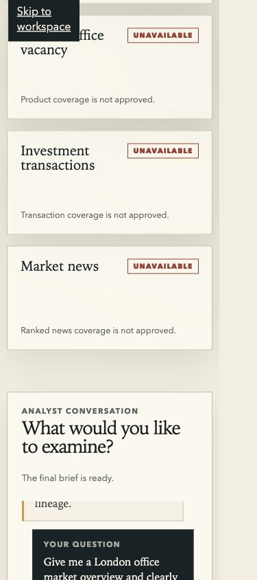

# TC-01 Dashboard UI Test — 2026-08-02

## 結論

**通過。** Fresh Docker Demo 由 `demo-data-init` 建立 deterministic Bank Rate
fixture，dashboard 建立 memory-only bearer session，透過 authenticated SSE 接收 Pi
runtime events，而且只把 host-finalized `market_brief.v1` 當成答案。

Bank Rate 顯示 `5.25 percent`、official source、top-level `as_of`、freshness、publication
state、三層 confidence 與 lineage。London office rent、vacancy、transactions 及 ranked
news 仍明確顯示 unavailable；fixture banner 持續可見，不會把 demo 說成 live ingestion。

## 真實 in-app browser 驗收

| 情境 | UI 結果 | Backend trace |
|---|---|---|
| Bank Rate | `Complete`；顯示 `5.25 percent`、Bank of England HTTPS source、as-of、published、freshness、confidence、lineage。 | `UhnCoGfGeJLIvMa6w5idvw`；`describe_market_data → query_market_data → get_citation_metadata → finalize_market_brief`。 |
| London office overview | `Partial`；Bank Rate 只作 macro context，rent/vacancy/transactions 全部列為 unavailable。 | `Zv22sIqZFGSuto7pYpCkxg`；完整 query/citation/finalizer sequence。 |
| West End vacancy | `Unavailable`；沒有 vacancy facts、sources 或模型生成的 vacancy number。 | `stk_1xOQF876CMPqA2p1Tw`；`describe_market_data → finalize_market_brief`。 |
| Cancel / retry | cancel 後舊 brief 立即清除並顯示安全訊息；同一 browser session 可立刻重試 Bank Rate。 | cancel turn `j2oYm8y3wDU_I5tqvmS-Dg` 在 `282.173 ms` 以 `terminal_state: cancelled` 結束；retry 正常完成。 |

每個 trace 都標示 `runtime_engine: pi-agent-session` 與 `model: glm/GLM-5.2`，且不含
prompt、bearer 或 API key。Browser console warning/error 為空；container logs 沒有
unhandled exception。

## Deterministic browser regression

`npm run test:browser` 共 9 cases，涵蓋：

- session load/error/pagehide keepalive cleanup 與 12 次 reload；
- seeded、empty、stale/degraded overview；
- suggested prompts、空白、中文、英文、多行、4000 字、double submit、16-turn limit；
- success、failure-after-success、cancel/retry、SSE reconnect/replay；
- facts、warnings、confidence、lineage、safe HTTP(S) source links；
- unsupported rent/vacancy 保持 unavailable 且沒有模型數字；
- desktop/tablet/mobile、keyboard/focus、reduced motion 與 axe scan。

## Docker lifecycle

- `docker compose down -v` 後執行 `docker compose up --build --wait`：initializer
  回報 `seeded`，service healthcheck 通過。
- `docker compose down` 後再次 `up --wait`：initializer 回報 `verified`，canonical
  run count 不增加。
- non-demo mode 遇到 demo marker：fail closed。
- Linux container 沒有 daemon 或 refresh profile；live ingestion 仍只允許在有
  `sandbox-exec` parser isolation 的 macOS host。

## Evidence

- Final GLM desktop：[[wiki/questions/Test_result/screenshots/dashboard-glm-desktop.jpg|dashboard-glm-desktop.jpg]]
- Responsive mobile：[[wiki/questions/Test_result/screenshots/dashboard-glm-mobile.jpg|dashboard-glm-mobile.jpg]]
- Baseline overview：[[wiki/questions/Test_result/screenshots/dashboard-overview-bank-rate.png|dashboard-overview-bank-rate.png]]
- Baseline unavailable case：[[wiki/questions/Test_result/screenshots/dashboard-tc01-unavailable.png|dashboard-tc01-unavailable.png]]

## Fixture boundary

`5.25` 是固定 checksum 的 packaged fixture，只驗證 Browser → HTTP/SSE → Pi
AgentSession → typed tools → Facade → SQLite → host finalizer 鏈路。它不是即時 Bank
Rate，也不代表 London office coverage 已經完成。
